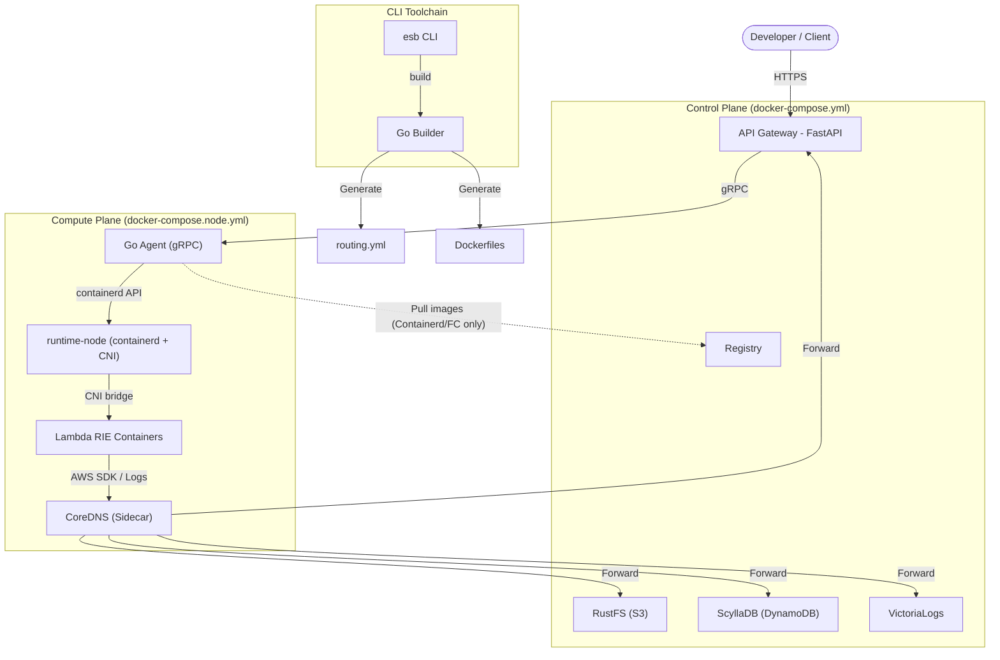

<!--
Where: README.md
What: Project overview, usage, and CLI reference.
Why: Provide a single entry point for developers and operators.
-->
# Edge Serverless Box

**オンプレミス・エッジ環境のための、自己完結型サーバーレス実行基盤**
*(A self-contained, serverless-compatible environment for edge and local development)*

### 特徴
- **True AWS Compatibility**: 実行エンジンに **AWS Lambda Runtime Interface Emulator (RIE)** を採用。クラウド上の Lambda と完全に一致する挙動をローカル環境で保証します。
- **Integrated Developer Experience (CLI)**: 専用 CLI ツール `esb` を提供。環境構築の核として SAM ビルドを提供し、起動は `docker compose` で実現します。
- **Production-Ready Architecture**: 外部公開用の `Gateway` と特権を持つ `Go Agent` を分離したマイクロサービス構成により、セキュリティと耐障害性を実現しています。
- **Docker-Contained Runtime**: `runtime-node` に `containerd + CNI + CoreDNS` を集約し、ホストのネットワーク改変を最小化しつつ Firecracker/Remote Node での透明なサービス解決を実現します。
- **Full Stack in a Box**: S3互換ストレージ (RustFS)、DynamoDB互換DB (ScyllaDB)、ログ基盤を同梱しており、`docker compose` で Control + Compute を立ち上げるだけでクラウドネイティブ環境が得られます。
- **Efficient Orchestration**: コンテナオーケストレーション技術により、Lambda関数コンテナをオンデマンドで起動・プーリング。`ReservedConcurrentExecutions` に基づくオートスケーリングと、**Scale-to-Zero (アイドル時自動停止)** によりリソースを最適化します。Gateway 側の Janitor がアイドルコンテナと孤児コンテナを定期的に整理します。

### CLI コマンド一覧

| コマンド       | 説明                                                                                   | 主なオプション                                                                               |
| -------------- | -------------------------------------------------------------------------------------- | -------------------------------------------------------------------------------------------- |
| `esb build`    | SAM テンプレート (`template.yaml`) を解析して Dockerfile / config を生成し、関数イメージをビルドします。 | `--template (-t)`, `--env (-e)`, `--mode (-m)`, `--output (-o)`, `--no-cache`, `--verbose (-v)` |
| `esb completion` | Bash / Zsh / Fish 用の補完スクリプトを生成します。                                      | `bash`, `zsh`, `fish`                                                                        |
| `esb version`   | CLI のバージョン情報を表示します。                                                      | —                                                                                            |

補足:
- `esb build` は `--template` / `--env` / `--mode` を必須とし、テンプレート内の `Parameters` は実行時に対話入力して解決されます。
- CLI はランタイムの起動・停止機能を提供しておらず、生成物は `docker compose` で起動します。

## アーキテクチャ



CLI は現在 `esb build` に特化しており、生成された構成は下の Compose ファイル群を使って手動で起動してください。

### システムコンポーネント
- **`Gateway`**: API Gateway 互換プロキシ。`routing.yml` に基づき認証・ルーティングを行い、Go Agent を介して Lambda コンテナをオンデマンドで呼び出します。
- **`Go Agent`**: コンテナのライフサイクル管理を担当。`containerd` を直接操作する高性能エージェントで、gRPC 通信により Gateway と高速かつ堅牢に連携します。
- **`runtime-node`**: `containerd + CNI` と DNSベースのサービスディスカバリを持つ実行基盤コンテナ。
- **`CoreDNS`**: `runtime-node` のサイドカーとして動作。Lambda VM からの DNS クエリを解決し、`s3-storage` / `database` などの論理名を適切な IP (Docker DNS または WireGuard Gateway) へマッピングします。
- **`esb CLI`**: SAM テンプレート (`template.yaml`) を **Single Source of Truth** とし、開発を自動化する統合コマンドラインツールです。

### ファイル構成
```text
.
├── docker-compose.yml       # Control/Core compose
├── docker-compose.node.yml  # Compute compose (runtime-node/agent)
├── docker-compose.containerd.yml # Standalone adapter (Core + Compute)
├── services/
│   ├── gateway/             # API Gateway (FastAPI)
│   ├── agent/               # Container Orchestrator (Go Agent)
│   ├── runtime-node/        # containerd + CNI runtime
│   └── common/              # 共通ライブラリ
├── config/                  # 設定ファイル
├── tools/
│   ├── cli/                 # ★ ESB CLI ツール (New)
│   ├── generator/           # SAM Template Generator
│   └── provisioner/         # Infrastructure Provisioner
├── e2e/                 # E2Eテスト用Lambda関数
│   ├── template.yaml    # SAM Source of Truth
│   └── functions/       # Lambda関数コード

```

### Compose ファイル構成と起動パターン

| ファイル                        | 役割                                   | 主な用途                                   |
| ------------------------------- | -------------------------------------- | ------------------------------------------ |
| `docker-compose.yml`            | Control/Core（Gateway + 依存サービス） | Control Plane（単一ノード/分離構成の共通） |
| `docker-compose.node.yml`       | Compute（runtime-node/agent/coredns）  | Compute Node（Firecracker/remote）         |
| `docker-compose.containerd.yml` | Adapter（単一ノード結合 / coredns）    | Core + Compute を同一ホストで統合          |

#### 起動パターン（docker compose）

単一ノード（containerd）:
```bash
docker compose -f docker-compose.yml \
  -f docker-compose.node.yml \
  -f docker-compose.containerd.yml up -d
```

Control/Compute 分離（Firecracker）:
```bash
# Control
docker compose -f docker-compose.yml up -d

# Compute
docker compose -f docker-compose.node.yml up -d
```

#### Compose を使った起動パターン

- **Containerd**: Control Plane (`docker-compose.yml`) + Compute Plane (`docker-compose.node.yml`, `docker-compose.containerd.yml`) を順番に `docker compose up -d` します。
- **Firecracker**: Control Plane のみ `docker compose -f docker-compose.yml up -d` で起動し、Compute は分離された `docker-compose.node.yml` を必要に応じて組み合わせます。

注意:
- `docker compose -f` は指定順に合成され、後のファイルが前の内容を上書きします。
- パスは最初の `-f` のディレクトリを基準に解決されます（必要なら `--project-directory` を使います）。

## クイックスタート

詳細な開発環境セットアップ（`mise` / `lefthook` を使った依存インストールや Git フック設定）は [CONTRIBUTING.md#1開発環境セットアップ](CONTRIBUTING.md#1開発環境セットアップ) に詳述しています。

### 開発環境セットアップ

詳細なセットアップ手順や開発ガイドライン（Lint, Type Check, VS Code設定など）については、[CONTRIBUTING.md](CONTRIBUTING.md) を参照してください。

```bash
# 1. 仮想環境作成と依存関係インストール
uv sync --all-extras

# 2. Git hooks のセットアップ
lefthook install

# 3. 仮想環境の有効化
source .venv/bin/activate  # macOS/Linux
# .venv\Scripts\activate   # Windows
```

#### 開発ツールチェーン
本プロジェクトでは品質維持のために以下の最新ツールを採用しています：
*   **uv**: 高速なパッケージ管理
*   **Ruff**: 高速な Lint / Formatting
*   **Ty**: 統合型チェック


### 証明書のセットアップ

開発環境で使用するSSL証明書を生成します。

```bash
mise run setup:certs
```

これにより `~/.esb/certs` に証明書が生成され、ローカル開発環境でHTTPSが利用可能になります。
初回実行時に `mkcert -install` が実行され、ローカルのルートCAがシステムにインストールされます。


### プロジェクトの初期化 (`esb init`)

新しいプロジェクトで ESB を使い始める場合、まず `esb init` を実行して設定ファイルを生成します。

`esb build` は先ほどの CLI コマンド一覧に記載した通り、SAM テンプレートを基に Dockerfile・`functions.yml`/`routing.yml`・`resources.yml` を生成し、関数コンテナと control-plane イメージをビルドします。

生成された構成は `output/<env>/config/` 配下に出力されるため、その後の起動やログは `docker compose -f docker-compose.yml ...` などを使って制御してください。

## ドキュメント

詳細な技術ドキュメントは `docs/` ディレクトリにあります。

| ドキュメント                                      | 説明                                 |
| ------------------------------------------------- | ------------------------------------ |
| [環境変数一覧](docs/environment-variables.md)     | 全環境変数の役割と設定方法           |
| [architecture-containerd.md](docs/architecture-containerd.md) | 標準実行モード (Docker) の構成図     |
| [container-management.md](docs/container-management.md)         | コンテナ管理とイメージ運用           |
| [resilience.md](docs/resilience.md)                 | システム回復性とサーキットブレーカー |
| [spec.md](docs/spec.md)                             | システム仕様                         |

## 実行ガイド

1. SAM テンプレートのあるディレクトリで `esb build --template template.yaml --env prod --mode docker` を実行します。`Parameters` に `Default` がないものは対話的に尋ねられます。
2. `docker compose -f compose/base.yml -f compose/worker.yml up -d` を使って Gateway/Agent/runtime-node を起動します。Firecracker/Containerd では `docker-compose.containerd.yml` を追加してください。
3. `docker compose logs` / `docker compose down` などで監視・停止を行います。生成済 `output/<env>/config/` には `functions.yml` / `routing.yml` / `resources.yml` が収められています。

### シェル補完

`esb completion <bash|zsh|fish>` で補完スクリプトを生成できます。設定例:

```bash
# bash
esb completion bash > ~/.bash_completion.d/esb
source ~/.bash_completion.d/esb

# zsh
mkdir -p ~/.zsh/completions
esb completion zsh > ~/.zsh/completions/_esb
fpath=(~/.zsh/completions $fpath)
autoload -Uz compinit && compinit

# fish
mkdir -p ~/.config/fish/completions
esb completion fish > ~/.config/fish/completions/esb.fish
```

## テスト

- Go のユニットテスト: `uv run go test ./cli/internal/...`
- E2E: `uv run python e2e/run_tests.py --unit-only` または `uv run python e2e/run_tests.py --profile e2e-containerd`

## トラブルシューティング

**Q. `esb` コマンドが見つからない**  
A. `.venv` を有効化するか、`uv run esb ...` を利用してください。

**Q. ビルド成果物をクリアしたい**  
A. `output/<env>/` を削除して再度 `esb build` を実行してください。
