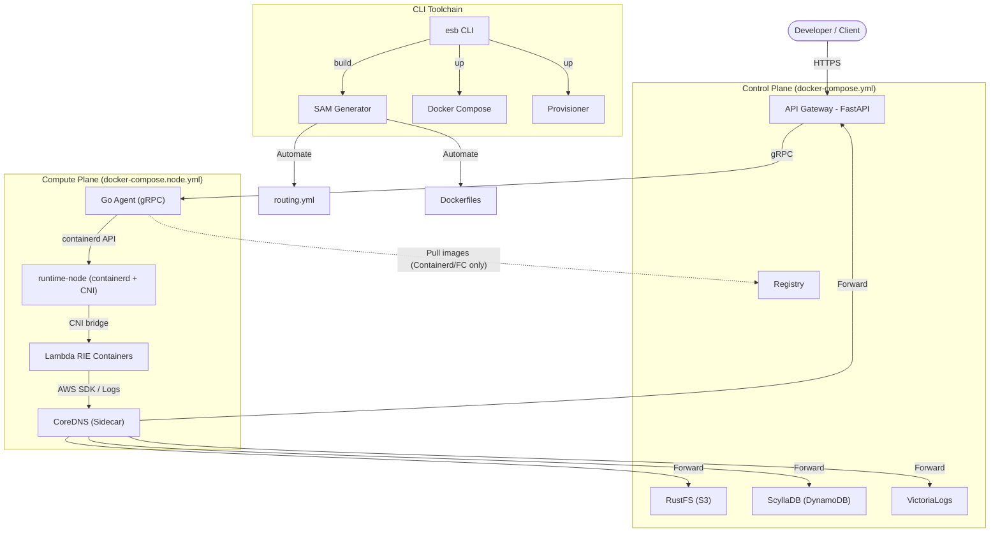

<!--
Where: README.md
What: Project overview, usage, and CLI reference.
Why: Provide a single entry point for developers and operators.
-->
# Edge Serverless Box

**オンプレミス・エッジ環境のための、自己完結型サーバーレス実行基盤**
*(A self-contained, serverless-compatible environment for edge and local development)*

### 特徴
- **True AWS Compatibility**: 実行エンジンに **AWS Lambda Runtime Interface Emulator (RIE)** を採用。クラウド上の Lambda と完全に一致する挙動をローカル環境で保証します。
- **Integrated Developer Experience (CLI)**: 専用 CLI ツール `esb` を提供。環境構築からビルド・起動まで、コマンド一つでシームレスな開発体験を提供します。
- **Production-Ready Architecture**: 外部公開用の `Gateway` と特権を持つ `Go Agent` を分離したマイクロサービス構成により、セキュリティと耐障害性を実現しています。
- **Docker-Contained Runtime**: `runtime-node` に `containerd + CNI + CoreDNS` を集約し、ホストのネットワーク改変を最小化しつつ Firecracker/Remote Node での透明なサービス解決を実現します。
- **Full Stack in a Box**: S3互換ストレージ (RustFS)、DynamoDB互換DB (ScyllaDB)、ログ基盤を同梱しており、`esb up` だけで完全なクラウドネイティブ環境が手に入ります。
- **Efficient Orchestration**: コンテナオーケストレーション技術により、Lambda関数コンテナをオンデマンドで起動・プーリング。`ReservedConcurrentExecutions` に基づくオートスケーリングと、**Scale-to-Zero (アイドル時自動停止)** によりリソースを最適化します。Gateway 側の Janitor がアイドルコンテナと孤児コンテナを定期的に整理します。

### CLI コマンド一覧

| コマンド             | 説明                                                                               | 主なオプション                                                                               |
| -------------------- | ---------------------------------------------------------------------------------- | -------------------------------------------------------------------------------------------- |
| `esb init`           | `generator.yml` を対話的に生成します。新規プロジェクト開始時に実行します。         | `--template (-t)`                                                                            |
| `esb build`          | `template.yaml` から設定を生成し、Docker イメージをビルドします。                  | `--no-cache`, `--dry-run`, `--verbose (-v)`                                                  |
| `esb up`             | サービスの起動とインフラのプロビジョニングを一括で行います（デフォルトでdetach）。 | `--build`, `--wait`                                                                          |
| `esb down`           | サービスを停止し、コンテナを削除します。                                           | `--volumes (-v)`                                                                             |
| `esb up --reset`     | 環境を完全に初期化し、DB等のデータも全て削除して再構築します。                     | `--yes (-y)`                                                                                 |
| `esb logs`           | サービスログを表示します。                                                         | `--follow (-f)`, `--tail`, `--timestamps`                                                    |
| `esb node add`       | Compute Node を登録します。                                                        | `--host`, `--password`, `--skip-key-setup`                                                   |
| `esb node doctor`    | Compute Node の前提チェックを行います。                                            | `--name`, `--host`, `--strict`                                                               |
| `esb node up`        | Compute Node 上で compose を起動します（Firecracker モードのみ）。                 | `--name`, `--host`                                                                           |
| `esb node provision` | Compute Node に必要な依存をプロビジョニングします。                                | `--name`, `--host`, `--sudo-password`, `--sudo-nopasswd`, `--firecracker-*`, `--devmapper-*` |

補足:
- 実行モードは環境変数 `ESB_MODE` で切り替えます（`docker` (デフォルト), `containerd`, `firecracker`）。
旧 Python CLI から `esb` CLI への移行を進めており、`esb node` 系コマンドは現在利用できません。

### Compute Node 管理（Phase C / 現在は無効）

Firecracker 用の Compute Node を **SSH 経由で登録・検査・準備** します。
初回登録時に `~/.esb/id_ed25519` を生成し、リモートの `authorized_keys` に登録します。

```bash
# 1. Node 登録（初回のみパスワード入力）
esb node add --host esb@10.1.1.220

# 2. Node 前提チェック
esb node doctor

# 3. Node 依存関係のセットアップ（sudo パスワードが必要）
esb node provision --sudo-password <SUDO_PASSWORD>

# 3-1. sudo の NOPASSWD を設定する場合（初回のみ）
esb node provision --sudo-nopasswd --sudo-password <SUDO_PASSWORD>

# 3-2. NOPASSWD 設定済みの再実行
esb node provision --sudo-nopasswd

# 4. Compute サービス起動（Firecracker モード）
esb node up --name node-1
```

補足:
- 鍵を使いたくない場合は `esb node add --host ... --skip-key-setup` を使います。
- `esb node add` は登録済みの鍵がリモートに無い場合、再インストールのためにパスワード入力を求めます。
- `esb node add` は既存のノード設定（例: `sudo_nopasswd`）を保持したまま更新します。
- `esb node up` は compose ファイルをリモートの `~/.esb/compose` に転送して起動します。
- `esb node up` は Agent の CNI 設定（`services/agent/config/cni`）も転送します。
- `esb node up` は `docker compose` を使うため、Compute Node には **Compose plugin** が必要です（`esb node provision` で導入）。
- `esb node up` は `docker compose down --remove-orphans` と `docker rm -f` を先に実行し、古いコンテナを除去します。
- `esb node up` は `runtime-node` を先に起動し、その後 `docker compose pull` と `up -d --force-recreate` を行います。
- `esb node provision` は ESB Root CA を配布し、`/etc/docker/certs.d/<registry>/ca.crt` を設定します。
- `ESB_CONTROL_HOST` が未設定の場合は `GATEWAY_INTERNAL_URL` のホスト名を利用します。
- `CONTAINER_REGISTRY` 未設定時は、Containerd/Firecracker モードでは `ESB_CONTROL_HOST` 和 `REGISTRY_PORT` から組み立てます。Docker モードではレジストリを使用せず、ローカルイメージを直接参照します（レジストリ経由の配布はサポートしません）。
- Firecracker モードでは `esb build` が `esb-runtime-node`/`esb-agent` をレジストリへ push します。
- `esb node provision` は sudo が必要です。sudo が通らない場合はリモート側の sudoers を確認してください。
- `--sudo-nopasswd` は SSH ユーザーに対して `/etc/sudoers.d/esb-<user>` を作成します。
- Firecracker のバージョンやインストール先を変えたい場合は `--firecracker-version` などのオプションを使用します。
- Kernel/RootFS や devmapper の設定を変えたい場合は `--firecracker-kernel-url` / `--devmapper-pool` などを指定します。
- RootFS はデフォルトで `make image` により生成し、`/var/lib/firecracker-containerd/runtime/default-rootfs.img` に配置します。
- `--firecracker-rootfs-url` を指定するとダウンロード優先になり、ビルドはスキップされます。
- Kernel/RootFS は **marker + sha256** により再収束します（手動削除は不要）。

## アーキテクチャ



### システムコンポーネント
- **`Gateway`**: API Gateway 互換プロキシ。`routing.yml` に基づき認証・ルーティングを行い、Go Agent を介して Lambda コンテナをオンデマンドで呼び出します。
- **`Go Agent`**: コンテナのライフサイクル管理を担当。`containerd` を直接操作する高性能エージェントで、gRPC 通信により Gateway と高速かつ堅牢に連携します。
- **`runtime-node`**: `containerd + CNI` と DNSベースのサービスディスカバリを持つ実行基盤コンテナ。
- **`CoreDNS`**: `runtime-node` のサイドカーとして動作。Lambda VM からの DNS クエリを解決し、`s3-storage` / `database` などの論理名を適切な IP (Docker DNS または WireGuard Gateway) へマッピングします。
- **`esb CLI`**: SAM テンプレート (`template.yaml`) を **Single Source of Truth** とし、開発を自動化する統合コマンドラインツールです。

### ファイル構成
```text
.
├── docker-compose.yml       # Control/Core compose
├── docker-compose.node.yml  # Compute compose (runtime-node/agent)
├── docker-compose.containerd.yml # Standalone adapter (Core + Compute)
├── services/
│   ├── gateway/             # API Gateway (FastAPI)
│   ├── agent/               # Container Orchestrator (Go Agent)
│   ├── runtime-node/        # containerd + CNI runtime
│   └── common/              # 共通ライブラリ
├── config/                  # 設定ファイル
├── tools/
│   ├── cli/                 # ★ ESB CLI ツール (New)
│   ├── generator/           # SAM Template Generator
│   └── provisioner/         # Infrastructure Provisioner
├── e2e/                 # E2Eテスト用Lambda関数
│   ├── template.yaml    # SAM Source of Truth
│   └── functions/       # Lambda関数コード

```

### Compose ファイル構成と起動パターン

| ファイル                        | 役割                                   | 主な用途                                   |
| ------------------------------- | -------------------------------------- | ------------------------------------------ |
| `docker-compose.yml`            | Control/Core（Gateway + 依存サービス） | Control Plane（単一ノード/分離構成の共通） |
| `docker-compose.node.yml`       | Compute（runtime-node/agent/coredns）  | Compute Node（Firecracker/remote）         |
| `docker-compose.containerd.yml` | Adapter（単一ノード結合 / coredns）    | Core + Compute を同一ホストで統合          |

#### 起動パターン（docker compose）

単一ノード（containerd）:
```bash
docker compose -f docker-compose.yml \
  -f docker-compose.node.yml \
  -f docker-compose.containerd.yml up -d
```

Control/Compute 分離（Firecracker）:
```bash
# Control
docker compose -f docker-compose.yml up -d

# Compute
docker compose -f docker-compose.node.yml up -d
```

#### CLI と compose の対応

- `esb up` は環境変数 `ESB_MODE` の値で compose の組み合わせを切り替えます。
  - `containerd`: `docker-compose.yml` + `docker-compose.node.yml` + `docker-compose.containerd.yml`
  - `firecracker`: `docker-compose.yml`
- Compute Node は `esb node up` が `docker-compose.node.yml` を転送して起動します。

注意:
- `docker compose -f` は指定順に合成され、後のファイルが前の内容を上書きします。
- パスは最初の `-f` のディレクトリを基準に解決されます（必要なら `--project-directory` を使います）。

## クイックスタート

詳細な開発環境セットアップ（`mise` / `lefthook` を使った依存インストールや Git フック設定）は [CONTRIBUTING.md#1開発環境セットアップ](CONTRIBUTING.md#1開発環境セットアップ) に詳述しています。

### 開発環境セットアップ

詳細なセットアップ手順や開発ガイドライン（Lint, Type Check, VS Code設定など）については、[CONTRIBUTING.md](CONTRIBUTING.md) を参照してください。

```bash
# 1. 仮想環境作成と依存関係インストール
uv sync --all-extras

# 2. Git hooks のセットアップ
lefthook install

# 3. 仮想環境の有効化
source .venv/bin/activate  # macOS/Linux
# .venv\Scripts\activate   # Windows
```

#### 開発ツールチェーン
本プロジェクトでは品質維持のために以下の最新ツールを採用しています：
*   **uv**: 高速なパッケージ管理
*   **Ruff**: 高速な Lint / Formatting
*   **Ty**: 統合型チェック


### 証明書のセットアップ

開発環境で使用するSSL証明書を生成します。

```bash
mise run setup:certs
```

これにより `~/.esb/certs` に証明書が生成され、ローカル開発環境でHTTPSが利用可能になります。
初回実行時に `mkcert -install` が実行され、ローカルのルートCAがシステムにインストールされます。


### プロジェクトの初期化 (`esb init`)

新しいプロジェクトで ESB を使い始める場合、まず `esb init` を実行して設定ファイルを生成します。

```bash
# template.yaml が存在するディレクトリで実行
esb init

# または、テンプレートパスを明示的に指定
esb --template /path/to/template.yaml init
```

対話的なウィザードが起動し、以下を設定できます:
- **パラメータ**: SAM テンプレートの `Parameters` セクションに定義された値
- **Docker Image Tag**: ビルドするイメージのタグ（デフォルト: `latest`）
- **Output Directory**: 生成物の出力先（デフォルト: `.esb/`）

設定は `generator.yml` として保存され、以降の `esb build` で使用されます。

### `esb` コマンドの利用方法

インストール完了後は、以下の 2 通りの方法でコマンドを実行できます。

1. **仮想環境をアクティベートして実行 (推奨)**
   `.venv` をアクティベートしている間は、どのディレクトリに `cd` しても `esb` コマンドが利用可能です。
   ```bash
   esb up
   ```

2. **`uv run` を使用して実行**
   プロジェクトルート配下にいれば、アクティベートなしでも仮想環境のコマンドを呼び出せます。
   ```bash
   uv run esb up
   ```

#### テンプレートの探索ロジック
`esb` は `template.yaml` を以下の優先順位で自動的に探します。これにより、自身のプロジェクトディレクトリに `cd` してから実行するスタイルにも対応しています。
1. 環境変数 `ESB_TEMPLATE` で指定されたパス
2. カレントディレクトリ直下の `template.yaml`
3. プロジェクトルート直下の `template.yaml`
4. `e2e/fixtures/template.yaml` (デフォルトのサンプル)

### サービスの起動 (`esb up`)

ビルド、コンテナ起動、インフラ（DB/S3）のプロビジョニングを一括で行います。

```bash
# 環境を起動（初回はビルドも実行されます）
esb up

# 強制的に再ビルドして起動する場合
esb up --build

```

起動後、以下のURLでサービスが利用可能です：

* **Gateway API**: `https://localhost:443`
* **VictoriaLogs**: `http://localhost:9428`

### 環境の停止 (`esb down`)

コンテナおよびネットワークリソースをクリーンに削除します。

```bash
# サービスを停止
esb down

# ボリューム（DBのデータやS3のファイル）も含めて完全に削除する場合
esb down --volumes
```

### 環境の完全リセット (`esb up --reset`)

DB の状態が複雑になった場合や、クリーンな状態からやり直したい場合に使用します。
**注意: この操作を実行すると、全てのデータベーステーブルと S3 バケットの内容が永久に失われます。** 実行前に確認プロンプトが表示されます。

```bash
esb up --reset
```

内部的には以下の処理を連続して行います：
1. `esb down --volumes` (データを含む完全削除)
2. `esb up --build` (イメージの再ビルドとクリーンな起動)

## ドキュメント

詳細な技術ドキュメントは `docs/` ディレクトリにあります。

| ドキュメント                                                                  | 説明                                 |
| ----------------------------------------------------------------------------- | ------------------------------------ |
| [環境変数一覧](docs/environment-variables.md)                                 | 全環境変数の役割と設定方法           |
| [proxy.md](docs/proxy.md)                                                     | 企業プロキシ環境での利用ガイド       |
| [trace-propagation.md](docs/trace-propagation.md)                             | X-Amzn-Trace-Id トレーシング         |
| [architecture-containerd.md](docs/architecture-containerd.md)                 | 標準実行モード (Docker) の構成図     |
| [container-management.md](docs/container-management.md)                       | コンテナ管理とイメージ運用           |
| [container-cache.md](docs/container-cache.md)                                 | コンテナホストキャッシュ             |
| [orchestrator-restart-resilience.md](docs/orchestrator-restart-resilience.md) | Agent/Gateway再起動時のコンテナ整理  |
| [network-optimization.md](docs/network-optimization.md)                       | ネットワーク最適化                   |
| [resilience.md](docs/resilience.md)                                           | システム回復性とサーキットブレーカー |
| [generator-architecture.md](docs/generator-architecture.md)                   | Generator内部アーキテクチャ          |
| [client-auth-spec.md](docs/client-auth-spec.md)                               | クライアント認証仕様                 |
| [autoscaling.md](docs/autoscaling.md)                                         | オートスケーリングとプーリング       |
| [spec.md](docs/spec.md)                                                       | システム仕様                         |
| [developer/cli-architecture.md](docs/developer/cli-architecture.md)         | `esb` CLI + Generator の設計         |

## `esb` CLI 利用ガイド

`esb` は CLI とジェネレータを組み合わせた統合ツールとして設計されており、テンプレート・環境・Compose をコマンドで制御できます。

1. `esb init -t template.yaml` で `generator.yml` を作成し、`app.tag`, `paths.output_dir`, `environments` を指定します。`esb env add <name> --mode docker|containerd|firecracker` で環境を登録し、`esb project` でテンプレート配置ディレクトリ（`generator.yml` のルート）を切り替えます。
2. `esb build --env <name>` は `cli/internal/generator/parser.go` によって SAM を検証し、`functions.yml`/`routing.yml` を `output_dir/config/` に生成したあと `docker compose` で `esb-lambda-base` と各関数イメージをビルドします。
3. `esb up --env <name>` → `esb logs`/`esb stop`/`esb prune` は `cli/internal/compose` の Compose 実行を経て、生成済 `.esb` の設定で gateway/agent/runtime を起動・監視・削除します。`esb prune` は ESB 限定の system prune 相当で、`--yes` で実行、`--all` で未使用イメージ全削除、`--volumes` で未使用ボリューム削除、`--hard` で `generator.yml` も削除します。
4. 状態遷移（Initialized → Up → Down など）や `esb env`/`esb project` の UX、`generator.yml` の参照フローは `docs/developer/cli-architecture.md` に詳述しています。

### シェル補完

`esb completion <bash|zsh|fish>` で補完スクリプトを生成できます。初回は以下のように読み込んでください。

```bash
# bash
esb completion bash > ~/.bash_completion.d/esb
source ~/.bash_completion.d/esb

# zsh
mkdir -p ~/.zsh/completions
esb completion zsh > ~/.zsh/completions/_esb
fpath=(~/.zsh/completions $fpath)
autoload -Uz compinit && compinit

# fish
mkdir -p ~/.config/fish/completions
esb completion fish > ~/.config/fish/completions/esb.fish
```

## 開発ガイド

### プロジェクト構成

#### generator.yml
ESB の設定ファイルで、`esb init` で自動生成されます。テンプレートと同じディレクトリに配置します。

```yaml
app:
  tag: latest              # Docker イメージタグ
paths:
  sam_template: template.yaml  # SAM テンプレートへの相対パス
  output_dir: .esb/            # 生成物の出力先
parameters:                    # テンプレートパラメータ（オプション）
  Prefix: dev
```

> **Note**: `functions_yml` と `routing_yml` は省略可能です。省略した場合、`output_dir/config/` に自動生成されます。

#### ディレクトリ構造（推奨）
```
your-project/
├── template.yaml      # SAM テンプレート（Single Source of Truth）
├── generator.yml      # ESB 設定（esb init で生成）
├── functions/         # Lambda 関数コード
│   └── my-func/
│       └── lambda_function.py
└── .esb/              # 生成物（.gitignore に追加）
    ├── config/
    │   ├── functions.yml
    │   └── routing.yml
    └── functions/
        └── my-func/
            └── Dockerfile
```

### SAM Template Generator

本プロジェクトでは、Lambda関数の構成管理を `template.yaml` に一本化しています。
手動で Dockerfile や `routing.yml` を編集する必要はありません。

#### 新しいLambda関数の追加手順

1. **`template.yaml` を編集**:
新しい `AWS::Serverless::Function` リソースを追加します。`Events` プロパティで API パスを定義してください。
```yaml
MyFunction:
  Type: AWS::Serverless::Function
  Properties:
    FunctionName: lambda-my-func
    CodeUri: functions/my-func/
    Handler: lambda_function.lambda_handler
    Runtime: python3.12
    Events:
      ApiEvent:
        Type: Api
        Properties:
          Path: /api/my-func
          Method: get
    ReservedConcurrentExecutions: 5 # ★ オートスケーリング設定
```

2. **コードの配置**:
`functions/my-func/lambda_function.py` を作成します。
3. **反映**:
`esb build && esb up` を実行してください。

### Infrastructure as Code (IaC)

DynamoDB テーブルや S3 バケットも `template.yaml` で管理されます。

```yaml
MyTable:
  Type: AWS::DynamoDB::Table
  Properties:
    TableName: my-table
    KeySchema:
      - AttributeName: id
        KeyType: HASH
    AttributeDefinitions:
      - AttributeName: id
        AttributeType: S
    BillingMode: PAY_PER_REQUEST

MyBucket:
  Type: AWS::S3::Bucket
  Properties:
    BucketName: my-test-bucket
    LifecycleConfiguration:
      Rules:
        - Status: Enabled
          ExpirationInDays: 7
```

上記を追記保存すると、ローカルのサービスに自動的にテーブルやバケット（およびライフサイクル設定）が作成・適用されます（`Provisioner` 機能）。

### テスト実行

#### E2E (End-to-End) Tests
E2Eテストは、`esb up` で構築された環境（Go Agent が containerd を介して Lambda を動的に管理）に対して実行されます。

Firecracker モードでは、事前に Compute Node を起動しておく必要があります。

```bash
esb node up
esb node doctor --require-up
```

この E2E スクリプトは `esb build`/`esb up` などの `esb` CLI を内部から呼び出すため、生成・起動のパスはすべて `esb` CLI で統一されています。

```bash
# Matrix定義に従い、全スイート（Containerd, Firecracker）を実行
uv run python e2e/run_tests.py

# 特定のプロファイルのみ実行（例: Containerdモードのみ）
uv run python e2e/run_tests.py --profile e2e-containerd

# 特定のテストファイルのみ実行（プロファイル指定が必須）
uv run python e2e/run_tests.py --test-target e2e/scenarios/standard/test_lambda.py --profile e2e-containerd
```

#### Unit Tests
各サービスの単体テストを実行します（環境起動は不要です）。

```bash
# ユニットテストのみ実行
uv run python e2e/run_tests.py --unit-only
```

## トラブルシューティング

**Q. `esb` コマンドが見つからない**
A. 仮想環境 (`.venv`) がアクティベートされているか確認してください。または `uv run esb ...` で実行できます。

**Q. コンテナの挙動がおかしい / データを初期化したい**
A. `esb up --reset` コマンドを使用して、環境を完全に初期化してください。

```bash
esb up --reset
```
