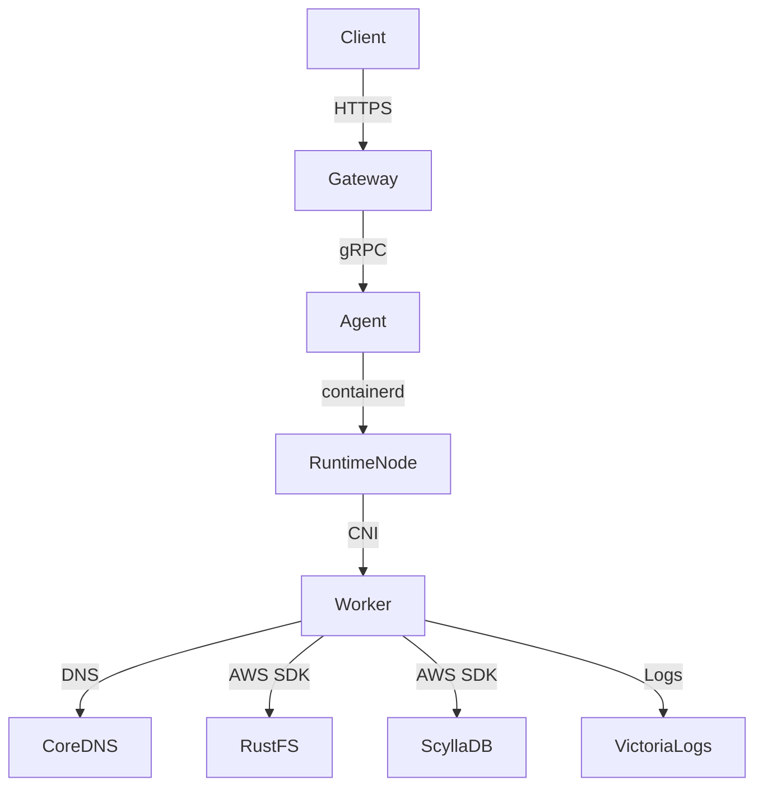

<!--
Where: docs/architecture-containerd.md
What: High-level runtime mode overview (Docker vs containerd).
Why: Clarify runtime-mode tradeoffs and operational boundaries.
-->
# アーキテクチャ: Docker vs Containerd（概要）

本基盤は `docker`（標準）と `containerd`（高密度/本番寄り）を提供します。  
このページは「どちらを選ぶか」と「何が違うか」の判断材料をまとめます。

## モード比較（概要）
| 項目 | Docker | containerd |
| --- | --- | --- |
| 実行エンジン | Docker Engine | containerd + CNI |
| Worker IP | Docker network | CNI bridge (`10.88.0.0/16`) |
| DNS | Docker DNS | CoreDNS (`10.88.0.1`) |
| Agent 接続 | Docker API | containerd socket + CNI |
| Firecracker | 非対応 | `CONTAINERD_RUNTIME=aws.firecracker` |
| 主な compose | `docker-compose.docker.yml` | `docker-compose.containerd.yml` |

## 選択指針
- `docker`: 開発/ローカル再現の初動を最短にしたい場合
- `containerd`: 本番寄りネットワーク分離や高密度運用を重視する場合
- `firecracker`: containerd 前提で追加分離を有効化したい場合

## 概略図（containerd）

## 実装境界
- Gateway/producer の上位契約は runtime モードに依存しません
- モード差分は主に Agent/runtime-node 側の実行基盤に閉じます
- E2E smoke はモード差分を吸収した共通契約として維持します

## 関連仕様（詳細）
- Agent runtime split: `services/agent/docs/runtime-containerd.md`
- runtime-node startup: `services/runtime-node/docs/startup.md`
- Gateway lifecycle split: `services/gateway/docs/architecture.md`
- E2E smoke contract: `docs/e2e-runtime-smoke.md`

---

## Implementation references
- `docker-compose.containerd.yml`
- `docker-compose.docker.yml`
- `services/agent/internal/runtime/containerd/runtime.go`
- `services/runtime-node/entrypoint.common.sh`
- `services/gateway/lifecycle.py`
