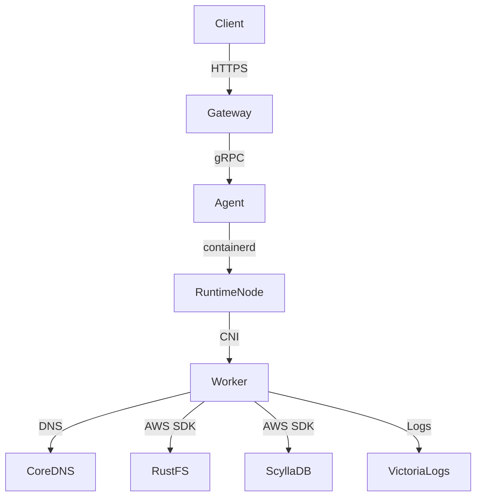

<!--
Where: docs/architecture-containerd.md
What: High-level runtime mode overview (Docker vs containerd).
Why: Keep system-level comparison and link to subsystem docs.
-->
# アーキテクチャ: Docker vs Containerd（概要）

本基盤は **Docker モード（標準）** と **containerd モード（高密度/本番寄り）** を提供します。
詳細なネットワーク・実装は subsystem docs に分離しています。

## モード比較（概要）
| 項目 | Docker | containerd |
| --- | --- | --- |
| 実行エンジン | Docker Engine | containerd + CNI |
| ワーカー IP | Docker Network | CNI Bridge (`10.88.0.0/16`) |
| DNS 解決 | Docker DNS | CoreDNS (10.88.0.1) |
| レジストリ | 任意 | 内蔵レジストリ推奨 |

## 概略図（containerd）

## 詳細ドキュメント
- runtime-node: [services/runtime-node/docs/README.md](../services/runtime-node/docs/README.md)
- Agent: [services/agent/docs/runtime-containerd.md](../services/agent/docs/runtime-containerd.md)
- Gateway: [services/gateway/docs/architecture.md](../services/gateway/docs/architecture.md)

---

## Implementation references
- `docker-compose.containerd.yml`
- `services/runtime-node/entrypoint.common.sh`
