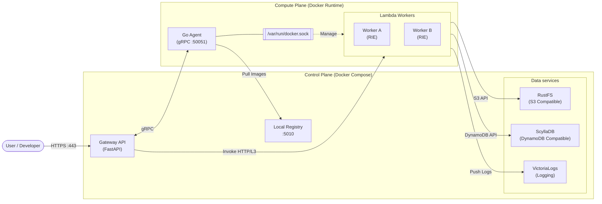
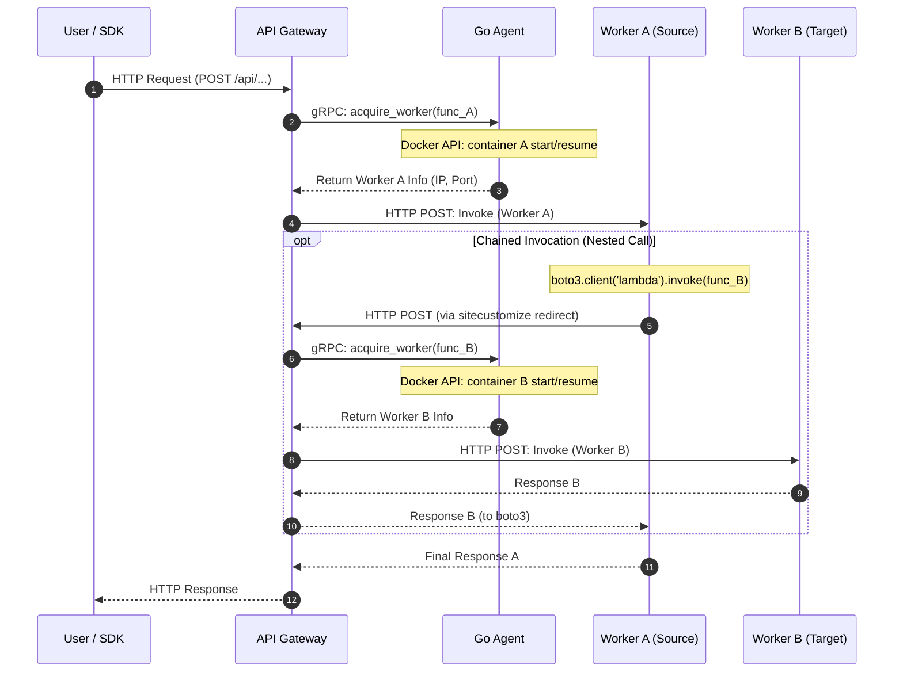

# アーキテクチャ: 標準モード (Docker ランタイム)

このドキュメントでは、Edge Serverless Box (ESB) の**標準モード (Standard Mode)** における詳細なアーキテクチャについて記述します。

## 概要

標準モードでは、ホスト上の Docker デーモンを利用して Lambda ワーカーコンテナを管理します。このモードは開発効率とローカル環境でのテストに最適化されています。

> [!IMPORTANT]
> 現在の標準モードの実装では `AGENT_RUNTIME=docker` を使用しています。将来的なアップデートでは、Docker デーモンのオーバーヘッドを削減し、よりタイトなランタイム制御を可能にするために、標準モードでの `containerd` 直接サポートも計画されています。

## 構成図

## 実行シーケンス

### Lambda 実行フロー (連鎖呼び出しを含む)
ユーザーからのリクエストから、Lambda 内での別 Lambda 呼び出し（Chained Invocation）までを含む一連の流れです。

### ステップ解説
- **1-4. 外部リクエストの受付とワーカー A の確保**: ユーザーからの HTTP リクエストを受け取った Gateway は、Go Agent に対し gRPC でワーカーの準備を依頼します。Agent は Docker API を介してコンテナを起動・レジュームし、そのエンドポイント情報を Gateway に返します。
- **5. ワーカー A の実行**: Gateway は取得した IP:Port に対して直接 HTTP リクエストを送信し、Lambda 関数の実行を開始します。
- **6-12. 連鎖呼び出し (任意)**: Lambda 関数内で `boto3` を使用して別の関数（B）を呼び出すと、SDK パッチによってリクエストが Gateway へ転送されます。Gateway は再び Agent と連携してワーカー B を準備し、実行結果をワーカー A に返します。
- **13-14. 最終レスポンス**: すべての処理を完了したワーカー A が Gateway へレスポンスを返し、最終的にユーザーへ結果が通知されます。

## コンポーネント解説

### 1. API Gateway
- **役割**: すべての Lambda 実行のフロントエンド。
- **リクエスト処理**: 
    - 外部からの HTTPS リクエストを適切なワーカーへルーティングします。
    - 認証 (X-API-Key / JWT) を管理します。
    - Agent と gRPC で通信し、ワーカーの確保 (acquire) と解放 (release) を行います。
- **ワーカーへのアクセス**: 標準モードでは、Gateway は `external_network` を介してワーカーコンテナへの直接的な L3 接続性を持ちます。

### 2. Go Agent
- **ランタイム**: `AGENT_RUNTIME=docker`。
- **主な責務**: `/var/run/docker.sock` と対話し、Lambda RIE コンテナのライフサイクル (作成、起動、停止、一時停止) を管理します。
- **イメージ管理**: ローカルレジストリから関数イメージをプルし、Docker デーモンで使用可能な状態にします。

### 3. Lambda ワーカー (RIE)
- **エンジン**: Docker コンテナ内で動作する AWS Lambda Runtime Interface Emulator (RIE)。
- **接続性**: 
    - Gateway からの実行リクエストを `:8080` で待ち受けます。
    - 環境変数 (`AWS_ENDPOINT_URL_S3` など) が注入され、データサービスと通信します。
- **分離**: 各ワーカーは独立した Docker コンテナとして実行され、標準の Docker 名前空間および cgroup によって隔離されます。

### 4. データサービス
- **RustFS**: S3 互換ストレージを提供します。
- **ScyllaDB**: DynamoDB 互換ストレージ (Alternator API) を提供します。
- **VictoriaLogs**: ログの中央ストレージ。Lambda ワーカーはパッチ済みの `sitecustomize.py` を介してログを直接 VictoriaLogs へ送信します。

## ネットワーク詳細

### `external_network`
すべてのコンポーネントが所属する Docker ブリッジネットワーク (デフォルト: `172.50.0.0/16`) です。
- **可視性**: すべてのサービスはコンテナ名 (例: `esb-s3-storage`) で相互に名前解決が可能です。
- **Invocation**: Gateway は `http://<worker_ip>:8080` を直接呼び出します。

### `internal_network`
Lambda 間の通信や、バックエンドサービスの厳密な分離が必要な場合に使用されます。

## 比較: 標準モード vs Firecracker モード
| 項目 | 標準モード (Standard) | Firecracker モード |
| :--- | :--- | :--- |
| **Agent ランタイム** | `docker` | `containerd` |
| **ワーカー実体** | Docker コンテナ | microVM (Firecracker) |
| **分離レベル** | コンテナ (名前空間) | ハードウェア仮想化 |
| **ネットワーク** | Docker ブリッジ | WireGuard + CNI ブリッジ |
| **オーバーヘッド** | 低 | 中 (入れ子ランタイム) |
