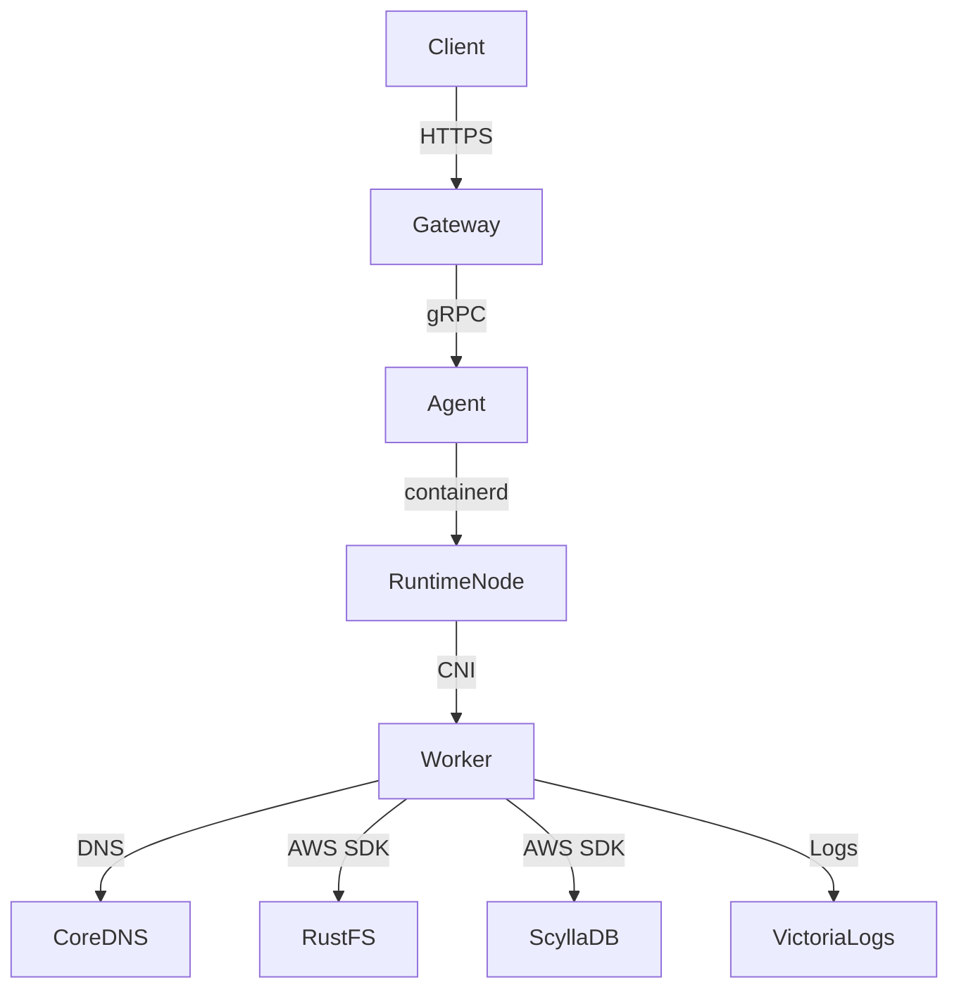

<!--
Where: docs/architecture-containerd.md
What: High-level runtime mode overview (Docker vs containerd).
Why: Keep system-level comparison and link to subsystem docs.
-->
# アーキテクチャ: Docker vs Containerd（概要）

本基盤は Docker モード（標準）と containerd モード（高密度/本番寄り）を提供します。
詳細なネットワーク・起動・CNI 実装は subsystem docs に分離しています。

## モード比較（概要）
| 項目 | Docker | containerd |
| --- | --- | --- |
| 実行エンジン | Docker Engine | containerd + CNI |
| Worker IP | Docker network | CNI bridge (`10.88.0.0/16`) |
| DNS | Docker DNS | CoreDNS (`10.88.0.1`) |
| Agent 接続 | Docker API | containerd socket + CNI |
| Firecracker | 非対応 | `CONTAINERD_RUNTIME=aws.firecracker` |

## 概略図（containerd）

## 関連仕様
- Agent runtime split: `services/agent/docs/runtime-containerd.md`
- runtime-node startup: `services/runtime-node/docs/startup.md`
- Gateway lifecycle split: `services/gateway/docs/architecture.md`
- E2E smoke contract: `docs/e2e-runtime-smoke.md`

---

## Implementation references
- `docker-compose.containerd.yml`
- `services/agent/internal/runtime/containerd/runtime.go`
- `services/runtime-node/entrypoint.common.sh`
- `services/gateway/lifecycle.py`
