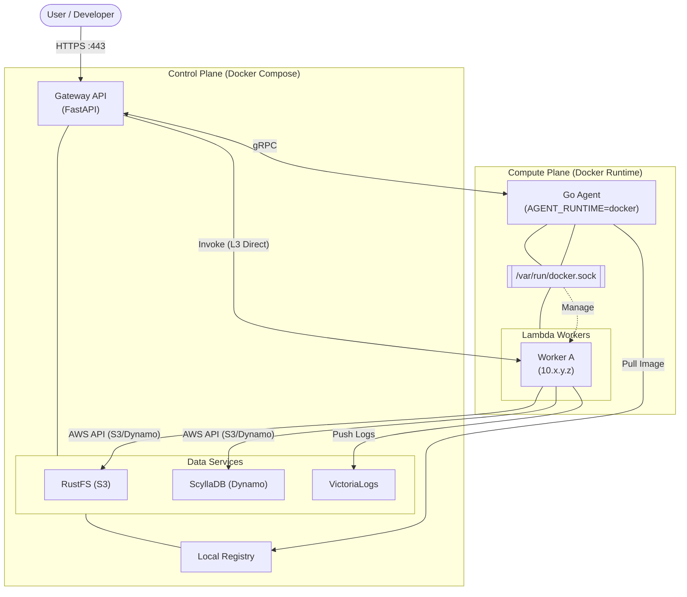
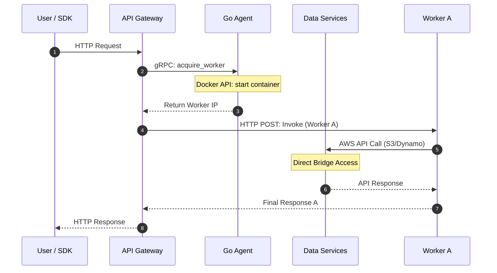
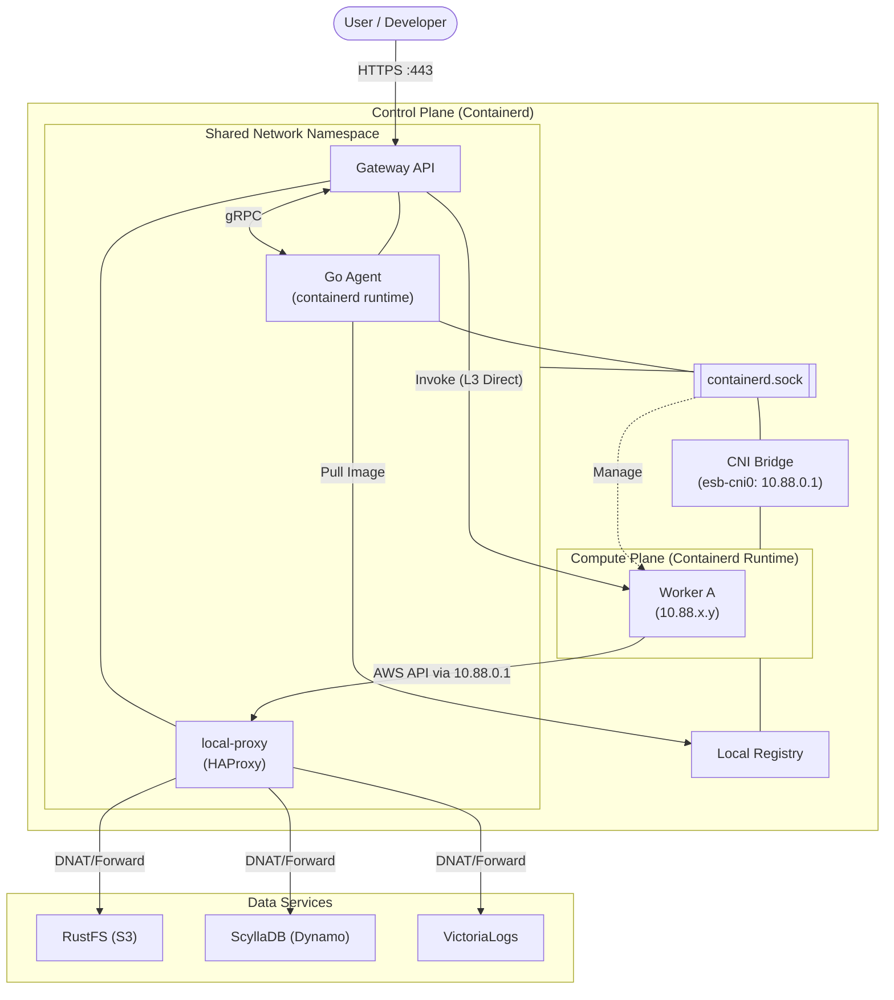
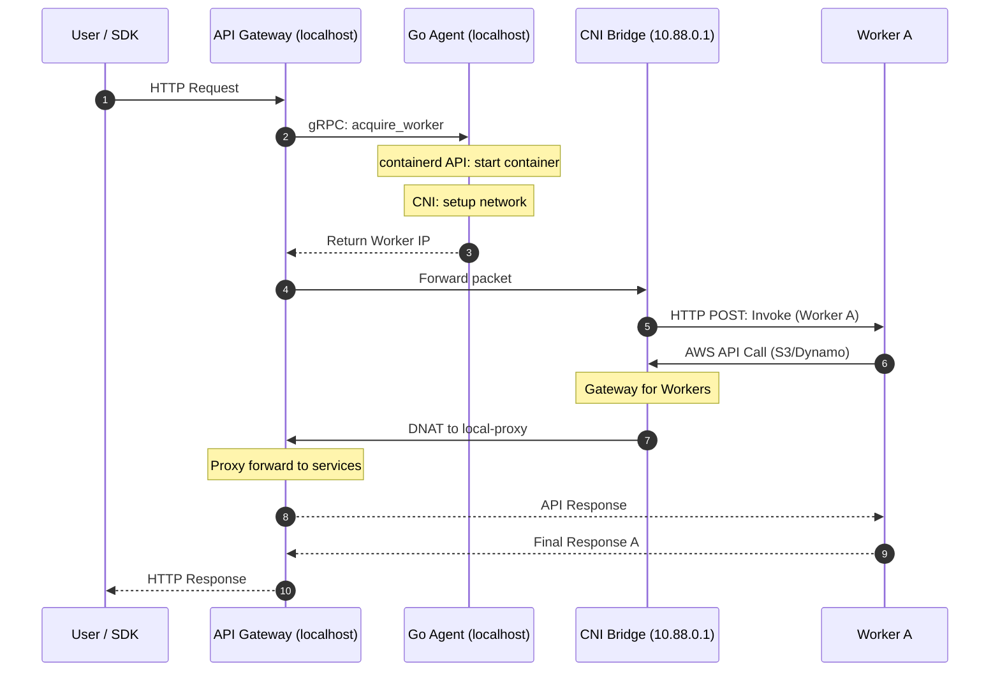

# アーキテクチャ: Docker vs Containerd ランタイム

Edge Serverless Box (ESB) は、開発効率に優れた **Docker ランタイム (標準モード)** と、本番環境に近い低オーバーヘッドな **Containerd ランタイム (Containerd モード)** の 2 つの実行環境をサポートしています。

---

## 1. Docker ランタイム (標準モード)

ホスト上の Docker デーモンを利用して Lambda ワーカーコンテナを管理します。主に開発効率とローカル環境でのテストに最適化されています。

### 構成図 (Docker)

### 実行シーケンス (Docker)

### ステップ解説 (Docker)
- **1-4. 準備**: Gateway は Go Agent に対し gRPC でワーカーを要求します。Agent は Docker API を介してコンテナを起動・確保し、IP 情報を返します。
- **5. 実行**: Gateway は Docker ブリッジを介して、ワーカーの IP に対して直接 HTTP リクエストを送信します。
- **6-8. 通信**: ワーカーは Docker ネットワーク内のデータサービスへ直接アクセスします。完了後、Gateway 経由でユーザーへ結果を返します。

---

## 2. Containerd ランタイム (Containerd モード)

Docker デーモンを介さず、低レベルランタイムである `containerd` を直接操作します。Firecracker モードへの布石であり、より厳密なリソース制御が可能です。

### 構成図 (Containerd)

### 実行シーケンス (Containerd)

### ステップ解説 (Containerd)
- **1-4. 準備**: Agent は containerd API を直接操作してコンテナを起動し、CNI を通じて独立した IP を割り当てます。
- **5-7. 実行**: Gateway は CNI ブリッジを介して、ワーカーのプライベート IP に対して直接パケットを送信します。
- **8-12. 通信**: ワーカーからのアクセスはゲートウェイ IP (`10.88.0.1`) 経由で `local-proxy` に届き、データサービスへ転送されます。

---

## スペック比較

| 項目 | Docker ランタイム | Containerd ランタイム |
| :--- | :--- | :--- |
| **Agent ランタイム** | `docker` | `containerd` |
| **接続方法** | `/var/run/docker.sock` | `/run/containerd/containerd.sock` |
| **ワーカーの隔離** | 名前空間 (Docker ネットワーク) | 名前空間 (CNI ブリッジ) |
| **ネットワーク構成** | Docker ブリッジ (L3 接点あり) | CNI ブリッジ (完全隔離 + Proxy) |
| **オーバーヘッド** | 最小 | 低 (containerd 直操作) |
| **適した用途** | 開発・デバッグ | 本番環境、高性能・高密度環境 |
