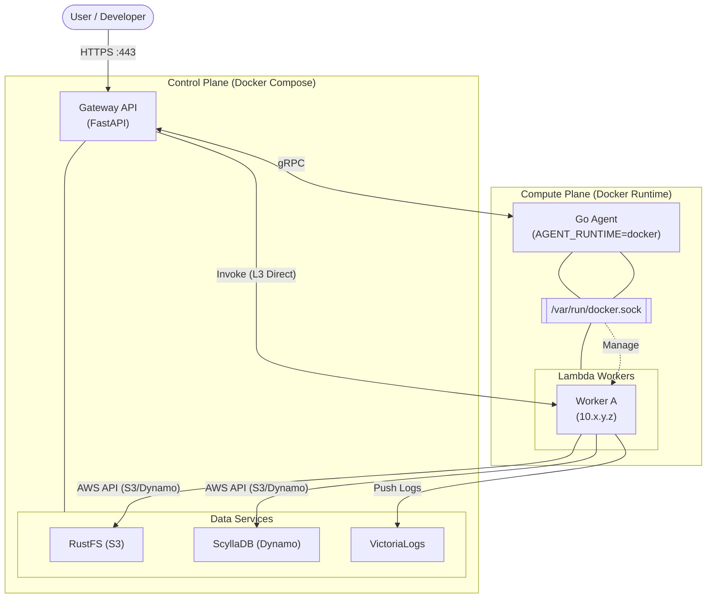
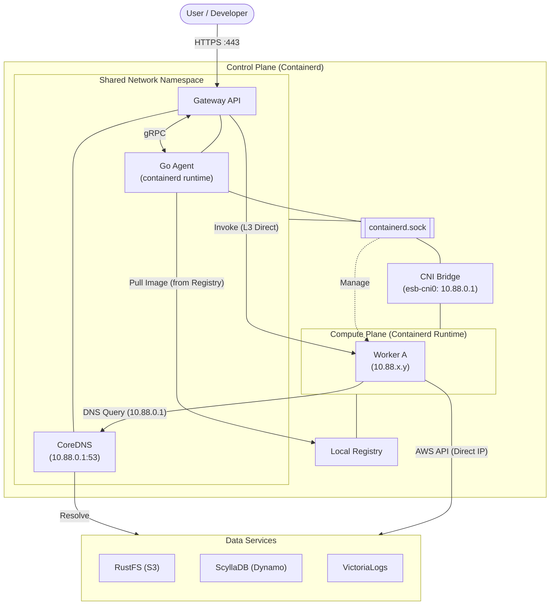
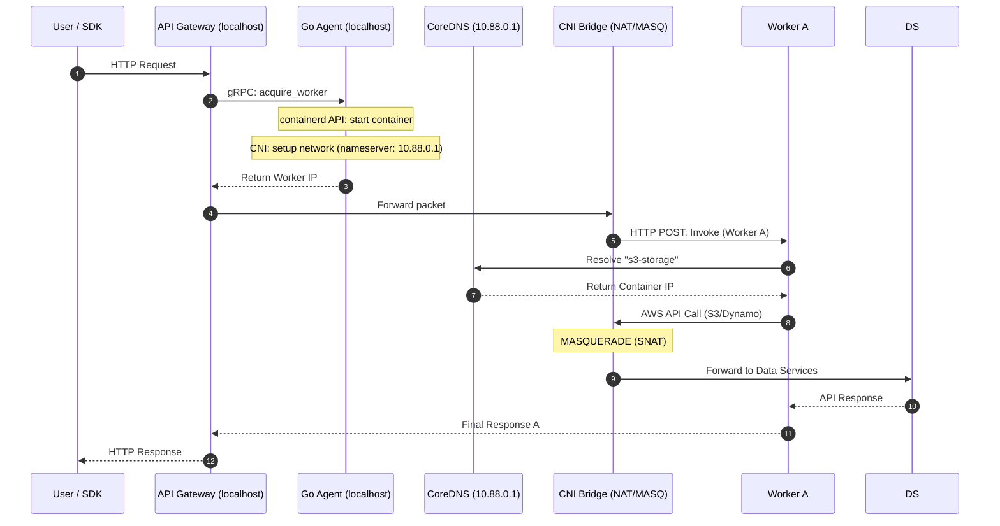

# アーキテクチャ: Docker vs Containerd ランタイム

Edge Serverless Box (ESB) は、開発効率に優れた **Docker ランタイム (標準モード)** と、本番環境に近い低オーバーヘッドな **Containerd ランタイム (Containerd モード)** の 2 つの実行環境をサポートしています。

---

## 1. Docker ランタイム (標準モード)

ホスト上の Docker デーモンを利用して Lambda ワーカーコンテナを管理します。主に開発効率とローカル環境でのテストに最適化されています。

### 構成図 (Docker)

### 実行シーケンス (Docker)

### ステップ解説 (Docker)
- **1-4. 準備**: Gateway は Go Agent に対し gRPC でワーカーを要求します。Agent は Docker API を介してコンテナを起動・確保し、IP 情報を返します。
- **5. 実行**: Gateway は Docker ブリッジを介して、ワーカーの IP に対して直接 HTTP リクエストを送信します。
- **6-8. 通信**: ワーカーは Docker ネットワーク内のデータサービスへ直接アクセスします。完了後、Gateway 経由でユーザーへ結果を返します。

---

### 構成図 (Containerd)

### 実行シーケンス (Containerd)

### ステップ解説 (Containerd)
- **1-4. 準備**: Agent は containerd API を直接操作してコンテナを起動し、CNI を通じて独立した IP を割り当てます。この際、DNS サーバーとして `10.88.0.1` (CoreDNS) が設定されます。
- **5-7. 実行**: Gateway は CNI ブリッジを介して、ワーカーのプライベート IP に対して直接パケットを送信します。
- **8-13. 通信**: ワーカーは `CoreDNS` を介してサービス名（`s3-storage` 等）を解決します。実際の通信は CNI ブリッジの `MASQUERADE` ルールによって透過的に外部ネットワークへルーティングされます。

---

## スペック比較

| 項目                 | Docker ランタイム              | Containerd ランタイム               |
| :------------------- | :----------------------------- | :---------------------------------- |
| **Agent ランタイム** | `docker`                       | `containerd`                        |
| **接続方法**         | `/var/run/docker.sock`         | `/run/containerd/containerd.sock`   |
| **ワーカーの隔離**   | 名前空間 (Docker ネットワーク) | 名前空間 (CNI ブリッジ)             |
| **ネットワーク構成** | Docker ブリッジ (L3 接点あり)  | CNI ブリッジ (完全隔離 + CoreDNS)   |
| **サービス解決**     | Docker DNS (名前で直接)        | CoreDNS (論理名から IP 解決)        |
| **オーバーヘッド**   | 最小                           | 低 (containerd 直操作)              |
| **内蔵レジストリ**   | 不要 (ローカルイメージを使用)  | 必要 (イメージ配布に利用)           |
| **適した用途**       | 開発・デバッグ                 | 本番環境、高性能・高密度環境        |
