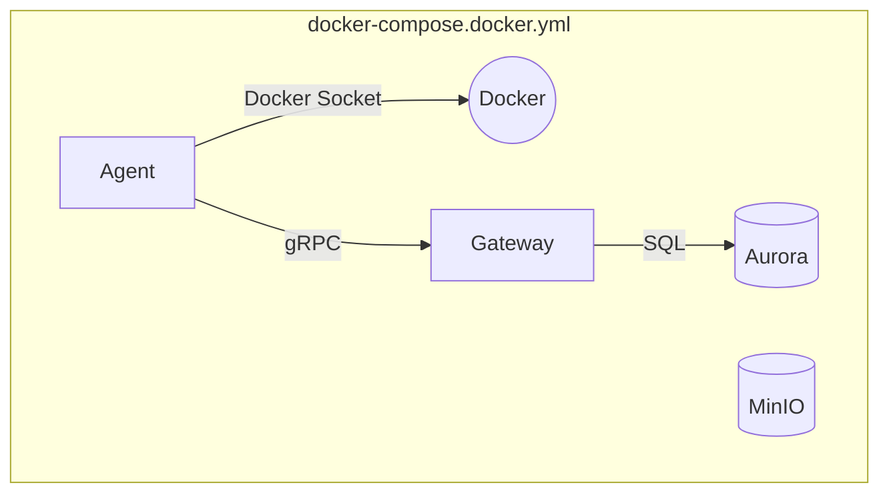

# Docker Compose アーキテクチャ

ESB (Edge Serverless Box) では、`include` ディレクティブを活用したモジュール式の Docker Compose アーキテクチャを採用し、異なるランタイムモード（Docker, Containerd, Firecracker）やデプロイ構成を効率的に管理しています。

## 概要

複数のファイルを CLI フラグ (`-f ... -f ...`) で混在させる従来の Mixin 方式ではなく、モードごとに**自己完結したエントリーポイントファイル**を定義しています。これらのファイルは `include` ディレクティブを使用して、`compose/` ディレクトリ配下の共通設定をインポートします。

### 主なメリット
1.  **CLI の簡素化**: `esb up` (および手動の `docker compose up`) は、単一のファイル（例: `docker-compose.docker.yml`）のみを対象とすればよくなりました。
2.  **依存関係の明示化**: 各モードは、必要なベースサービスを自身の YAML ファイル内で明示的に宣言します。
3.  **関心の分離**: 共通定義（`compose/`）とモード固有の上書き定義が分離されました。
4.  **Firecracker の分離**: コントロールプレーンとコンピュートノードの設定が明示的に分離されました。

## ファイル構成

### 共通設定 (`compose/`)
共有コンポーネントは `compose/` ディレクトリでモジュール化されています。

| ファイル | 役割 | 説明 |
| :--- | :--- | :--- |
| **`compose/base.yml`** | **Core** | 共通のインフラサービス (S3, Aurora/Postgres, VictoriaLogs, Gateway base)。ネットワーク、ボリューム、シークレットを定義します。 |
| **`compose/worker.yml`** | **Worker** | Agent サービスの基本定義 (Image, Build context, Environment variables)。ランタイムモードに依存しない部分です。 |
| **`compose/registry.yml`** | **Registry** | ローカル Docker Registry 定義。Containerd/Firecracker モードでイメージをローカル運用するために必要です。 |

### モード固有エントリーポイント
これらは `docker compose -f <file>` で指定するターゲットファイルです。

| ファイル | モード | Include 対象 | 説明 |
| :--- | :--- | :--- | :--- |
| **`docker-compose.docker.yml`** | **Docker** | `base.yml`, `worker.yml` | 標準の開発モードです。Agent は Docker デーモンに直接接続されたコンテナとして実行されます。 |
| **`docker-compose.containerd.yml`** | **Containerd** | `base.yml`, `worker.yml`, `registry.yml` | 統合モードです。`runtime-node` (Containerd + CNI) と、サイドカーとしての Agent/Gateway を実行します。 |
| **`docker-compose.fc.yml`** | **Firecracker (Control)** | `base.yml`, `registry.yml` | **コントロールプレーンのみ**。Gateway, Database, S3, Registry を実行します。コンピュートノードは実行しません。Gateway は `0.0.0.0:8080` (HTTP) と `0.0.0.0:50051` (gRPC) でリッスンします。 |
| **`docker-compose.fc-node.yml`** | **Firecracker (Compute)** | `worker.yml` | **コンピュートノードのみ**。`runtime-node` (Firecracker VM Manager), `coredns`, Agent を実行します。ネットワーク経由でコントロールプレーンに接続します。 |

## アーキテクチャ図

### Docker Mode
Agent と Gateway が標準的なコンテナとして実行されるシンプルな構成です。



### Containerd Mode
Agent と Gateway が `runtime-node` コンテナのサイドカーとして実行され、ネットワーク名前空間を共有することで、標準的なノード環境を模倣します。

```mermaid
graph TD
    subgraph Ctr_Compose ["docker-compose.containerd.yml"]
        Runtime[runtime-node]
        Agent[agent<br>(netns: runtime-node)]
        Gateway[gateway<br>(netns: runtime-node)]
        
        Agent --- Runtime
        Gateway --- Runtime
    end
    
    Gateway -- "gRPC (localhost)" --> Agent
```

### Firecracker Mode (Split Architecture)
Firecracker モードは、現実世界のデプロイメントをシミュレートするために、**コントロールプレーン** (管理系) と **コンピュートノード** (VM ホスト) に分割されています。

**1. Control Plane (`docker-compose.fc.yml`)**
*   ホストマシン、または中央管理サーバー。
*   API, Database, Image Registry を実行します。

**2. Compute Node (`docker-compose.fc-node.yml`)**
*   ワーカーマシン、またはネストされた仮想化ホスト。
*   Firecracker VM を起動する `runtime-node` を実行します。
*   コントロールプレーンと通信する Agent を実行します。

```mermaid
graph LR
    subgraph Control_Plane ["Control Plane (docker-compose.fc.yml)"]
        Gateway[Gateway]
        Registry[Registry]
        DB[(Aurora)]
    end

    subgraph Compute_Node ["Compute Node (docker-compose.fc-node.yml)"]
        Runtime[runtime-node<br>(FC Manager)]
        Agent[Agent]
        
        Runtime -- "Spawns" --> VM1[VM]
        Runtime -- "Spawns" --> VM2[VM]
    end
    
    Agent -- "gRPC" --> Gateway
    Runtime -- "Pull Images" --> Registry
```

## 使用方法

### CLI (推奨)
CLI は選択されたモードに基づいて適切なファイルを自動的に解決します。

```bash
# Docker Mode
esb up

# Containerd Mode
esb up --mode containerd

# Firecracker Mode (Starts Control Plane)
esb up --mode firecracker

# Firecracker Compute Node (Starts Compute Node)
esb up --mode firecracker --target node
```

### Manual Docker Compose
単一のエントリーポイントファイルを使用して `docker compose` を直接実行することも可能です。

```bash
# Docker Mode
docker compose -f docker-compose.docker.yml up -d

# Containerd Mode
docker compose -f docker-compose.containerd.yml up -d

# Firecracker Control Plane
docker compose -f docker-compose.fc.yml up -d

# Firecracker Compute Node
docker compose -f docker-compose.fc-node.yml up -d
```
