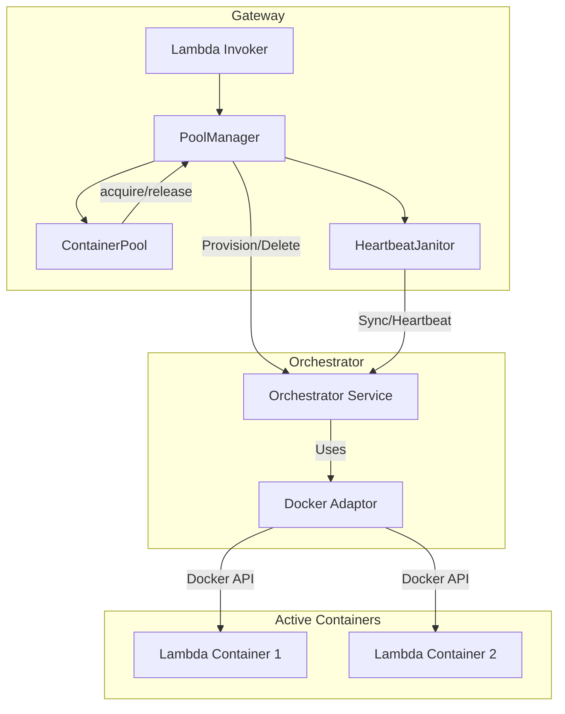

# オートスケーリングとコンテナ・ライフサイクル管理 (v2.1)

## 概要

Edge Serverless Box (ESB) は、Lambda関数の同時実行リクエストを効率的に処理し、リソース利用効率を最大化するために、高度なオートスケーリングとコンテナ・プーリング機能（v2.1）を備えています。

新機能である **Scale-to-Zero (Active Pruning)** により、アイドル状態のコンテナを能動的に削除し、完全なリソース解放を実現します。また、**Adoption (State Sync)** により、Gateway再起動時の耐障害性も確保しています。

## アーキテクチャ

オートスケーリング機能は主に Gateway 内の `PoolManager` と `ContainerPool` によって制御され、Orchestrator と連携してコンテナのライフサイクルを管理します。



### 主要コンポーネント

1.  **`PoolManager`**: Gateway のエントリポイント。全関数のプールを統括し、Gateway 起動時の状態同期 (Sync) や終了時の全削除 (Shutdown) を指示します。
2.  **`ContainerPool`**: 関数ごとのコンテナプール。`asyncio.Condition` による同時実行数制御と、アイドルコンテナの追跡、および待機待ちリクエストの正確な通知を行います。
3.  **`HeartbeatJanitor`**: 定期的にプールを巡回し、以下の責務を担います。
    *   **Active Pruning**: アイドルタイムアウトを超過したコンテナを検出し、削除リストを作成。
    *   **Heartbeat**: 稼働中のコンテナ名リストを Orchestrator に送信し、Orchestrator 側のウォッチドッグタイマーをリセット。
4.  **`Orchestrator Service`**: Gateway からの指示でコンテナを操作するほか、Gateway からのハートビートが途絶えた孤児コンテナを強制削除するセーフガード機能を持ちます。

## コンテナ・ライフサイクル

v2.1 では、コンテナの状態遷移がより厳密に管理されています。

### 1. Provisioning (起動)
リクエスト受信時、プールに空きコンテナがなく、かつ最大同時実行数 (`MAX_CAPACITY`) に達していない場合、Gateway は Orchestrator に新規コンテナ作成を依頼します。

### 2. Pooling (待機)
リクエスト処理が完了したコンテナはプールに戻され (`release`)、設定されたタイムアウトまでアイドル状態で待機します。これにより後続リクエストのコールドスタートを防ぎます。

### 3. Scale-to-Zero (自動削除)
v2.1 の核となる機能です。

*   **Active Pruning**: Gateway 側の `Janitor` が定期的にプールをチェックします。最終利用時刻 (`last_used_at`) から `GATEWAY_IDLE_TIMEOUT_SECONDS` を経過したコンテナはプールから除外され、Orchestrator に対して即座に `DELETE` リクエストが送信されます。
*   **Safety Net**: 万が一 Gateway がクラッシュした場合、Orchestrator 側の `CONTAINER_IDLE_TIMEOUT` (Gateway設定より短い/長い設定可) により、ハートビートが途絶えたコンテナが削除されます。

### 4. Adoption (再起動時の復元)
Gateway が再起動した際、Orchestrator に `GET /containers/sync` をリクエストします。既に稼働中のコンテナがある場合、それらを自身のプールに取り込み (`adopt`)、サービス提供を即座に再開します。これにより、Gateway 再起動によるコールドスタートの発生を防ぎます。

### 5. Draining (終了時の排出)
Gateway が正常終了 (SIGTERM) する際、管理下の全コンテナに対して削除リクエストを送信し、リソースをクリーンな状態に戻します。

## 設定

オートスケーリングの挙動は環境変数と `template.yaml` で制御します。

### SAM テンプレート設定

`AWS::Serverless::Function` の `ReservedConcurrentExecutions` プロパティが、その関数の最大同時実行数（プールのキャパシティ）として使用されます。

```yaml
MyFunction:
  Type: AWS::Serverless::Function
  Properties:
    ReservedConcurrentExecutions: 5  # 最大5コンテナまでスケールアウト
```

### 環境変数設定

プーリングとタイムアウトの挙動は以下の環境変数で調整します。**二重タイムアウト設計**により、積極的な削除と安全性確保を両立しています。

| 変数名 | 設定箇所 | 説明 | デフォルト値 |
| :--- | :--- | :--- | :--- |
| `GATEWAY_IDLE_TIMEOUT_SECONDS` | Gateway | **Active Pruning 用**。この時間を超えたアイドルコンテナは Gateway が能動的に削除します。 | `300` (5分) |
| `CONTAINER_IDLE_TIMEOUT` | Orchestrator | **セーフガード用**。Gateway からのハートビートがこの時間を超えて途絶えると、Orchestrator が強制削除します。 | `90` |
| `HEARTBEAT_INTERVAL` | Gateway | Orchestrator へのハートビート送信間隔（秒）。 | `30` |


> [!NOTE]
> `GATEWAY_IDLE_TIMEOUT_SECONDS` は、ユーザー体験（コールドスタート回避）とリソース節約のバランスを決める主要なパラメータです。

## 動作フロー詳細

### リクエスト処理フロー
1.  **Request**: Gateway がリクエスト受信
2.  **Acquire**: `ContainerPool` からワーカー取得
    *   *Idleあり*: 即座に取得して `last_used_at` 更新
    *   *Idleなし*: キャパシティに空きがあれば `Provisioning` 実行。満杯であれば `Condition.wait()` により空きが出るまで待機。
3.  **Invoke**: コンテナに対して Lambda 実行
    *   **Reliability**: `try...finally` ブロックにより、タイムアウトや例外発生時でも確実にワーカーがプールに返却または除外（Evict）されます。
4.  **Release**: コンテナをプールに返却 (`last_used_at` 更新)

### Janitor フロー (周期実行)
1.  **Pruning**: 各プールをスキャン。`last_used_at` > timeout のコンテナをリストアップ。
2.  **Deletion**: リストアップされたコンテナを `DELETE` API で削除。
3.  **Heartbeat**: 残存している全コンテナの ID リストを Orchestrator に送信 (`POST /containers/heartbeat`)。

## 制限事項

*   **Cold Start**: Scale-to-Zero 状態からの初回リクエストは、Docker コンテナ起動のため数秒の遅延が発生します。
*   **Docker Socket**: Orchestrator は Docker API を操作するため、適切な権限設定が必要です。
