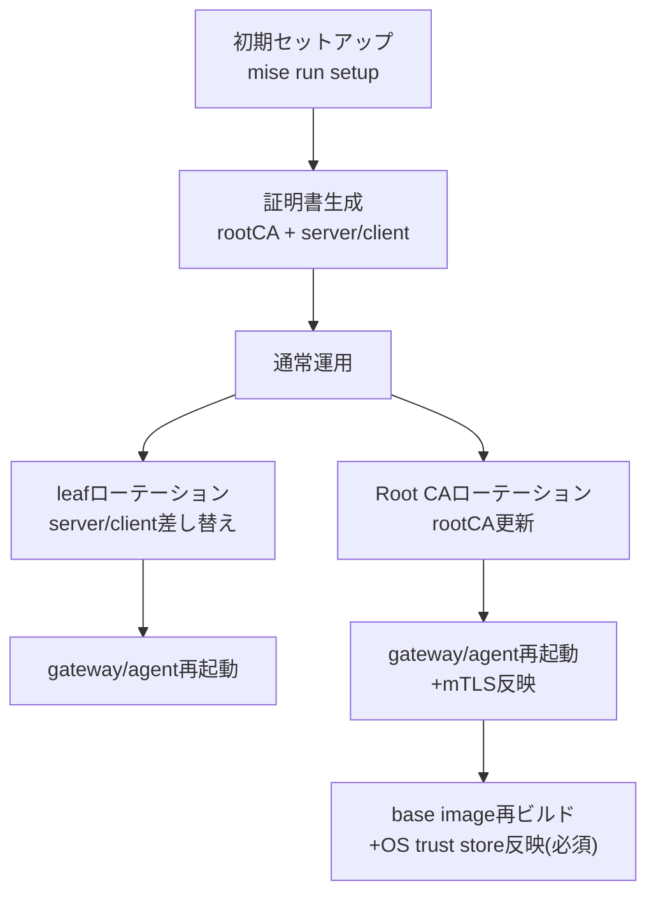

<!--
Where: docs/certificate-operations.md
What: Current certificate operation model, creation/rotation procedures, and validation evidence.
Why: Clarify end-to-end certificate operations for operators unfamiliar with internals.
-->
# 証明書運用（現状）

本ドキュメントは、**2026-02-23 時点**の実装に基づき、現行で実施可能な証明書運用を整理したものです。  
内部実装に詳しくない運用者が、証明書の作成（`mise`）からローテーションまでを一連で判断できることを目的にします。

クイックサマリ:
- 既定構成では Root CA は `CERT_DIR/rootCA.crt` の 1 つです。
- 初期作成は `mise run setup`（内部で `mise run setup:certs` を実行）で行えます。
- leaf だけ更新したい場合は `mise run rotate:certs:leaf:docker` / `mise run rotate:certs:leaf:containerd` を使えます。
- Root/leaf をまとめて更新する場合は `mise run rotate:certs:all:docker` / `mise run rotate:certs:all:containerd` を使えます（再ビルド込み）。
- `server.crt` / `server.key` / `client.crt` / `client.key` は、ホスト側差し替え + 対象サービス再起動で反映できます。
- OS trust store 側の Root CA 反映はビルド時固定のため、更新には再ビルドが必要です。

前提環境:
- 本書のコマンド例は Linux の `bash` と GNU coreutils（`install`, `md5sum`, `awk`）を前提にしています。

注意（用途）:
- `tools/cert-gen/generate.py` は `step certificate create --no-password --insecure` を使用します。
- そのため、本書の `cert-gen` ベース手順は開発・検証用途を前提とします。本番運用では組織標準の PKI 手順を優先してください。

---

## 1. 用語（最小）

- `Root CA`: サーバー/クライアント証明書を検証するための CA 証明書。
- `leaf 証明書`: 実際にサービスが提示するサーバー証明書やクライアント証明書（`server.crt` / `client.crt`）。
- `OS trust store`: コンテナ内 OS が参照する CA ストア（`/usr/local/share/ca-certificates`）。
- `mTLS 参照`: Gateway と Agent が gRPC 通信時に参照する証明書ファイル（`/app/config/ssl`）。

---

## 2. 証明書の種類と反映条件（現行）

前提（重要）:
- **既定構成では Root CA は 1 つ**です（`CERT_DIR/rootCA.crt`）。
- 本章では、同じ `rootCA.crt` が「どこで」「いつ」参照されるかを用途別に分解して記載しています。
- `AGENT_GRPC_CA_CERT_PATH` / `AGENT_GRPC_TLS_CA_CERT_PATH` を別値に設定した場合のみ、mTLS 用 CA を分離できます。

| 種類 | 主な用途 | 参照パス | 反映タイミング | 変更時に必要な操作 |
| --- | --- | --- | --- | --- |
| Root CA（同一 `rootCA.crt` の OS trust store 参照） | イメージ内 OS の信頼ストア | `/usr/local/share/ca-certificates/rootCA.crt` | **ビルド時**（BuildKit secret + `update-ca-certificates`） | イメージ再ビルド + 再デプロイ |
| Root CA（同一 `rootCA.crt` の mTLS 参照） | gRPC mTLS の相互検証 | `/app/config/ssl/rootCA.crt` | **プロセス起動時** | ホスト側差し替え + `gateway`/`agent` 再起動 |
| Gateway サーバ証明書 | HTTPS 受け口 | `/app/config/ssl/server.crt` + `/app/config/ssl/server.key` | **プロセス起動時** | ホスト側差し替え + `gateway` 再起動 |
| Agent サーバ証明書 | gRPC サーバ | `/app/config/ssl/server.crt` + `/app/config/ssl/server.key` | **プロセス起動時** | ホスト側差し替え + `agent` 再起動 |
| Gateway クライアント証明書 | Gateway->Agent mTLS クライアント認証 | `/app/config/ssl/client.crt` + `/app/config/ssl/client.key` | **チャネル生成時（起動時）** | ホスト側差し替え + `gateway` 再起動 |

補足:
- `docker-compose.*.yml` では `CERT_DIR` が `/app/config/ssl` に `:ro` マウントされます。
- そのため、コンテナ内で証明書を編集する運用は行えません（ホスト側差し替えのみ）。

---

## 3. 運用全体フロー



---

## 4. 運用手順（現状で実行可能）

### 4.1 初期作成（既存 `mise setup`）

`README` 既定の初期セットアップで証明書は生成されます。

```bash
mise trust
mise install
mise run setup
```

`mise run setup` は内部で `mise run setup:certs`（`uv run python tools/cert-gen/generate.py`）を実行します。
初回は `step certificate install` によりローカル trust store 更新が走るため、環境によっては `sudo` を要求します。
Root CA を再生成する場合は、既存の `CERT_DIR/rootCA.crt` を使って旧 trust を先に uninstall してから install します。
trust store への登録名は `--prefix ca-<CERT_DIR由来hash>_` を使用し、ファイル名が長くなりすぎないようにしています。
この prefix/hash 桁数は `tools/cert-gen/config.toml` の `[trust]`（`root_ca_prefix`, `root_ca_hash_length`）で変更できます。
再生成時は `/usr/local/share/ca-certificates` 配下の `prefix*.crt` も列挙して uninstall するため、同prefixの過去ファイルが残りにくい実装です。

生成先（既定）:
- `./.esb/certs/rootCA.crt`
- `./.esb/certs/rootCA.key`
- `./.esb/certs/server.crt`
- `./.esb/certs/server.key`
- `./.esb/certs/client.crt`
- `./.esb/certs/client.key`

確認コマンド:

```bash
ls -l ./.esb/certs
```

### 4.2 leaf 証明書ローテーション（Root CA据え置き）

#### 方法A: 外部で発行した証明書を配置

`./new/*` は例示です。実運用の配置先パスに置き換えてください。

```bash
export CERT_DIR="${CERT_DIR:-./.esb/certs}"
install -m 0644 ./new/server.crt "$CERT_DIR/server.crt"
install -m 0600 ./new/server.key "$CERT_DIR/server.key"
install -m 0644 ./new/client.crt "$CERT_DIR/client.crt"
install -m 0600 ./new/client.key "$CERT_DIR/client.key"
```

反映（Docker mode）:

```bash
docker compose -f docker-compose.docker.yml restart agent gateway
docker compose -f docker-compose.docker.yml ps
```

反映（containerd mode）:

```bash
docker compose -f docker-compose.containerd.yml restart agent gateway
docker compose -f docker-compose.containerd.yml ps
```

#### 方法B: 既存 Root CA のまま `cert-gen` で再発行

`tools/cert-gen/generate.py` は「既存ファイルがあるとスキップ」するため、leaf のみ再作成する場合は leaf ファイルを削除してから再実行します。

推奨コマンド（フル反映）:

```bash
mise run rotate:certs:leaf:docker
# containerd:
# mise run rotate:certs:leaf:containerd
```

同等の手動コマンド（ファイル再発行のみ）:

```bash
export CERT_DIR="${CERT_DIR:-./.esb/certs}"
rm -f "$CERT_DIR/server.crt" "$CERT_DIR/server.key" "$CERT_DIR/client.crt" "$CERT_DIR/client.key"
mise run setup:certs
```

その後、上記と同様に `gateway` / `agent` を再起動します。

### 4.3 Root CA ローテーション（再ビルド必須）

**重要:** Root CA を更新した場合、`gateway` / `agent` 再起動だけでは不十分です。  
OS trust store 側を新 Root CA に揃えるため、**再ビルド + 再デプロイは必須**です。

理由:
- Root CA は `mTLS 参照` と `OS trust store` の両方で使われます。
- `gateway` / `agent` 再起動で更新されるのは `mTLS 参照` 側のみです。
- 再ビルドを省略すると `/usr/local/share/ca-certificates/rootCA.crt` は旧 CA のまま残ります。

#### 方法A: 外部で発行した Root CA を配置

1. Root CA（必要なら leaf も）を差し替え

```bash
export CERT_DIR="${CERT_DIR:-./.esb/certs}"
install -m 0644 ./new/rootCA.crt "$CERT_DIR/rootCA.crt"
# 新しい Root CA が旧 CA と別鍵の場合は leaf も更新
# install -m 0644 ./new/server.crt "$CERT_DIR/server.crt"
# install -m 0600 ./new/server.key "$CERT_DIR/server.key"
# install -m 0644 ./new/client.crt "$CERT_DIR/client.crt"
# install -m 0600 ./new/client.key "$CERT_DIR/client.key"
```

2. `gateway` / `agent` 再起動（mTLS 参照側反映）

```bash
docker compose -f docker-compose.docker.yml restart agent gateway
# containerd:
# docker compose -f docker-compose.containerd.yml restart agent gateway
```

3. **必須**: OS trust store 反映のため再ビルド + 再デプロイ

```bash
export ROOT_CA_FINGERPRINT="$(md5sum "$CERT_DIR/rootCA.crt" | awk '{print $1}')"
docker compose -f docker-compose.docker.yml build os-base python-base gateway agent
docker compose -f docker-compose.docker.yml up -d --force-recreate gateway agent
# containerd:
# docker compose -f docker-compose.containerd.yml build os-base python-base runtime-node agent gateway
# docker compose -f docker-compose.containerd.yml up -d --force-recreate runtime-node agent gateway
```

#### 方法B: `cert-gen --force` で Root/leaf を同時再発行

推奨コマンド（再ビルド込み）:

```bash
mise run rotate:certs:all:docker
# containerd:
# mise run rotate:certs:all:containerd
```

同等コマンド（ファイル再生成のみ）:

```bash
mise run rotate:certs:all:files
```

`--force` は Root CA / server / client をすべて再生成し、Root CA のローカル trust install も再実行します。  
`rotate:certs:all:files` は非対話実行を優先し、`--no-trust-install` を付与してローカル trust install をスキップします。  
ローカル trust store へのインストールも必要な場合は、対話端末で `mise run setup:certs -- --force` を実行してください。  
この場合も、OS trust store 反映には前項 `3.` の再ビルド手順が**必須**です。

#### E2E 検証時の注意（`uv run e2e/run_tests.py`）

`uv run e2e/run_tests.py` は既定では `compose up` 時に毎回 `--build` を付けません。  
そのため、Root CA を更新しても再ビルドを明示しない限り、`/usr/local/share/ca-certificates/rootCA.crt` が旧CAのまま残ることがあります。

Root CA 更新後に E2E で反映確認する場合:

```bash
# docker
uv run e2e/run_tests.py --profile e2e-docker --build-only --build --verbose

# containerd
uv run e2e/run_tests.py --profile e2e-containerd --build-only --build --verbose
```

もしくは本番運用と同様に、`docker compose ... build ...` を明示実行した後に E2E を実行します。

### 4.4 反映後の最小確認

```bash
docker compose -f docker-compose.docker.yml ps
# または containerd compose ファイルを指定
```

必要に応じて証明書期限を確認:

```bash
export CERT_DIR="${CERT_DIR:-./.esb/certs}"
openssl x509 -in "$CERT_DIR/server.crt" -noout -subject -issuer -enddate
openssl x509 -in "$CERT_DIR/client.crt" -noout -subject -issuer -enddate
openssl x509 -in "$CERT_DIR/rootCA.crt" -noout -subject -issuer -enddate
```

### 4.5 Proxy 環境での build-time CA 注入（`uv sync` 向け）

`docker build` 中の `uv sync` は、ホストではなく **build コンテナの trust store** で TLS 検証します。  
社内 Proxy が TLS 中継（MITM）する環境では、Proxy 発行 CA を build 時にだけ渡してください。

```bash
export PROXY_CA_CERT_FILE=/path/to/corporate-proxy-ca.crt
docker compose -f docker-compose.docker.yml build provisioner gateway
# containerd:
# docker compose -f docker-compose.containerd.yml build provisioner gateway
```

補足:
- `PROXY_CA_CERT_FILE` は optional です（未設定時は既定値を利用）。
- CA は build ステージの `uv sync` にのみ使われ、runtime コンテナへマウントしません。

---

## 5. 適用範囲と制約（誤解しやすい点）

- 証明書のホットリロード（プロセス無再起動での自動反映）は非対応です。
- コンテナ内での `/app/config/ssl` 書き換えは非対応です（`read_only` マウント）。
- OS trust store の実行時更新は非対応です（設計上ビルド時固定）。
- `/app/config/ssl/rootCA.crt` の更新は **mTLS 経路に限定**されます。  
  containerd の image pull 用 TLS resolver は `config.DefaultCACertPath`（`/usr/local/share/ca-certificates/rootCA.crt`）を参照します。
- containerd 既定では `CONTAINER_REGISTRY_INSECURE=1` のため、内部レジストリ通信は HTTP 扱いとなり、CA 設定が使われない経路があります。
- `tools/cert-gen/config.toml` の既定有効期間は `ca/server/client` すべて `87600h`（約10年）です。必要に応じて短縮してください。

---

## 6. 検証結果（2026-02-23 / 2026-02-24）

以下を実行して、本ドキュメント記載内容を検証しました。

### 6.1 実行検証（コマンド実行済み）

1. Compose 解決結果の確認
   - `docker compose -f docker-compose.docker.yml config`（exit 0）
   - `docker compose -f docker-compose.containerd.yml config`（exit 0）
   - 確認内容: `CERT_DIR -> /app/config/ssl:ro`、gRPC/mTLS 証明書パス、`root_ca` build secret

2. Agent の証明書読み込み挙動（単体テスト）
   - `go test ./services/agent/cmd/agent -run 'TestGrpcServerOptions_EnabledByDefault|TestGrpcServerOptions_Disabled'`（exit 0）
   - 確認内容: TLS 有効時の証明書読込と TLS 無効化分岐

3. `mise run setup:certs` への引数受け渡し
   - `mise run setup:certs -- --help`（exit 0）
   - 確認内容: `--force`, `--no-trust-install` を指定可能

4. `mise` ローテーションタスクの存在確認
   - `mise tasks ls | rg '^rotate:certs:'`（exit 0）
   - 確認内容: `rotate:certs:leaf:*`, `rotate:certs:all:*`, `rotate:certs:all(guard)` を確認

5. Root CA 更新後の実動比較（2026-02-24）
   - `mise run rotate:certs:all:files` + `gateway/agent` 再起動のみ:
     - `/app/config/ssl/rootCA.crt` は新CAに更新
     - `/usr/local/share/ca-certificates/rootCA.crt` は旧CAのまま
   - `--build` 付き再ビルド後:
     - 両パスとも新CAに一致
   - 確認コマンド:
     - `docker exec <agent> md5sum /app/config/ssl/rootCA.crt /usr/local/share/ca-certificates/rootCA.crt`

### 6.2 静的確認（コード読解による根拠）

- OS trust store は build 時に `update-ca-certificates` 実行
- Gateway/Agent の mTLS 証明書は起動時にファイル読込
- Gateway の config reloader は routing/functions 対象であり、証明書監視はしない
- containerd image pull 用 TLS resolver は `config.DefaultCACertPath` を参照
- `tools/cert-gen/generate.py` は既存ファイルをスキップし、`--force` ですべて再生成
- `rotate:certs:all:files` は `--no-trust-install` 付きで非対話実行可能

### 6.3 検証の限界

- 本検証は「設定と起動時読込の事実」を対象としています。
- 実際の無停止性（切替中のコネクション断最小化）やクライアント互換性は、環境依存のためステージングで E2E 検証が必要です。

---

## Implementation references
- `README.md`
- `.mise.toml`
- `tools/cert-gen/generate.py`
- `tools/cert-gen/config.toml`
- `docs/docker-image-architecture.md`
- `services/common/Dockerfile.os-base`
- `services/common/Dockerfile.python-base`
- `docker-compose.docker.yml`
- `docker-compose.containerd.yml`
- `services/agent/cmd/agent/main.go`
- `services/agent/cmd/agent/main_test.go`
- `services/agent/internal/runtime/containerd/image.go`
- `services/agent/internal/config/constants.go`
- `services/gateway/services/grpc_channel.py`
- `services/gateway/lifecycle.py`
- `services/gateway/services/config_reloader.py`
