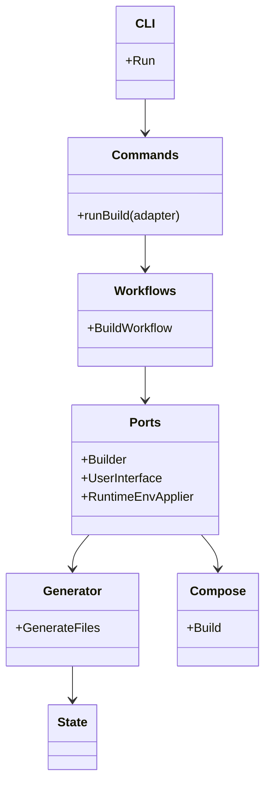
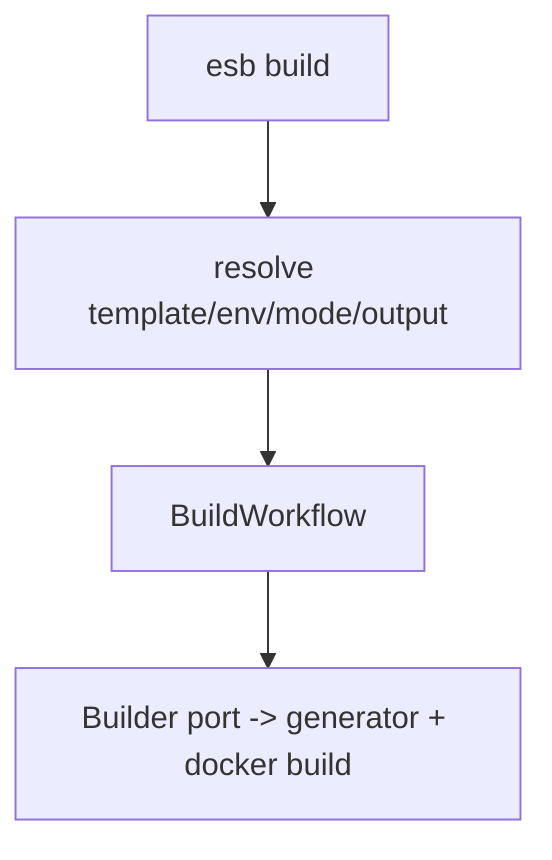

# `esb` CLI アーキテクチャ（build-only）

`esb` CLI (`cli/cmd/esb`) とジェネレータ (`cli/internal/generator`) は、SAM テンプレート → Docker ビルドまでを完結させるための基盤です。この文書では build-only 構成の設計、処理フロー、スキーマ追加時の手順を収録しています。

## コンポーネント概要

- `cli/cmd/esb`: `kong` ベースの CLI エントリポイント。`commands.Run` を呼び出して依存 (`Dependencies`) を注入し、`build`/`completion`/`version` を実行します。
- `cli/internal/commands`: CLI アダプタ。引数・対話入力の解決（`template`/`env`/`mode`/`output`/`env-file`/SAM Parameters）を担い、`workflows` へ DTO を渡します。
- `cli/internal/interaction`: TTY 判定とプロンプト入力（`Prompter`, 確認ダイアログ）を提供します。
- `cli/internal/helpers`: `RuntimeEnvApplier` などの共通アダプタを提供します。
- `cli/internal/ports`: ワークフローが使うインタフェース群（Builder/RuntimeEnvApplier/UserInterface）。
- `cli/internal/workflows`: ビジネスロジックのオーケストレーション（`build` のみ）。
- `cli/internal/generator`: Parser/Renderer で `template.yaml` を `functions.yml`/`routing.yml`・Dockerfile に変換し、`go_builder` で Docker イメージのビルドまで進みます。
- `cli/internal/compose`: `docker compose` を呼び出すユーティリティで、コントロールプレーンのビルドで利用します。
- `cli/internal/state`: ビルド時のコンテキスト構築に必要な最低限の状態を提供します（`generator.yml` は使用しません）。

## クラス図

## ビルド・起動フロー

## Workflows / Ports の概要

`build` は `workflows` へ移行済みです。CLI アダプタは入力収集とプロンプト処理のみを担当し、ワークフローは `ports` を通じて Builder/RuntimeEnvApplier などを呼び出します。出力は `ports.UserInterface` に統一し、現状は従来出力互換の `LegacyUI` を利用しています。

### Dependencies の構成

`Dependencies` は共有フィールドとビルド専用束に分割されています。

- 共有: `Out` / `Prompter` / `RepoResolver`
- コマンド束: `Build`

## Schema 追加・更新手順

1. `aws-sam-parser-go/tools/schema-gen/sam.schema.json` または `extensions/` を更新し、`generate.py` で `aws-sam-parser-go/schema/sam_generated.go` を再生成（`go-json-schema-generate` を使用）。  
2. 生成後、ESB 側でモジュールのバージョン（または `replace`）を更新し、必要であれば `parser.go` で新しいプロパティを `FunctionSpec` 等にマッピング。数値/文字列混在は `asString`/`asIntPointer` で正規化。  
3. `validator.go` で `gojsonschema` を使ったバリデーションを追加し、`.tmp/template.yml` や `e2e/fixtures/template.yaml` などで `validateSAMTemplate` テストを回して新しいフィールドを含むか確認。  
4. `cli/internal/generator/templates` の Dockerfile/functions/routing テンプレートに必要な変数（`Functions`, `Events`）を追加し、`renderer.go` がロジックを反映。`renderer_test.go` を用意して YAML 出力を検証。  
5. このドキュメントや `docs/generator-architecture.md` を更新し、新しいフィールド一覧と検証手順を記録。E2E を `uv run python e2e/run_tests.py --reset --parallel` で再実行して生成/Compose が通ることを確認。

## 検証ポイント

- `cd cli && go test ./...` でユニットを通す。`cli/internal/generator` への `validator_test` を含める。  
- `uv run python e2e/run_tests.py --parallel --reset` で `e2e-docker`/`e2e-containerd` 両プロファイルが通るかを確認。  
- `esb build --env <env>` のみで、生成・ビルドが完結することを確認。

このドキュメントは `esb` CLI の開発者向けに、クラス図・処理フロー・スキーマ更新手順をまとめたものです。常に `cli/internal/generator`、`cli/internal/compose`、`cli/internal/state` が同期していることを意識して変更を加えてください。
