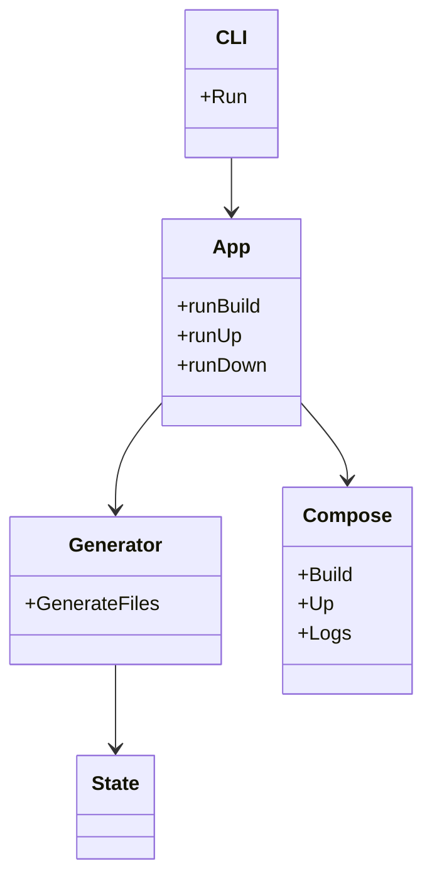
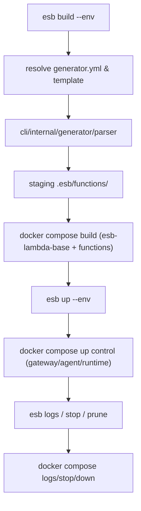
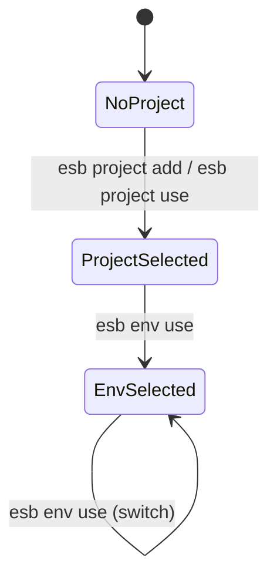

# `esb` CLI アーキテクチャ

`esb` CLI (`cli/cmd/esb`) とジェネレータ (`cli/internal/generator`) は、SAM テンプレート → Compose 運用の全工程を完結させるための基盤です。この文書では CLI 利用者向けの設計、処理フロー、スキーマ追加時の手順を収録しています。

## コンポーネント概要

- `cli/cmd/esb`: `kong` ベースの CLI エントリポイント。`app.Run` を呼び出して依存 (`Dependencies`) を注入し、`build`/`up`/`down`/`logs`/`stop`/`prune`/`env`/`project` などのコマンドを実行します。
- `cli/internal/app`: コマンドごとのリクエスト構造とステート解決ロジック (`resolveCommandContext`) を持ち、`compose` へ依頼するための `BuildRequest`/`UpRequest` 等を組み立てます。対話型プロンプト (`Prompter`) による環境・プロジェクト選択もここで行われます。
- `cli/internal/generator`: Parser/Renderer で `template.yaml` を `functions.yml`/`routing.yml`・Dockerfile に変換し、`go_builder` で Docker イメージや Compose 設定まで進みます。
- `cli/internal/compose`: `docker compose` を呼び出すユーティリティで、`ResolveComposeFiles` により `docker-compose.yml` + mode 固有ファイルを選びます。
- `cli/internal/state`: `generator.yml` や `global_config` を読み込んで `Context` を管理します。`applyRuntimeEnv` により、解決されたコンテキストに基づいた `ESB_` 環境変数の適用を一元的に行います。

## クラス図

## ビルド・起動フロー

## generator.yml とステートマシン

`generator.yml` は `app.name`, `app.tag`, `app.last_env`, `PathsConfig`, `Environments` を含みます。CLI は次のレイヤで状態を解決します。

1. Bootstrap: `~/.esb/config.yaml` を確実に作成 (`projects` + `last_used` を保持)。
2. Project 選択: `--template` > `ESB_PROJECT` > `projects.last_used`。複数ある場合は対話型セレクタを表示。
3. Env 選択: `--env` > `ESB_ENV` > `app.last_env`。複数ある場合は対話型セレクタを表示。
4. Detector: `resolveCommandContext` で `Context` を解決し、`applyRuntimeEnv` で環境変数を適用後、各コマンドへ連携。

`esb project use` は `projects[*].last_used` を更新し、`esb env use` は `app.last_env` と `projects[*].last_used` を更新します。`export` 行は stdout、メッセージは stderr に出力されます。

`ESB_PROJECT` / `ESB_ENV` が不正な場合は対話で `unset` を促し、非対話環境では `--force` 指定時のみ自動 `unset` します。

## Schema 追加・更新手順

1. `cli/internal/generator/schema/sam.schema.json` に必要なフィールド/定義を追加し、`sam.schema.json` の `$ref` 参照を使って `sam_generated.go` を再生成（`go-jsonschema` を使用）。  
2. `sam_generated.go` を再生成後、`Parser` 側（`parser.go`）で新しいプロパティを `FunctionSpec` 等にマッピング。数値/文字列混在は `asString`/`asIntPointer` で正規化。  
3. `validator.go` で `gojsonschema` を使ったバリデーションを追加し、`.tmp/template.yml` や `e2e/fixtures/template.yaml` などで `validateSAMTemplate` テストを回して新しいフィールドを含むか確認。  
4. `cli/internal/generator/templates` の Dockerfile/functions/routing テンプレートに必要な変数（`Functions`, `Events`）を追加し、`renderer.go` がロジックを反映。`renderer_test.go` を用意して YAML 出力を検証。  
5. このドキュメントや `docs/generator-architecture.md` を更新し、新しいフィールド一覧と検証手順を記録。E2E を `uv run python e2e/run_tests.py --reset --parallel` で再実行して生成/Compose が通ることを確認。

## 検証ポイント

- `cd cli && go test ./...` でユニットを通す。`cli/internal/generator` への `validator_test` を含める。  
- `uv run python e2e/run_tests.py --parallel --reset` で `e2e-docker`/`e2e-containerd` 両プロファイルの 39 テストが通るかを確認。  
- `esb build --env <env>` → `esb up --env <env>` → `esb logs/stop/prune` の組み合わせで `docker compose` の状態遷移が正しいか確認。

## ステートマシン

CLI の状態遷移は「Bootstrap → Project → Env → Detector」の四層モデルで整理します。Detector レイヤは既存の `State` (running/stopped 等) を維持し、選択前の状態遷移は次の通りです。

Detector レイヤは `cli/internal/app/command_context.go` を起点に `resolveCommandContext` が解決し、Compose 操作へ引き継ぎます。

このドキュメントは `esb` CLI の開発者向けに、クラス図・処理フロー・スキーマ更新手順をまとめたものです。常に `cli/internal/generator`、`cli/internal/compose`、`cli/internal/state` が同期していることを意識して変更を加えてください。
