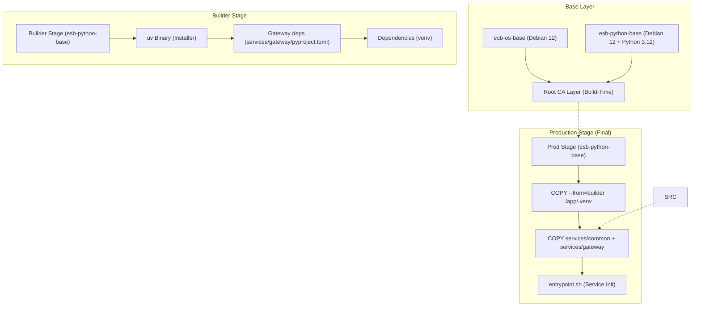

# Docker イメージ設計アーキテクチャ

ESB (Edge Serverless Box) における Docker イメージの設計思想、原則、およびビルドパイプラインの構造について記述します。本ドキュメントは、システムの堅牢性とメンテナンス性を維持するための技術的指針となります。

---

## 1. 設計思想と原則

ESB のイメージ設計は、以下の 3 つの核心的原則に基づいています。

### 1.1 不変性と一貫性 (Immutability & Consistency)
OS およびランタイムの断片化（例：Alpine と Debian の混在）は、ライブラリ互換性 (libc) やパッケージ管理の複雑化を招きます。
- **原則**: 全てのシステムサービスは Debian 12 を共通基盤とし、Python サービスは `esb-python-base`、非 Python サービスは `esb-os-base` を起点とする。
- **利点**: バイナリ互換性の 100% 確保、およびセキュリティ脆弱性スキャンの効率化。

### 1.2 隔離性とセキュリティ (Isolation & Security)
広すぎるビルドコンテキストは、機密情報の漏洩リスクを高め、ビルドキャッシュの効率を低下させます。
- **原則**: Dockerfile では必要なサブディレクトリのみを `COPY` し、依存解決はサービス固有の定義を参照する。
- **実装例**: `services/gateway/pyproject.toml` を使って依存を解決し、`services/common` と `services/gateway` のみをコピーする。
- **利点**: 無関係な変更でキャッシュが壊れない、意図しないファイル依存を排除できる。

### 1.3 決定論的信頼 (Deterministic Trust)
動的な証明書設定は、実行時の予期せぬ失敗（x509 エラー）の温床となります。
- **原則**: Root CA はビルド時に焼き込み、存在しなければビルドを失敗させる。
- **利点**: 実行時の信頼ストア更新が不要になり、最小権限に寄せられる。

---

## 2. ビルドパイプライン構造

ESB のビルドプロセスは、効率的なキャッシュ利用とクリーンな最終イメージ生成のために、マルチステージビルドを標準化しています。

---

## 3. 重要コンポーネントの詳解

### 3.1 Root CA のビルド時焼き込み
Root CA はビルド時にイメージへ焼き込み、実行時に更新しません。
- **BuildKit secret `esb_root_ca`**: `${ESB_CERT_DIR}/rootCA.crt` をビルド時に渡し、`/usr/local/share/ca-certificates/esb-rootCA.crt` として配置します。
- **ビルド時更新**: `update-ca-certificates` をビルドで実行し、実行時の権限要件を排除します。
- **適用対象**: `esb-os-base` と `esb-python-base` の両方で同一の CA ストアを保持します。
- **BuildKit 必須**: `docker build --secret` / `docker compose build` の build secrets を利用します。
- **ローテーション**: CA を更新する場合はイメージを再ビルドします。

### 3.2 パッケージ管理 (`uv`)
ビルドの高速化と再現性のために `uv` を採用しています。
- **開発用バイナリの同梱**: `prod` イメージにも `/usr/local/bin/uv` を同梱し、運用時のライブラリデバッグを容易にしています。

### 3.3 モード別イメージ分離
Firecracker を使う構成は必要なバイナリが多くサイズが肥大化するため、用途別に Dockerfile を分離しています。
- **Runtime Node**: containerd 用は `services/runtime-node/Dockerfile`、Firecracker 用は `services/runtime-node/Dockerfile.firecracker`。
- **Gateway**: 通常用は `services/gateway/Dockerfile`、Firecracker 用は `services/gateway/Dockerfile.firecracker`。

---

## 4. 今後の拡張への指針

- **非 root 実行**: Gateway は Docker/containerd モードで非 root で動作します。`~/.esb/certs`
  を読むため、`ESB_UID`/`ESB_GID` をホストの UID/GID に合わせてビルドしてください。
  Firecracker モードは WireGuard と `/dev/net/tun` の都合で root 実行を継続し、
  `docker-compose.fc.yml` で `user: 0:0` を指定しています。
- **C 拡張への対応**: 新たなライブラリを追加する際は、`builder` ステージでビルドされたバイナリが
  `prod` ステージで必要とする共有ライブラリ (`.so`) を、OS パッケージとして `apt-get` 等で追加することを忘れないでください。
