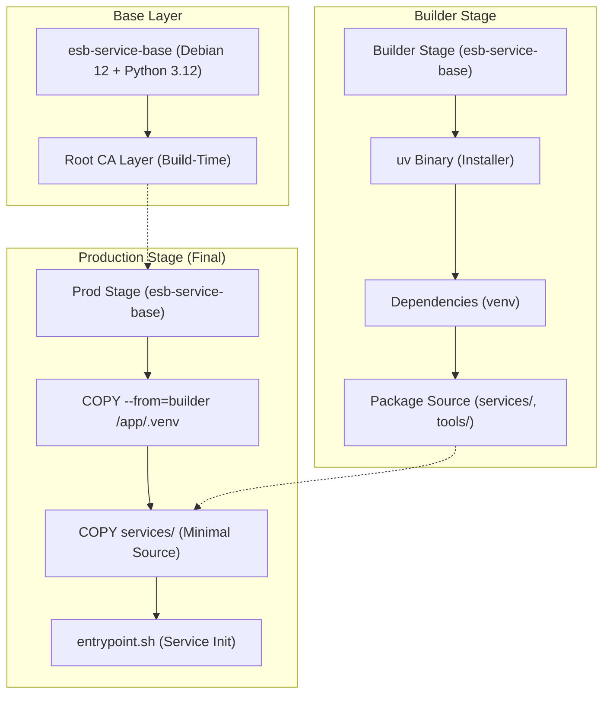

# Docker イメージ設計アーキテクチャ

ESB (Edge Serverless Box) における Docker イメージの設計思想、原則、およびビルドパイプラインの構造について記述します。本ドキュメントは、システムの堅牢性とメンテナンス性を維持するための技術的指針となります。

---

## 1. 設計思想と原則

ESB のイメージ設計は、以下の 3 つの核心的原則に基づいています。

### 1.1 不変性と一貫性 (Immutability & Consistency)
OS およびランタイムの断片化（例：Alpine と Debian の混在）は、ライブラリ互換性 (libc) やパッケージ管理の複雑化を招きます。
- **原則**: 全てのシステムサービスは `python:3.12-slim-bookworm` (Debian 12) をベースとする `esb-service-base` を起点とする。
- **利点**: バイナリ互換性の 100% 確保、およびセキュリティ脆弱性スキャンの効率化。

### 1.2 隔離性とセキュリティ (Isolation & Security)
広すぎるビルドコンテキストは、機密情報の漏洩リスクを高め、ビルドキャッシュの効率を低下させます。
- **原則**: 各サービスは、自身のディレクトリ (`services/X`) をコンテキストとしてビルドを完結させる。
- **実装例**: `docker-compose.yml` において `context: services/gateway` のように設定し、プロジェクトルートの全ファイルをビルドに持ち込まない。
- **利点**: 意図しないファイル依存の排除とビルド時間の短縮。

### 1.3 決定論的信頼 (Deterministic Trust)
動的な証明書設定は、実行時の予期せぬ失敗（x509 エラー）の温床となります。
- **原則**: Root CA はビルド時に焼き込み、存在しなければビルドを失敗させる。
- **利点**: 実行時の信頼ストア更新が不要になり、最小権限に寄せられる。

---

## 2. ビルドパイプライン構造

ESB のビルドプロセスは、効率的なキャッシュ利用とクリーンな最終イメージ生成のために、マルチステージビルドを標準化しています。

---

## 3. 重要コンポーネントの詳解

### 3.1 Root CA のビルド時焼き込み
Root CA はビルド時にイメージへ焼き込み、実行時に更新しません。
- **BuildKit secret `esb_root_ca`**: `${ESB_CERT_DIR}/rootCA.crt` をビルド時に渡し、`/usr/local/share/ca-certificates/esb-rootCA.crt` として配置します。
- **ビルド時更新**: `update-ca-certificates` をビルドで実行し、実行時の権限要件を排除します。
- **BuildKit 必須**: `docker build --secret` / `docker compose build` の build secrets を利用します。
- **ローテーション**: CA を更新する場合はイメージを再ビルドします。

### 3.2 パッケージ管理 (`uv`)
ビルドの高速化と再現性のために `uv` を採用しています。
- **開発用バイナリの同梱**: `prod` イメージにも `/usr/local/bin/uv` を同梱し、運用時のライブラリデバッグを容易にしています。

---

## 4. 今後の拡張への指針

- **非 root 実行への移行**: Gateway は 8443 で待ち受けるため特権ポート要件は緩和されていますが、WireGuard/iptables 等の権限要件が残っています。将来的に `USER` 命令を使用して非 root 化する場合は、権限分離や `setcap` の検討が必要です。
- **C 拡張への対応**: 新たなライブラリを追加する際は、`builder` ステージでビルドされたバイナリが `prod` ステージで必要とする共有ライブラリ (`.so`) を、OS パッケージとして `apt-get` 等で追加することを忘れないでください。
