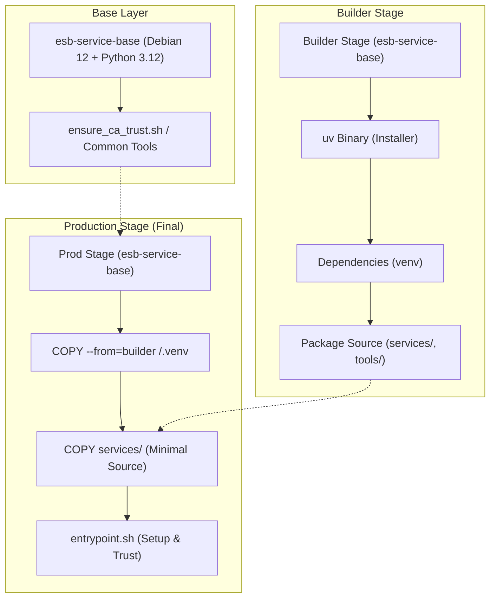

# Docker イメージ設計アーキテクチャ

ESB (Edge Serverless Box) における Docker イメージの設計思想、原則、およびビルドパイプラインの構造について記述します。本ドキュメントは、システムの堅牢性とメンテナンス性を維持するための技術的指針となります。

---

## 1. 設計思想と原則

ESB のイメージ設計は、以下の 3 つの核心的原則に基づいています。

### 1.1 不変性と一貫性 (Immutability & Consistency)
OS およびランタイムの断片化（例：Alpine と Debian の混在）は、ライブラリ互換性 (libc) やパッケージ管理の複雑化を招きます。
- **原則**: 全てのシステムサービスは `python:3.12-slim-bookworm` (Debian 12) をベースとする `esb-service-base` を起点とする。
- **利点**: バイナリ互換性の 100% 確保、およびセキュリティ脆弱性スキャンの効率化。

### 1.2 隔離性とセキュリティ (Isolation & Security)
広すぎるビルドコンテキストは、機密情報の漏洩リスクを高め、ビルドキャッシュの効率を低下させます。
- **原則**: 各サービスは、自身のディレクトリ (`services/X`) をコンテキストとしてビルドを完結させる。
- **利点**: 意図しないファイル依存の排除とビルド時間の短縮。

### 1.3 決定論的信頼 (Deterministic Trust)
動的な証明書設定は、実行時の予期せぬ失敗（x509 エラー）の温床となります。
- **原則**: 「証明書が存在しない限り起動を許可しない (Fail-Fast)」を徹底する。
- **利点**: 起動時に問題を検知し、安全でない状態での運用を物理的に阻止。

---

## 2. ビルドパイプライン構造

ESB のビルドプロセスは、効率的なキャッシュ利用とクリーンな最終イメージ生成のために、マルチステージビルドを標準化しています。

---

## 3. 重要コンポーネントの詳解

### 3.1 共通信頼ユーティリティ (`ensure_ca_trust.sh`)
全てのイメージに `/usr/local/bin/ensure_ca_trust.sh` を配置し、エントリポイントから呼び出す形式です。
- **環境変数 `REQUIRE_CA_TRUST=true`**: これがセットされている場合、Root CA が見つからなければステータスコード `1` で終了します。
- **環境変数 `SSL_CERT_DIR`**: ホストからマウントされた証明書を探索する標準パス。

### 3.2 パッケージ管理 (`uv`)
ビルドの高速化と再現性のために `uv` を採用しています。
- **開発用バイナリの同梱**: `prod` イメージにも `/usr/local/bin/uv` を同梱し、運用時のライブラリデバッグを容易にしています。

---

## 4. 今後の拡張への指針

- **非 root 実行への移行**: 現在は 443 ポートのリスニング等のため root で動作していますが、将来的に `USER` 命令を使用して非 root 化する場合は、特権ポートの回避（8443等）と `setcap` の検討が必要です。
- **C 拡張への対応**: 新たなライブラリを追加する際は、`builder` ステージでビルドされたバイナリが `prod` ステージで必要とする共有ライブラリ (`.so`) を、OS パッケージとして `apt-get` 等で追加することを忘れないでください。
