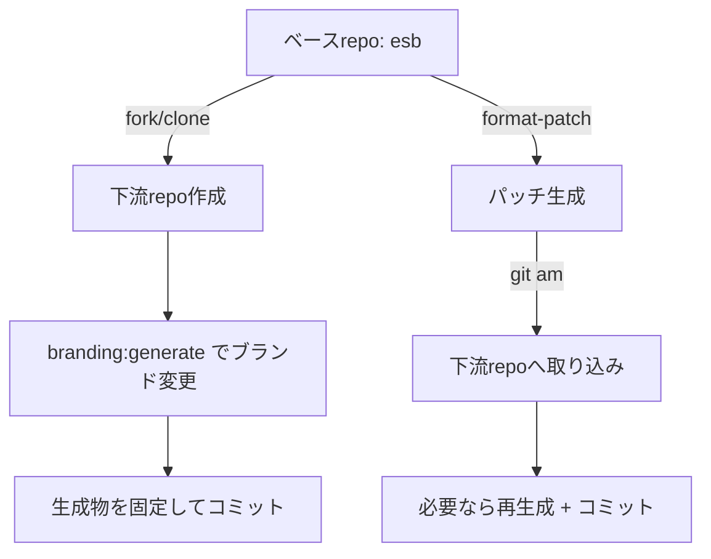

<!--
Where: docs/downstream-branding-flow.md
What: Downstream branding + base patch intake flow.
Why: Keep downstream secrets out of base and keep updates reproducible.
-->
# 下流リポジトリ運用フロー（ブランド変更とベース取り込み）

## 前提
- ベースリポジトリは常に `brand: esb` を維持する（下流固有情報は一切含めない）。
- 下流リポジトリでのみブランド変更を実行する。
- `.branding.env` は下流でのみ使うが、**追跡しない**。
- ベースの変更は **パッチとして取り込む**（履歴共有前提）。

## 全体フロー


## 手順詳細

### 1) 下流リポジトリ作成
```bash
# ベースから派生（fork or clone）
git clone <base-repo-url> <downstream-repo>
cd <downstream-repo>
git remote add upstream <base-repo-url>
```

### 2) 下流でブランド変更（初回）
```bash
# 例: acme に変更
mise run branding:generate -- --brand acme
# もしくは
uv run python tools/branding/generate.py --brand acme

git add .
git commit -m "Branding: acme"
```

### 3) ベース変更のパッチ生成（ベース側）
```bash
# 取り込み基点（タグ/コミット）からパッチを作成
git format-patch <BASE_COMMIT>..HEAD -o /tmp/branding-patches
```

### 4) 下流でパッチ適用
```bash
git am /tmp/branding-patches/*.patch
```

### 5) 取り込み後の再生成（必要な場合）
以下の条件に当たる場合、下流で再生成して差分を固定します。
- テンプレートや generator が更新された
- compose / Dockerfile / runtime 設定のテンプレが更新された

```bash
mise run branding:generate -- --brand <downstream_brand>
git add .
git commit -m "Branding: regenerate for upstream changes"
```

## セキュリティ確認（ベース側）
ベースに下流情報が混入しないことを、パッチ作成前に確認します。

```bash
# 例: 下流ブランド名が acme の場合
rg -n "acme" -S
git status -sb
git diff --stat
git ls-files .branding.env
```

## メモ
- 下流は履歴共有（fork/派生）を強く推奨。  
  履歴が共有できない場合は `git diff` / `git apply` を使うが、衝突コストが増える。
- ベースの `config/branding.yaml` は常に `brand: esb` のまま維持する。
