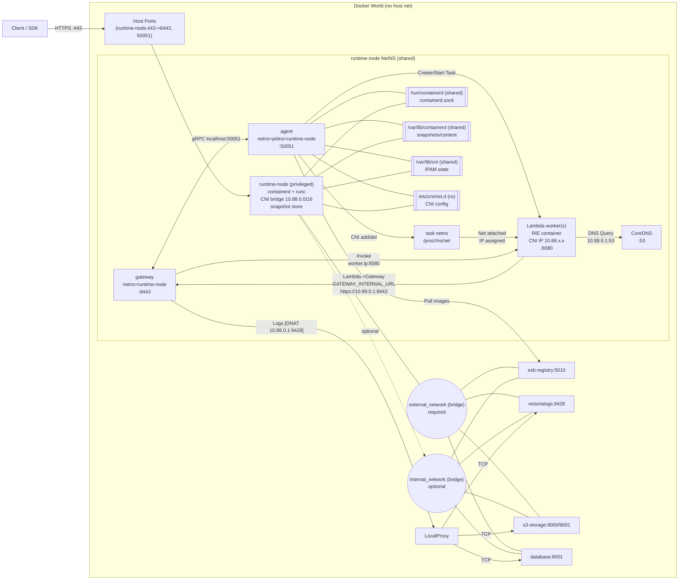
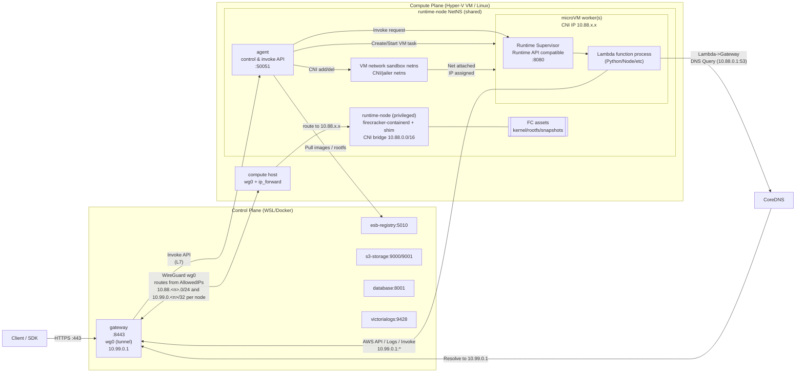

<!--
Where: docs/firecracker-roadmap.md
What: Firecracker migration roadmap and design milestones.
Why: Keep Phase C scope and sequencing aligned across the team.
-->
# Firecracker 導入ロードマップ（Phase B 実装を起点に Phase C へ）

## 目的とスコープ
- **現行の Phase B 実装**を出発点として、Phase C で Firecracker へ移行する。
- **外側インターフェースは維持**する（Gateway API、`worker.ip:8080`、`sitecustomize`、`10.88.0.1` 互換）。
- **ホストのネットワーク改変を最小化**し、Docker の世界に閉じる。

---

# Phase C に向けた AS IS / TO BE

## AS IS（Phase B: 現行実装）

### 構成の要点
- **runtime-node 内で containerd + runc + CNI** を実行（CNI bridge `10.88.0.0/16`）。
- **agent/coredns は runtime-node の NetNS を共有**し、gateway は Control 側の独立コンテナで起動する。
- **agent は PIDNS を共有**し、`/proc/<pid>/ns/net` を使って CNI add/del を行う。
  - 参照する PID は **containerd task/shim の実行 PID**。
- **gateway は 8443 で待ち受け、ホスト 443 を外部公開**し、runtime-node が 50051 を公開する。
- **registry / s3-storage / database / victorialogs** は external_network 上で稼働。
- **CoreDNS により `10.88.0.1` での名前解決を提供**（S3/Dynamo/VictoriaLogs）。
  - Lambda VM の nameserver として `10.88.0.1` を設定。
  - CNI bridge から外部への通信は **MASQUERADE (SNAT)** を利用。
  - registry は TLS/SAN の都合で **論理名解決**（`esb-registry:5010` を直接使用）。
  - Compute からは WG 経由で `10.99.0.1:5010` に集約し、gateway 内 HAProxy で各サービスへ転送する。
- **sitecustomize による boto3 hook / trace 伝播 / logs** は現状維持。
- **Gateway は gRPC Agent を常時利用**（切替フラグは廃止）。

### Phase B 構成図（旧構成の参考）

※ 現行の compose は gateway を Control 側に分離しているため、以下の図は旧構成の参考として扱う。



### DNS 前提（Phase B 確定）
- `10.88.0.1` は **host ではなく runtime-node の CNI bridge gateway 兼 DNS サーバ**。
- CNI bridge から外部（external_network）への通信は **iptables MASQUERADE** で処理。
- 固定 IP 依存は廃止し、**各コンポーネントが論理名を使用して解決**する。
- CoreDNS は `runtime-node` のサイドカーとして動作し、Docker 内部 DNS へフォワードする。
- registry は **DNS 解決**（`esb-registry:5010` を直接使用）。
- 具体的な解決先（Containerd モード）:
  - `s3-storage` -> `esb-s3-storage:9000` (Docker DNS)
  - `database` -> `esb-database:8000` (Docker DNS)
  - `victorialogs` -> `esb-victorialogs:9428` (Docker DNS)

---

## TO BE（Phase C: Firecracker 置換後）

### 目標の要点
- **runtime-node 内の runtime を runc → firecracker runtime/shim へ差し替える**。
- **Lambda worker は microVM**（1 function = 1 microVM）に変更。
- **Gateway/Agent/外部ネットワークの関係は維持**（Phase B の外形は崩さない）。
- **sitecustomize / boto3 hook / Trace 伝播**は維持。
- **worker への Invoke は最終的に `worker.ip:8080` を維持**（初期は L7 経由で迂回）。

### Runtime Supervisor の責務（Phase C 固定）
- **Runtime API 互換 + Invoke 入口(8080) + ログ/メトリクス中継**までを担う。
- 画像 pull / CNI / DNAT 管理は **runtime-node/agent 側**に残す（責務を広げない）。

### Phase C 構成図（Control/Compute 分離・L7 先行）

#### Compute VM に入るもの（想定）
- **runtime-node**: firecracker-containerd / shim / jailer / devmapper / CNI / iptables (MASQUERADE)
- **agent**: gRPC API、CNI add/del、runtime 切替 (`CONTAINERD_RUNTIME`)、L7 代理（暫定）
- **coredns**: Lambda VM からの問い合わせに対し `10.99.0.1` へ解決するサイドカー
- **FC assets**: kernel/rootfs/snapshots（`/var/lib/firecracker-containerd/runtime`）

#### 通信方針（L7 → L3 移行）
- **L7 先行（当面）**: Gateway → Agent（gRPC）→ Supervisor への L7 代理で Invoke を成立させる。
- **L3 移行（最終）**: **Gateway コンテナ内でトンネルを終端**し、WSL ホストにはルートを入れずに
  `10.88.0.0/16` を Compute VM へ通す（`worker.ip:8080` 直アクセスへ復帰）。



※補足: Phase C の CNI add/del は **「VM 内部に IP を直接付与」ではなく、tap/bridge が netns に接続される**ことを指す。VM 内の IP 付与は別管理（DHCP/静的）である前提。

### AS IS → TO BE の差分（Phase C）
| 項目 | AS IS（Phase B） | TO BE（Phase C） |
| --- | --- | --- |
| Runtime | runc | firecracker runtime/shim |
| Worker 実体 | RIE コンテナ | microVM + Runtime Supervisor |
| 入口 | `worker.ip:8080` | `vm.ip:8080`（最終維持） |
| Invoke 経路 | 直接（L3） | **L7 先行 → L3 へ復帰** |
| CNI/IP | 10.88.x.x (CNI bridge) | 10.88.x.x (維持) |
| sitecustomize | あり | あり（VM 内へ配置） |
| registry | `esb-registry:5010` 直指定 | 同じ |
| 10.88.0.1 DNS | runtime-node 内 | 同じ |
| agent の CNI 付与 | `/proc/<pid>/ns/net` | **同様の PID が参照可能であることが前提** |

---

## Phase C Go/No-Go（最優先の判定）

**Go:** containerd が返す task/shim/jailer の PID から netns が参照でき、**現方式の CNI add/del が成立**する。  
**No-Go:** 参照できない（jailer が別 PID/別 ns、または netns を持たない）。  
→ **No-Go の場合は設計変更が必須**（例: CNI 操作を runtime-node 側へ移す／firecracker runtime が返す PID に合わせて agent を改修）。

---

## Phase C 切り替え運用（現行との共存）

- 基本は **Phase B の構成を維持**し、Firecracker 検証は compose mixin で切り替える。
- 例: `CONTAINERD_RUNTIME=aws.firecracker docker compose -f docker-compose.containerd.yml up -d`
- runtime-node/agent の Firecracker 設定は `docker-compose.containerd.yml` + `CONTAINERD_RUNTIME` に集約する。

---

## Phase C 移行ステップ（案）

### C-0: 前提固定
- Phase B の E2E を合格基準として固定。
- `worker.ip:8080` / `sitecustomize` / `10.88.0.1` (DNS) 互換は **維持前提**。

### C-1: runtime-node 内で firecracker runtime を動作確認
- containerd の runtime 設定に firecracker を追加。
- runtime-node へ firecracker-containerd / shim / firecracker / jailer と runtime 設定を導入。
- `ctr` で firecracker runtime による起動が通ることを確認。
  - `/etc/containerd/firecracker-runtime.json` を使用（kernel/rootfs は `/var/lib/firecracker-containerd/runtime`）
  - `/etc/firecracker-containerd/config.toml` は runtime-node イメージに同梱（`services/runtime-node/firecracker-containerd.toml`）。
    `pool_name` / `root_path` / `base_image_size` は `DEVMAPPER_*` と整合させる。
  - Compute Node 側のバイナリ・設定・kernel/rootfs・devmapper の準備は手順化（TBD）。
  - Docker を自分でインストールする場合は **storage driver を overlay2 に固定**する（`/etc/docker/daemon.json`）。
  - devmapper の thin-pool は **再初期化しない**（既存 pool がある状態で `dmsetup reload/create` を繰り返すと `different pool cannot replace a pool` が発生する）。
    その場合は Compute Node で `dmsetup remove_all` と `losetup -D` を実行してから `runtime-node` を再起動する。
  - プロビジョニング手順（TBD）は pool 既存時に reload を行わず、再初期化を避ける。
  - 検証手順（TBD）で `cmd_firecracker` / `fc_kernel` / `devmapper_pool` が OK になっていることを確認する。
  - `firecracker-containerd` を起動し、`firecracker-ctr` で起動確認を行う。
  - **C-1 完了確認（実測ログ）**
    - rootfs は **agent 入りの `rootfs.img`** が必須（`make image` で生成）。Quickstart の rootfs だけだと `vsock dial refused` で失敗する。
    - `firecracker-ctr` は **`--snapshotter devmapper`** を必ず指定する（overlayfs だと stub drive で失敗する）。

```bash
# Compute Node で rootfs を作成（firecracker-containerd）
git clone https://github.com/firecracker-microvm/firecracker-containerd.git
cd firecracker-containerd
make image

sudo mkdir -p /var/lib/firecracker-containerd/runtime
sudo cp tools/image-builder/rootfs.img /var/lib/firecracker-containerd/runtime/default-rootfs.img
sudo curl -fsSL -o /var/lib/firecracker-containerd/runtime/default-vmlinux.bin \
  https://s3.amazonaws.com/spec.ccfc.min/img/quickstart_guide/x86_64/kernels/vmlinux.bin

# firecracker-containerd 起動
sudo firecracker-containerd \
  --config /etc/firecracker-containerd/config.toml \
  --address /run/firecracker-containerd/containerd.sock \
  --root /var/lib/firecracker-containerd \
  --state /run/firecracker-containerd

# C-1 smoke
sudo firecracker-ctr --address /run/firecracker-containerd/containerd.sock \
  --namespace default images pull --snapshotter devmapper \
  docker.io/library/alpine:latest
sudo firecracker-ctr --address /run/firecracker-containerd/containerd.sock \
  --namespace default run --rm --snapshotter devmapper --runtime aws.firecracker \
  docker.io/library/alpine:latest fc-smoke /bin/sh -c 'echo hello from firecracker'
```
  - 成功条件: `hello from firecracker` が出力されること。

### C-1.5: L7 先行で Invoke 経路を成立
- Gateway → Agent（gRPC）→ Supervisor への L7 代理で Invoke を通す。
- `worker.ip:8080` への直アクセスは **一時停止**（L3 未整備のため）。
- Gateway は `AGENT_INVOKE_PROXY=true` を有効化し、Agent の L7 代理を使用する。

#### L7 Invoke 仕様（暫定）
- **Gateway → Agent へ gRPC で Invoke を委譲**し、Agent が `http://worker.ip:8080` へ代理送信する。
- **RIE 互換パス**は維持（`/2015-03-31/functions/function/invocations`）。
- **Trace 伝播**: `X-Amzn-Trace-Id` と `X-Amz-Client-Context` を Gateway → Agent → Worker で透過。
- **成功/失敗判定**は Gateway 既存ロジックを踏襲（`X-Amz-Function-Error` や 5xx を基準）。
- **Readiness Check** は L7 代理モードではスキップ（Gateway から worker.ip に到達できないため）。

**想定 API（Agent 側, gRPC）**
- `InvokeWorkerRequest`:
  - `container_id`
  - `function_name`
  - `payload`（bytes）
  - `timeout_ms`
  - `headers`（任意、Trace 伝播用）
- `InvokeWorkerResponse`:
  - `status_code`
  - `headers`
  - `body`（bytes）
  - `function_error`（`X-Amz-Function-Error`）

### C-1.6: L3 へ移行（`worker.ip:8080` へ復帰）
- **方針（B）**: **Gateway コンテナ内でトンネルを終端し、WSL ホストにはルートを入れない**。
  Gateway コンテナ内のルートで `10.88.x.x` を Compute VM に送る。

#### 実装計画（B: gateway 内トンネル）
**Goal:** Gateway コンテナから `worker.ip:8080` へ直アクセス可能にする（L7 代理を外せる状態）。

1) **サブネット設計（必須）**
   - node1: `10.88.1.0/24`
   - node2: `10.88.2.0/24`
   - 以降、**node ごとに /24 を固定**（Control 側の経路衝突を防ぐ）。

2) **Gateway コンテナにトンネル終端を実装**
   - トンネル方式は **WireGuard（ユーザー空間 `wireguard-go` 前提）**を採用。
   - **gateway は runtime-node の NetNS を共有しない**（`network_mode: service:runtime-node` を外す）。
     - 例: `ports: ["443:8443"]`, `networks: [external_network]`
     - `AGENT_GRPC_ADDRESS=runtime-node:50051` を指定し、gRPC は runtime-node 経由で接続する。
   - Gateway コンテナに以下を追加（実装時の変更点）:
     - `cap_add: [NET_ADMIN]`
     - `devices: [/dev/net/tun]`
     - パッケージ: `wireguard-tools`, `wireguard-go`, `iproute2`
   - 設定ファイルをマウント:
     - `/app/config/wireguard/wg0.conf`
    - 既定の配置: `<repo_root>/.<brand>/wireguard/gateway/wg0.conf`
   - プロビジョニング手順（TBD）で **gateway 側の wg0.conf も生成/追記**する想定。
   - 起動時に `wg0` を作成し、**Gateway コンテナ内でルートを追加**:
     ```bash
     wg-quick up /app/config/wireguard/wg0.conf
     ip route replace 10.88.1.0/24 dev wg0
     ```
   - WSL ホストには **一切ルートを入れない**（route は gateway コンテナ内のみ）。
   - **worker → gateway の戻り経路は WG に寄せる**:
     - `GATEWAY_INTERNAL_URL=https://10.99.0.1:8443`
     - runtime-node に `WG_CONTROL_NET=10.99.0.0/24` を設定し、WG 宛のルートを追加する。

3) **Compute VM（ホスト側）でトンネル終端と転送を有効化**
   - `wireguard` を導入し `wg0` を作成。
   - `sysctl -w net.ipv4.ip_forward=1` を有効化（永続化も行う）。
   - `wg0` 側から `10.88.1.0/24` 宛を **runtime-node 側へ転送**できるようにする。
  - プロビジョニング手順（TBD）は `<repo_root>/.<brand>/wireguard/compute/<node>/wg0.conf` を `/etc/wireguard/wg0.conf` に配置し、
     `wg-quick` の起動までを行う前提。
   - `wireguard-tools` が Control 側にあれば **鍵と config を自動生成**する。
   - 例: （TBD）

4) **runtime-node への到達（2案のどちらかを選択）**
   - **採用: runtime-node を user-defined bridge + 固定 IP で稼働**
     - Compute VM ホストから **runtime-node の外側 IP**へルートを張る。
     - runtime-node は **固定 IP（専用 Docker network）必須**。
     - 例:
       ```bash
       ip route replace 10.88.1.0/24 via 172.20.0.10
       ```
     - Compute VM 側の compose では `runtime_net`（例: `172.20.0.0/16`）を定義し、
       `runtime-node` を `172.20.0.10` に固定する（`RUNTIME_NODE_IP` で上書き可）。

5) **受け入れテスト（C-1.6 完了条件）**
   - Gateway コンテナ内で:
     ```bash
     ip route | grep 10.88
     curl -sv http://10.88.1.<worker>:8080/ 2>&1 | head -n 20
     ```
   - `AGENT_INVOKE_PROXY=false` にしても Invoke が通ること。

#### WireGuard 設定例（最小）
**Gateway 側（wg0.conf）**
```ini
[Interface]
Address = 10.99.0.1/24
PrivateKey = <gateway_private_key>
MTU = 1340

[Peer]
PublicKey = <compute_public_key>
Endpoint = <compute_vm_ip>:51820
AllowedIPs = 10.88.1.0/24, 10.99.0.2/32
PersistentKeepalive = 25
```

**Compute VM 側（wg0.conf）**
```ini
[Interface]
Address = 10.99.0.2/32
ListenPort = 51820
PrivateKey = <compute_private_key>
MTU = 1340
PostUp = sysctl -w net.ipv4.ip_forward=1
PostUp = iptables -t mangle -A FORWARD -o %i -p tcp --tcp-flags SYN,RST SYN -j TCPMSS --clamp-mss-to-pmtu || true
PostUp = ip route replace 10.88.1.0/24 via 172.20.0.10
PostDown = iptables -t mangle -D FORWARD -o %i -p tcp --tcp-flags SYN,RST SYN -j TCPMSS --clamp-mss-to-pmtu || true
PostDown = ip route del 10.88.1.0/24 via 172.20.0.10

[Peer]
PublicKey = <gateway_public_key>
AllowedIPs = 10.99.0.1/32
```

> 実装時は `AllowedIPs`/route のどちらで `10.88.1.0/24` を流すかを統一する  
> （wg0 に `AllowedIPs` で持たせる or `ip route add 10.88.1.0/24 dev wg0`）。
> MTU は `ESB_WG_MTU` で調整可能（WSL/Hyper-V では 1340 前後が安定しやすい）。

### C-2: microVM 内 Runtime Supervisor を実装
- Runtime API 互換の **Supervisor** を用意（init/invoke/shutdown）。
- 既存の Gateway → worker ルートを **Supervisor に吸収**。

### C-2.5: rootfs 変換パイプラインを定義
- 目的: 取得したコンテナイメージを **Firecracker 用 ext4 rootfs** に変換し、
  以降の起動で再利用できる形にする。
- 入力: OCI イメージ（ref または digest）、snapshotter（例: overlayfs）。
- 出力: rootfs イメージ（ext4）+ 付随メタデータ（digest, size, created_at など）。

- 変換手順（例: `ctr` 利用、疑似コマンド）
  ```bash
  # 1) pull & unpack
  ctr -n esb-runtime images pull <image>
  ctr -n esb-runtime images unpack <image>

  # 2) snapshot を mount（snapshot_key は実装側で管理）
  ctr -n esb-runtime snapshots mount /run/esb/rootfs-src/<key> overlayfs <snapshot_key>

  # 3) サイズ見積もり（+余白 64-128MB など）
  SIZE_MB=$(du -s --block-size=1M /run/esb/rootfs-src/<key> | awk '{print $1+128}')

  # 4) ext4 生成
  dd if=/dev/zero of=/var/lib/esb/fc/rootfs/<key>.ext4 bs=1M count=$SIZE_MB
  mkfs.ext4 -F /var/lib/esb/fc/rootfs/<key>.ext4
  mount -o loop /var/lib/esb/fc/rootfs/<key>.ext4 /run/esb/rootfs-dst/<key>

  # 5) ルートFS書き出し（rsync または tar）
  rsync -aHAX /run/esb/rootfs-src/<key>/ /run/esb/rootfs-dst/<key>/

  # 6) cleanup
  umount /run/esb/rootfs-dst/<key>
  ctr -n esb-runtime snapshots unmount /run/esb/rootfs-src/<key>
  ```

- 保存先（例）: `/var/lib/esb/fc/rootfs/` に ext4 と metadata を保存。
- キャッシュキー（例）:
  - `image digest` + `rootfs format version` + `runtime supervisor version`
  - いずれか変更で invalidate。
- GC 方針（例）:
  - LRU / TTL を併用し、最大容量を超えたら古いものから削除。
  - 未参照の rootfs を優先して削除。
- rootfs 変換の責務は **runtime-node/agent 側**に置く（Supervisor へは渡さない）。

### C-3: agent の CNI 付与対象 PID を検証
- `/proc/<pid>/ns/net` が **firecracker shim/jailer に対して有効**か確認。
- もし task PID が netns を持たない場合は、**対象 PID の取得ロジック**を調整。

### C-4: snapshot/restore（任意）
- cold start を短縮するための snapshot/restore を導入。
- kernel/rootfs の更新手順と互換性ルールを確定。

---

## 受け入れ条件（Phase C 完了条件）
- Gateway → Agent → worker.invoke が **`worker.ip:8080` で成功**する。
- Lambda → Lambda (boto3) が **sitecustomize 経由で成功**する。
- logs が VictoriaLogs に到達し、trace がつながる。
- Phase B のネットワーク前提（DNAT/10.88.0.1）を崩していない。

---

## リスク / 確認ポイント
- firecracker runtime における **netns PID の見え方**。
- Runtime Supervisor の API 互換レベル（拡張機能/レスポンス形式）。
- snapshot の互換性（kernel/rootfs 更新時の invalidation）。
- microVM での log/trace の欠損（sitecustomize の配置確認）。
