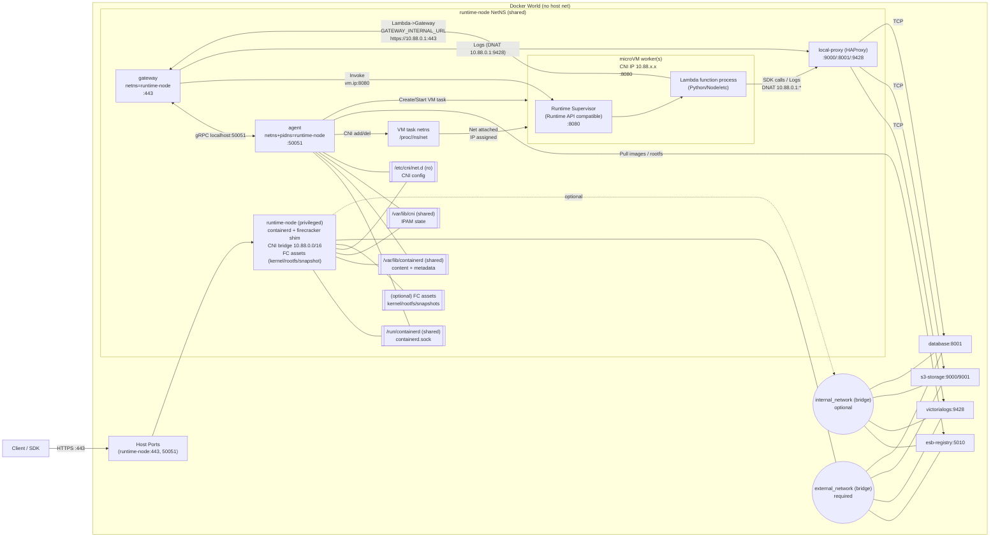

# Firecracker 導入ロードマップ（Phase B 実装を起点に Phase C へ）

## 目的とスコープ
- **現行の Phase B 実装**を出発点として、Phase C で Firecracker へ移行する。
- **外側インターフェースは維持**する（Gateway API、`worker.ip:8080`、`sitecustomize`、`10.88.0.1` 互換）。
- **ホストのネットワーク改変を最小化**し、Docker の世界に閉じる。

---

# Phase C に向けた AS IS / TO BE

## AS IS（Phase B: 現行実装）

### 構成の要点
- **runtime-node 内で containerd + runc + CNI** を実行（CNI bridge `10.88.0.0/16`）。
- **gateway/agent は runtime-node の NetNS を共有**（`network_mode: service:runtime-node`）。
- **agent は PIDNS を共有**し、`/proc/<pid>/ns/net` を使って CNI add/del を行う。
  - 参照する PID は **containerd task/shim の実行 PID**。
- **runtime-node が 443/50051 を外部公開**（service:netns の制約のため ports は runtime-node に集約）。
- **registry / s3-storage / database / victorialogs** は external_network 上で稼働。
- **DNAT により `10.88.0.1` 互換を維持**（S3/Dynamo/VictoriaLogs）。
  - PREROUTING を基本、runtime-node 内から叩く場合のみ OUTPUT を併用。
  - OUTPUT の場合は **SNAT(MASQUERADE) を必須**。
  - registry は TLS/SAN の都合で **DNAT 対象外**（`esb-registry:5010` を直接使用）。
- **sitecustomize による boto3 hook / trace 伝播 / logs** は現状維持。
- **Gateway は gRPC Agent を常時利用**（切替フラグは廃止）。

### Phase B 構成図（現実装準拠）


### DNAT 前提（Phase B 確定）
- `10.88.0.1` は **host ではなく runtime-node の CNI bridge gateway**。
- DNAT 先は **runtime-node 内プロキシ**のみ（service 名への DNAT は不可）。
- 固定 IP 依存は廃止し、**プロキシが service 名を解決**する。
- DNAT は PREROUTING を基本とし、runtime-node 内から叩く場合のみ OUTPUT を併用。
- OUTPUT で DNAT する場合は **SNAT(MASQUERADE) を必須**。
- registry は **DNAT 対象外**（`esb-registry:5010` を直接使用）。
- DNAT 対象は **S3/Dynamo/Logs のみに限定**し、その他は service 名直アクセスに統一する。
- 具体的な転送先:
  - `10.88.0.1:9000` -> `127.0.0.1:9000` (local proxy) -> `s3-storage:9000`
  - `10.88.0.1:8001` -> `127.0.0.1:8001` (local proxy) -> `database:8000`
  - `10.88.0.1:9428` -> `127.0.0.1:9428` (local proxy) -> `victorialogs:9428`

---

## TO BE（Phase C: Firecracker 置換後）

### 目標の要点
- **runtime-node 内の runtime を runc → firecracker runtime/shim へ差し替える**。
- **Lambda worker は microVM**（1 function = 1 microVM）に変更。
- **Gateway/Agent/外部ネットワークの関係は維持**（Phase B の外形は崩さない）。
- **sitecustomize / boto3 hook / Trace 伝播**は維持。
- **worker への Invoke は `worker.ip:8080` を維持**。

### Runtime Supervisor の責務（Phase C 固定）
- **Runtime API 互換 + Invoke 入口(8080) + ログ/メトリクス中継**までを担う。
- 画像 pull / CNI / DNAT 管理は **runtime-node/agent 側**に残す（責務を広げない）。

### Phase C 構成図（想定）



※補足: Phase C の CNI add/del は **「VM 内部に IP を直接付与」ではなく、tap/bridge が netns に接続される**ことを指す。VM 内の IP 付与は別管理（DHCP/静的）である前提。

### AS IS → TO BE の差分（Phase C）
| 項目 | AS IS（Phase B） | TO BE（Phase C） |
| --- | --- | --- |
| Runtime | runc | firecracker runtime/shim |
| Worker 実体 | RIE コンテナ | microVM + Runtime Supervisor |
| 入口 | `worker.ip:8080` | `vm.ip:8080`（維持） |
| CNI/IP | 10.88.x.x (CNI bridge) | 10.88.x.x (維持) |
| sitecustomize | あり | あり（VM 内へ配置） |
| registry | `esb-registry:5010` 直指定 | 同じ |
| 10.88.0.1 DNAT | runtime-node 内 | 同じ |
| agent の CNI 付与 | `/proc/<pid>/ns/net` | **同様の PID が参照可能であることが前提** |

---

## Phase C Go/No-Go（最優先の判定）

**Go:** containerd が返す task/shim/jailer の PID から netns が参照でき、**現方式の CNI add/del が成立**する。  
**No-Go:** 参照できない（jailer が別 PID/別 ns、または netns を持たない）。  
→ **No-Go の場合は設計変更が必須**（例: CNI 操作を runtime-node 側へ移す／firecracker runtime が返す PID に合わせて agent を改修）。

---

## Phase C 切り替え運用（現行との共存）

- 基本は **Phase B の構成を維持**し、Firecracker 検証は compose override で切り替える。
- 例: `COMPOSE_FILE=docker-compose.yml:docker-compose.fc.yml docker compose up -d`
- `docker-compose.fc.yml` で `CONTAINERD_RUNTIME=io.containerd.firecracker.v2` を指定し、containerd の runtime のみを差し替える。

---

## Phase C 移行ステップ（案）

### C-0: 前提固定
- Phase B の E2E を合格基準として固定。
- `worker.ip:8080` / `sitecustomize` / `10.88.0.1` 互換は **維持前提**。

### C-1: runtime-node 内で firecracker runtime を動作確認
- containerd の runtime 設定に firecracker を追加。
- `ctr` で firecracker runtime による起動が通ることを確認。

### C-2: microVM 内 Runtime Supervisor を実装
- Runtime API 互換の **Supervisor** を用意（init/invoke/shutdown）。
- 既存の Gateway → worker ルートを **Supervisor に吸収**。

### C-2.5: rootfs 変換パイプラインを定義
- 目的: 取得したコンテナイメージを **Firecracker 用 ext4 rootfs** に変換し、
  以降の起動で再利用できる形にする。
- 入力: OCI イメージ（ref または digest）、snapshotter（例: overlayfs）。
- 出力: rootfs イメージ（ext4）+ 付随メタデータ（digest, size, created_at など）。

- 変換手順（例: `ctr` 利用、疑似コマンド）
  ```bash
  # 1) pull & unpack
  ctr -n esb-runtime images pull <image>
  ctr -n esb-runtime images unpack <image>

  # 2) snapshot を mount（snapshot_key は実装側で管理）
  ctr -n esb-runtime snapshots mount /run/esb/rootfs-src/<key> overlayfs <snapshot_key>

  # 3) サイズ見積もり（+余白 64-128MB など）
  SIZE_MB=$(du -s --block-size=1M /run/esb/rootfs-src/<key> | awk '{print $1+128}')

  # 4) ext4 生成
  dd if=/dev/zero of=/var/lib/esb/fc/rootfs/<key>.ext4 bs=1M count=$SIZE_MB
  mkfs.ext4 -F /var/lib/esb/fc/rootfs/<key>.ext4
  mount -o loop /var/lib/esb/fc/rootfs/<key>.ext4 /run/esb/rootfs-dst/<key>

  # 5) ルートFS書き出し（rsync または tar）
  rsync -aHAX /run/esb/rootfs-src/<key>/ /run/esb/rootfs-dst/<key>/

  # 6) cleanup
  umount /run/esb/rootfs-dst/<key>
  ctr -n esb-runtime snapshots unmount /run/esb/rootfs-src/<key>
  ```

- 保存先（例）: `/var/lib/esb/fc/rootfs/` に ext4 と metadata を保存。
- キャッシュキー（例）:
  - `image digest` + `rootfs format version` + `runtime supervisor version`
  - いずれか変更で invalidate。
- GC 方針（例）:
  - LRU / TTL を併用し、最大容量を超えたら古いものから削除。
  - 未参照の rootfs を優先して削除。
- rootfs 変換の責務は **runtime-node/agent 側**に置く（Supervisor へは渡さない）。

### C-3: agent の CNI 付与対象 PID を検証
- `/proc/<pid>/ns/net` が **firecracker shim/jailer に対して有効**か確認。
- もし task PID が netns を持たない場合は、**対象 PID の取得ロジック**を調整。

### C-4: snapshot/restore（任意）
- cold start を短縮するための snapshot/restore を導入。
- kernel/rootfs の更新手順と互換性ルールを確定。

---

## 受け入れ条件（Phase C 完了条件）
- Gateway → Agent → worker.invoke が **`worker.ip:8080` で成功**する。
- Lambda → Lambda (boto3) が **sitecustomize 経由で成功**する。
- logs が VictoriaLogs に到達し、trace がつながる。
- Phase B のネットワーク前提（DNAT/10.88.0.1）を崩していない。

---

## リスク / 確認ポイント
- firecracker runtime における **netns PID の見え方**。
- Runtime Supervisor の API 互換レベル（拡張機能/レスポンス形式）。
- snapshot の互換性（kernel/rootfs 更新時の invalidation）。
- microVM での log/trace の欠損（sitecustomize の配置確認）。
