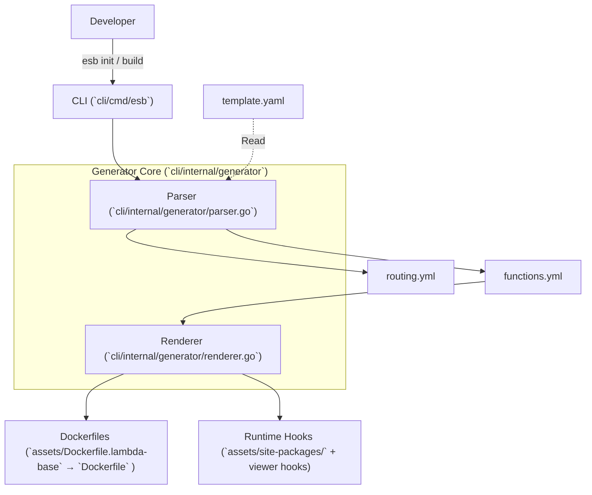

# SAM Generator Architecture

## 概要

`cli/internal/generator` は、AWS SAM テンプレート (`template.yaml`) を解析し、ESB (Edge Serverless Box) 上で実行可能な設定ファイルと Docker アーティファクトを生成する中核コンポーネントです。  
`esb` CLI (`cli/cmd/esb`) がこのジェネレータを呼び出すことで、SAM テンプレートを "Single Source of Truth" として扱えるワークフローを提供します。

## アーキテクチャ構成



### コンポーネント

1.  **CLI (`cli/cmd/esb`)**  
    `esb` CLI がユーザーインターフェースを提供し、`esb init`, `esb build`, `esb up` などのコマンドを通じて `cli/internal/generator` や Compose 制御をオーケストレートします。

2.  **Parser (`cli/internal/generator/parser.go`) → Phase 1**  
    SAM テンプレートを解析し、中間設定ファイル（`routing.yml`, `functions.yml`）を組み立てます。主な役割は以下です：  
    - `AWS::Serverless::Function` リソースの抽出  
    - `Events` プロパティから API ルーティング情報の抽出  
    - `ReservedConcurrentExecutions` や `ProvisionedConcurrencyConfig` などからスケーリング設定の取り出し  
    - `Globals.Function` の環境変数/ランタイム/アーキテクチャの適用

3.  **Renderer (`cli/internal/generator/renderer.go`) → Phase 2**  
    抽出された関数メタデータを元に、Go テンプレートで Dockerfile や補助ファイルを生成し、`output_dir` 以下のビルドコンテキストを整備します。

## 生成プロセス詳細

### 1. 初期化 (`esb init`)

プロジェクト開始時に `esb init` を実行すると、SAM テンプレートのパラメータ/出力先などを記した `generator.yml` が生成されます。

- **入力**: ユーザー指定（対話または CLI 引数）、`template.yaml` のパラメータ  
- **出力**: `generator.yml`  
  - SAM パラメータ値（例: `Prefix`, `ServiceVersion`）  
  - Docker イメージタグ（`app.tag`）  
  - 出力ディレクトリパス（デフォルト `.esb/`。`paths.output_dir` で調整可能）

### 2. ビルドフェーズ (`esb build`)

#### Phase 1: 設定生成  
`parser.go` が `template.yaml` と `generator.yml` を読み、最終的な `functions.yml`, `routing.yml` を `output_dir/config/` に書き出します。

**出力例 (`routing.yml`)**:
```yaml
routes:
  - path: /hello
    method: get
    function: lambda-hello
```

#### Phase 2: アーティファクト生成  
`functions.yml` にリストアップされた関数ごとに Build Context を作成、`renderer.go` がファイルを生成します。

1. **Dockerfile の生成**  
   `cli/internal/generator/assets/Dockerfile.lambda-base` をベースに、関数/ランタイム特有のステップ（`COPY functions/...` や `ENV` 設定）を動的に組み立てます。  
2. **Layer のステージング**  
   `AWS::Serverless::LayerVersion` から抽出したレイヤーは `output_dir/layers/` に展開し、各関数の Dockerfile から共有参照されます。ZIP 形式のレイヤーは展開済みバージョンを `/opt/` にコピー。  
3. **ビルドコンテキストの最小化**  
   `renderer.go` は `.dockerignore` 相当の構成を `output_dir/` に書き、関数やレイヤー以外のファイルがビルドコンテキストに入らないようにします。  
4. **Runtime Hooks の配置**  
   `cli/internal/generator/assets/site-packages/` 配下のファイル（`sitecustomize.py` など）を各関数のコンテキストにコピーし、Trace ID やログキャプチャの仕組みを Lambda 実行時に提供します。これには VictoriaLogs や X-Ray 互換のフックが含まれます。

## ランタイムフックの仕組み (`sitecustomize.py`)

Go ジェネレータは、Python の `sitecustomize` を利用してユーザーコードを変更せずにランタイム挙動を拡張します。

### Trace ID Hydration（復元）
Lambda RIE は `X-Amzn-Trace-Id` ヘッダーを環境変数に変換しません。`sitecustomize.py` は `awslambdaric` にパッチを当て、**ClientContext** から Trace ID を抽出し `_X_AMZN_TRACE_ID` にセットします。

### Direct Logging
`sys.stdout`/`sys.stderr` をフックし、ログを VictoriaLogs へ非同期送信します。ローカル実行でも本番と同じログ集約が可能になります。
