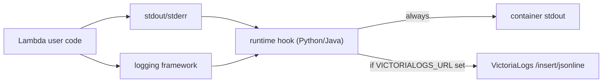

<!--
Where: docs/local-logging-adapter.md
What: Direct logging adapter design via sitecustomize.py and javaagent.
Why: Document platform-wide log forwarding behavior for runtime images.
-->
# 透過的ロギングアダプター設計 (Direct Logging)

## 目的
アプリケーションコードを変更せずに、Lambda 実行時ログを構造化して収集すること。

- Python: `sitecustomize.py` で stdout/stderr と logging をフック
- Java: `lambda-java-agent.jar` で stdout/stderr と AWS SDK 呼び出しをフック

## ログ経路


重要点:
- まずコンテナ stdout へ出力し、VictoriaLogs 送信は追加経路として扱う
- VictoriaLogs 送信失敗でアプリ実行は失敗させない（best effort）
- `trace_id` / `aws_request_id` を可能な範囲で自動付与する

## 設定項目
| 変数名 | 用途 | 備考 |
| --- | --- | --- |
| `VICTORIALOGS_URL` | 直接送信の有効化 | 未設定なら stdout のみ |
| `LOG_LEVEL` | Python logging 閾値 | `INFO` など |
| `AWS_LAMBDA_FUNCTION_NAME` | `container_name` の補完 | 未設定時は fallback 名 |

## 実装対応表
| runtime | 主実装 |
| --- | --- |
| Python | `runtime-hooks/python/sitecustomize/site-packages/sitecustomize.py` |
| Java | `runtime-hooks/java/agent/src/main/java/com/runtime/agent/logging/VictoriaLogsHook.java` |
| Java sink | `runtime-hooks/java/agent/src/main/java/com/runtime/agent/logging/VictoriaLogsSink.java` |

## 確認手順
```bash
# 1) ランタイム起動
docker compose -f docker-compose.docker.yml up -d

# 2) invoke 実行後にログ確認
docker logs <project>-gateway
docker logs <project>-agent

# 3) VictoriaLogs UI（有効時）
# http://localhost:9428/select/vmui
```

検索例:
- `container_name:"lambda-hello"`
- `trace_id:"Root=1-..."`
- `level:"ERROR"`

---

## Implementation references
- `runtime-hooks/python/sitecustomize/site-packages/sitecustomize.py`
- `runtime-hooks/java/agent/src/main/java/com/runtime/agent/logging/VictoriaLogsHook.java`
- `runtime-hooks/java/agent/src/main/java/com/runtime/agent/logging/VictoriaLogsSink.java`
