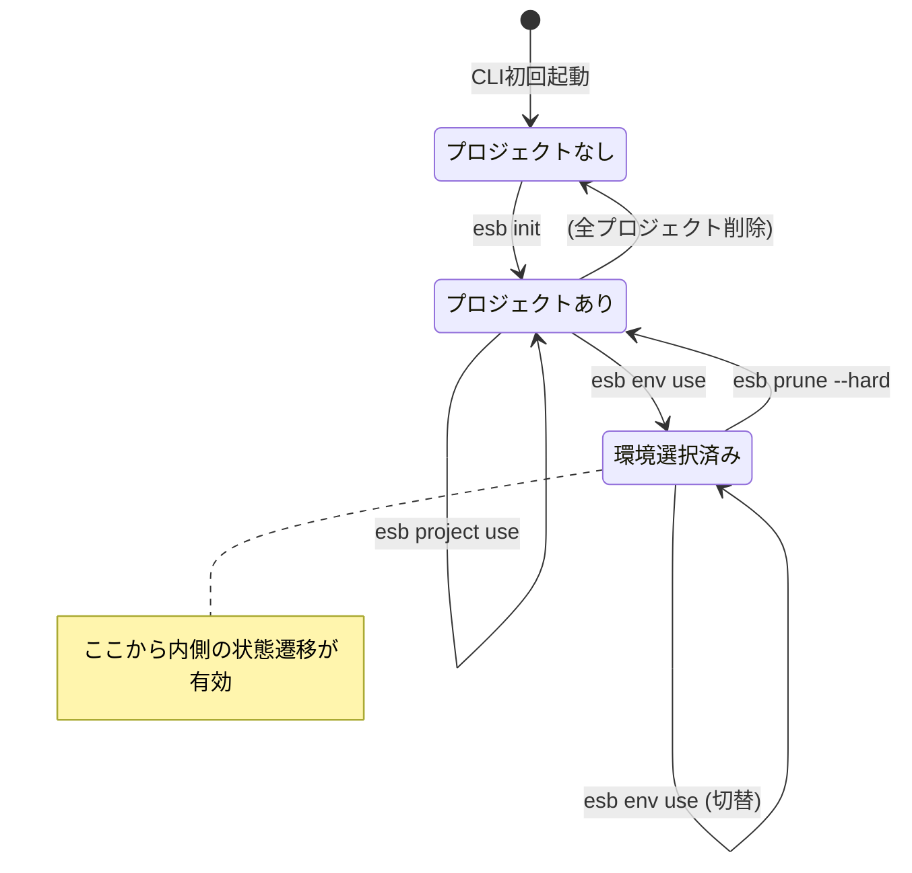
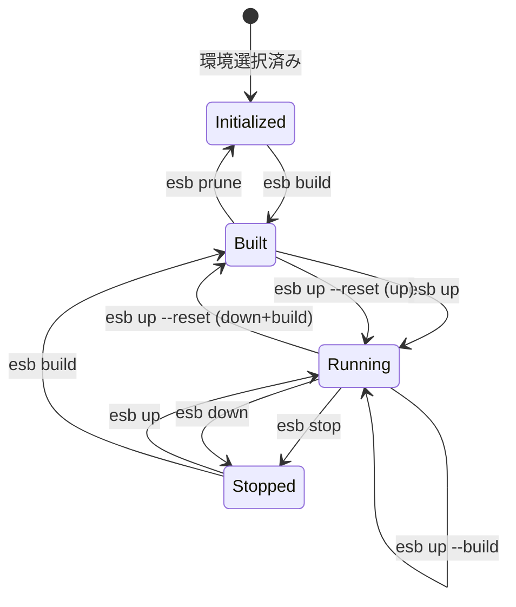

# CLI ステート管理改善計画

## 背景と課題

### 現状の問題

現在の CLI ステートマシンは「プロジェクトの環境状態」のみを管理しており、以下の矛盾が存在する：

1. **初回起動時の矛盾**: プロジェクトも環境も存在しないのに、ステートマシンが動作しようとする
2. **スナップショット判定**: 状態遷移を追跡せず、現在値のみで判定
3. **エラーの握り潰し**: `ResolveContext` 失敗時に原因が不明確

### 現在の実装

```
detector.go → DeriveState() → 5状態のみ
  (uninitialized / initialized / built / running / stopped)
```

問題点：
- プロジェクトが存在しない = uninitialized（原因が見えない）
- 環境が選択されていない = エラーまたは暗黙のdefault

## 提案: 4層ステート管理モデル

```
┌──────────────────────────────────────────────────────┐
│ Bootstrap: グローバル設定 (~/.esb/config.yaml)        │
│   - 存在しなければ自動作成                           │
│   - プロジェクト登録 (projects + last_used) のみ永続化│
│   - active_project/active_env は保存しない           │
└──────────────────────────────────────────────────────┘
        ↓ 常に保証される
┌──────────────────────────────────────────────────────┐
│ Level 0: アプリケーション状態 (環境変数 + config)     │
│   - ESB_PROJECT: プロジェクト名                      │
│   - has_projects: config.yaml から判定               │
│   - fallback: projects.last_used                     │
└──────────────────────────────────────────────────────┘
        ↓ project が解決できた場合のみ
┌──────────────────────────────────────────────────────┐
│ Level 1: プロジェクト状態 (環境変数 + generator)      │
│   - ESB_ENV: 環境名                                  │
│   - has_environments: generator.yml から判定         │
│   - fallback: app.last_env / 単一環境の自動選択       │
└──────────────────────────────────────────────────────┘
        ↓ env が解決できた場合のみ
┌──────────────────────────────────────────────────────┐
│ Level 2: 環境状態 (既存のステートマシン)              │
│   - uninitialized / initialized / built /            │
│     running / stopped                                │
└──────────────────────────────────────────────────────┘
```

### 環境変数ベースの利点

- **並列実行安全**: プロセスごとに独立、ファイル競合なし
- **既存互換**: ESB_ENV は既に使用中
- **シンプル**: config.yaml の書き込み競合を回避

### 優先順位 (project/env の解決)

1. `--env` / `--template` フラグ
2. `ESB_ENV` / `ESB_PROJECT`
3. `config.yaml` の `projects.last_used`

### 自動選択ルール

- **ESB_PROJECT 未設定**:
  - `projects.last_used` が最新のプロジェクトを採用
  - プロジェクトが1件のみなら自動選択
  - それ以外はエラー
- **ESB_ENV 未設定**:
  - `generator.yml` の `app.last_env` を採用
  - 環境が1件のみなら自動選択
  - それ以外はエラー

### `init` の入力ルール

- 環境名は必須 (`--env` 未指定なら対話で入力)
- 選択肢がある場合は選択式で提示
- 既定の `default` は自動作成しない

### `esb project use` / `esb env use` の動作

```bash
$ esb project use my-app
Switched to project 'my-app'
export ESB_PROJECT=my-app

$ esb env use dev
Switched to 'my-app:dev'
export ESB_ENV=dev

# ユーザーが eval で適用
$ eval $(esb project use my-app)
$ eval $(esb env use dev)
```

補足:
- `project use` は `config.yaml` の `projects[*].last_used` を更新
- `env use` は `generator.yml` の `app.last_env` と `projects[*].last_used` を更新
- メッセージは stderr、`export` 行は stdout に出力する

## 設計の重要ポイント

### 既存 Detector の位置づけ

現在の `Detector` (Level 2) は**環境が確定した状態**を前提として設計されており、そのまま維持する。
今回の改善は Detector の **手前にゲートを追加** するもの。

```
[追加] Bootstrap チェック (~/.esb/config.yaml 保証)
[追加] project 解決 (優先順位 + last_used + 自動選択 + 対話/--force)
[追加] env 解決 (優先順位 + app.last_env + 自動選択 + 対話/--force)
    ↓ ここまでがゲート
[既存] Detector (Level 2) ← 基本そのまま維持
```

### 環境切り替え時の状態再評価

Level 2 の状態は**環境ごとに独立**している。`esb env use` で環境を切り替えると、Detector は新しい環境に対して再評価される。

```
$ esb env use dev    # dev環境: running
$ esb env use prod   # prod環境: stopped (別の状態)
```

## 全体状態遷移図（二段構え）

### 外側: セットアップ状態遷移（環境選択まで）



### 内側: 環境状態遷移（既存 Detector）



### 入れ子構造の全体像

```
┌─────────────────────────────────────────────────────────────┐
│ 外側: セットアップ状態遷移                                   │
│                                                             │
│   NoProject ──init──> HasProject ──env use──> EnvSelected   │
│                                                             │
│   ┌─────────────────────────────────────────────────────┐   │
│   │ 内側: 環境状態遷移 (EnvSelected 時のみ有効)          │   │
│   │                                                     │   │
│   │   Initialized ──build──> Built ──up──> Running      │   │
│   │        ↑                   ↑            ↓  ↑        │   │
│   │        └──prune────────────┘      stop/down up      │   │
│   │                                        ↓  ↑        │   │
│   │                                      Stopped        │   │
│   └─────────────────────────────────────────────────────┘   │
└─────────────────────────────────────────────────────────────┘
```

## コマンドのレベル分類

### 前提条件の依存チェーン

```
project 選択 (ESB_PROJECT / last_used)
    ↓ 必須
env 選択 (ESB_ENV / app.last_env / 単一環境)
    ↓ 必須
build / up / down / stop / logs / prune (環境操作コマンド、up --reset は up の拡張)
```

### コマンド別の前提条件

| コマンド | Bootstrap | project 選択 | env 選択 | 備考 |
|---------|:---------:|:--------------:|:----------:|------|
| `esb init` | ✓ | - | - | 環境名入力必須 (未指定は対話) |
| `esb project list` | ✓ | - | - | 一覧表示のみ |
| `esb project use` | ✓ | - | - | プロジェクトが1つ以上必要 |
| `esb env list` | ✓ | ✓ 必須 | - | |
| `esb env add` | ✓ | ✓ 必須 | - | |
| `esb env use` | ✓ | ✓ 必須 | - | 環境が1つ以上必要 |
| `esb build` | ✓ | ✓ 必須 | ✓ 必須 | |
| `esb up` | ✓ | ✓ 必須 | ✓ 必須 | |
| `esb down` | ✓ | ✓ 必須 | ✓ 必須 | |
| `esb stop` | ✓ | ✓ 必須 | ✓ 必須 | |
| `esb logs` | ✓ | ✓ 必須 | ✓ 必須 | |
| `esb up --reset` | ✓ | ✓ 必須 | ✓ 必須 | |
| `esb prune` | ✓ | ✓ 必須 | ✓ 必須 | |
| `esb info` | ✓ | 適応表示 | 適応表示 | 詳細情報を表示 |

### エラーメッセージ例

```
# ESB_PROJECT が未設定の場合
$ esb env list
Error: No active project. Run 'esb project use <name>' first.

# ESB_ENV が未設定の場合
$ esb build
Error: No active environment. Run 'esb env use <name>' first.

# ESB_PROJECT が不正な場合 (TTY)
Error: ESB_PROJECT 'foo' not found. Unset ESB_PROJECT? [y/N]

# ESB_ENV が不正な場合 (non-TTY)
Error: ESB_ENV 'dev' not found. Re-run with --force to auto-unset.
```

### 対話と `--force`

- `ESB_PROJECT` / `ESB_ENV` が不正な場合は対話で `unset` を促す
- TTY でない場合は `--force` 付きのみ自動 `unset`
- `--force` は project/env 解決を行うコマンドに限定で追加

## 実装計画

### Phase 1: Bootstrap 層の実装

**目的**: `~/.esb/config.yaml` の自動作成を保証

**変更対象**:
- `cli/internal/config/global.go`: `EnsureGlobalConfig()` 関数追加 + `GlobalConfig` の整理
- `cli/cmd/esb/cli.go`: 初期化時に `EnsureGlobalConfig()` 呼び出し

**動作**:
```go
func EnsureGlobalConfig() error {
    path, err := GlobalConfigPath()
    if err != nil {
        return err
    }
    if _, err := os.Stat(path); os.IsNotExist(err) {
        return SaveGlobalConfig(path, DefaultGlobalConfig())
    }
    return nil
}
```

補足:
- `GlobalConfig` から `active_project` / `active_environments` を削除
- `projects[*].last_used` のみで履歴を保持

### Phase 2: Level 0 (アプリケーション状態) の実装

**目的**: プロジェクトの有無とアクティブプロジェクトを明示的に管理

**新規追加**:
- `cli/internal/state/app_state.go`

```go
type AppState struct {
    HasProjects   bool
    ActiveProject string // resolved by priority
}

func ResolveAppState() (AppState, error) {
    // priority: --template > ESB_PROJECT > projects.last_used
}
```

補足:
- `--template` 指定時は project dir が確定するため、`ESB_PROJECT` が未設定でも通す
- `ESB_PROJECT` が不正な場合は対話で `unset` を促し、`--force` で自動 `unset`
- project が解決できない場合はエラー

### Phase 3: Level 1 (プロジェクト状態) の実装

**目的**: 環境の有無とアクティブ環境を明示的に管理

**新規追加**:
- `cli/internal/state/project_state.go`

```go
type ProjectState struct {
    HasEnvironments bool
    ActiveEnv       string // resolved by priority
    GeneratorValid  bool
}

func ResolveProjectState(projectDir string) (ProjectState, error)
```

補足:
- `generator.yml` に `app.last_env` を追加し、`env use` 実行時のみ更新
- `ActiveEnv` は `--env` > `ESB_ENV` > `app.last_env` > 単一環境の順に解決
- `ESB_ENV` が不正な場合は対話で `unset` を促し、`--force` で自動 `unset`
- env が解決できない場合はエラー

### Phase 4: コマンドハンドラの統一

**目的**: 各コマンドで適切なレベルチェックを行う

**変更対象**:
- `cli/internal/app/app.go`: コマンド実行前のレベルチェック追加
  - `--force` は project/env 解決が必要なコマンドに限定で追加
  - TTY 判定が false の場合は `--force` がないと自動 unset しない
  - `resolveProjectSelection` は CWD 走査を廃止し、優先順位で解決
- `cli/internal/app/project.go` / `cli/internal/app/env.go`:
  - メッセージ(stderr) + export(stdout) の出力に統一
  - `projects[*].last_used` を更新
  - `env use` は `app.last_env` を更新
- `cli/internal/app/init.go`:
  - `--env` 未指定時は対話で入力
  - 既定の `default` は作成しない

```go
func runBuild(cli CLI, deps Dependencies, out io.Writer) int {
    // Phase 1: Bootstrap (自動)
    
    // Phase 2: Level 0 チェック
    appState, _ := state.ResolveAppState()
    if !appState.HasProjects {
        fmt.Fprintln(out, "No projects. Run 'esb init -t <template>'")
        return 1
    }
    
    // Phase 3: Level 1 チェック
    // ...
    
    // Phase 4: Level 2 チェック (既存の処理)
}
```

### Phase 5: info コマンドの改善

**目的**: 現在のレベルに応じた適切な情報表示

## ドキュメント更新

- `docs/developer/cli-architecture.md`: 状態図を実装に合わせて更新
- 現在の stateDiagram (Building/Failed/Resetting) を削除
- 4層モデルの説明を追加
- `app.last_env` / `--force` / 優先順位ルールを明記

## 検証計画

1. ユニットテスト
   - `EnsureGlobalConfig` のテスト
   - `ResolveAppState` / `ResolveProjectState` のテスト

2. 統合テスト
   - 初回起動シナリオ
   - プロジェクト作成→環境選択フロー

3. E2Eテスト
   - 既存テストが引き続きパスすることを確認

## 既知のバグ・改善項目

### BUG: reset 相当の処理で Provision が呼ばれない

**現象**: 旧 `esb reset` 実行後、Lambda 関数が正しく登録されない可能性がある

**原因**: 旧 `reset.go` は `Upper.Up()` のみ呼び出しており、`Provisioner.Provision()` を呼んでいない

```go
// reset.go (旧実装)
deps.Downer.Down(ctx.ComposeProject, true)
deps.Builder.Build(request)
deps.Upper.Up(UpRequest{...})  // ← provision なし

// up.go (runUp)
deps.Upper.Up(request)
deps.Provisioner.Provision(...)  // ← こちらにはある
```

**修正方針**: `reset` コマンドを廃止し、`esb up --reset` に統合して `Provisioner`/`Waiter` まで実行する

### UX改善: prune コマンドの再構成

**現状**:
```
esb prune         # 環境のビルド成果物を削除
esb prune --hard  # 上記 + generator.yml 削除
```

**提案**: 操作対象に応じたサブコマンド化

```
esb env delete    # 環境を削除 (成果物 + ボリューム)
esb project delete  # プロジェクトを削除 (generator.yml + 登録解除)
```

**メリット**:
- 操作対象が明確 (env vs project)
- 4層モデルとの整合性 (Level 1 操作 vs Level 0 操作)
- `--hard` フラグの曖昧さを解消

**状態遷移との対応**:
| コマンド | 遷移 |
|---------|------|
| `esb env delete` | Built/Running/Stopped → Initialized |
| `esb project delete` | HasProject → NoProject (外側) |

### E2Eテストの状態管理統合

**方針**: E2Eテストでも esb で管理されたプロジェクト・環境を使用する

#### test_matrix.yaml の変更 (簡素化版)

```yaml
# Test Execution Matrix

suites:
  smoke:
    targets:
      - "e2e/scenarios/smoke/"
  standard:
    targets:
      - "e2e/scenarios/autoscaling/"
      - "e2e/scenarios/standard/"

# ESB管理: プロジェクト名は固定
esb_project: "e2e-fixtures"

# 環境名のみ指定 (mode は generator.yml から自動取得)
matrix:
  - esb_env: docker
    env_file: "e2e/environments/.env.docker"
    suites:
      - smoke
      - standard

  - esb_env: containerd
    env_file: "e2e/environments/.env.containerd"
    suites:
      - smoke
      - standard

  - esb_env: firecracker
    env_file: "e2e/environments/.env.firecracker"
    suites:
      - smoke
      - standard
```

#### run_tests.py の変更

```python
# 環境変数を設定 (ファイル競合なし)
os.environ["ESB_PROJECT"] = config["esb_project"]  # "e2e-fixtures"
os.environ["ESB_ENV"] = entry["esb_env"]           # "docker" など

# セットアップ (初回のみ)
run_esb(["init", "-t", "e2e/fixtures/template.yaml"])

# シナリオ実行 (フラグ不要、mode は generator.yml から自動取得)
run_esb(["build"])
run_esb(["up", "--wait"])
# ... pytest ...
run_esb(["down"])
```

補足:
- 優先順位により `--env`/`--template` を渡す場合は `ESB_ENV`/`ESB_PROJECT` を無視する

#### generator.yml (環境定義の唯一の情報源)

`e2e/fixtures/generator.yml`:
```yaml
app:
  name: e2e-fixtures
environments:
  - name: docker
    mode: docker
  - name: containerd
    mode: containerd
  - name: firecracker
    mode: firecracker
paths:
  sam_template: template.yaml
  output_dir: .esb/
```

**メリット**:
- 環境定義は generator.yml のみ (DRY)
- test_matrix.yaml は環境名を参照するだけ
- mode 重複による不整合リスクなし
- 並列実行安全 (環境変数ベース)
