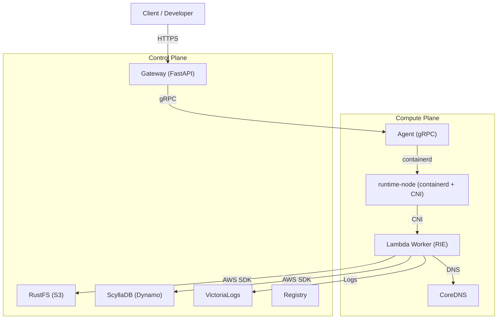

<!--
Where: docs/spec.md
What: System-level specification overview.
Why: Define stable platform boundaries before reading subsystem details.
-->
# システム仕様（概要）

## 目的
本基盤は、オンプレ環境で AWS Lambda 互換の実行体験を提供します。  
責務を `Gateway`（HTTP入口）と `Agent/runtime-node`（実行面）で分離し、
Docker Compose を起点に運用できる構成を採用しています。

## スコープ
- 含む: Lambda 互換 invoke、ワーカー管理、S3/Dynamo 互換接続、E2E 契約
- 含まない: クラウドマネージド基盤そのもの（AWS マネージドサービスの代替全般）

## 実行モード
- `docker` モード
- `containerd` モード

`firecracker` は containerd 系 runtime の切替（`CONTAINERD_RUNTIME=aws.firecracker`）で扱います。

## 全体構成（概略）

注: 上図は containerd モード寄りの概略です。`docker` モードでは `runtime-node/CoreDNS` を介さず、
Agent が Docker Engine 上の worker を直接管理します。

## 主要コンポーネント
| コンポーネント | 責務 |
| --- | --- |
| Gateway | 認証・ルーティング・invoke 制御 |
| Agent | ワーカー作成/破棄/再利用、runtime への操作委譲 |
| runtime-node | containerd/CNI/DNS 実行基盤（containerd モード時） |
| Provisioner | `resources.yml` に基づく初期リソース整備 |
| CLI (`esb`) | テンプレート解析、生成、ビルド、deploy オーケストレーション |

## 典型的な invoke フロー
1. Client が Gateway API を呼び出す
2. Gateway が Trace/Request context を確立し、invoke 対象を解決する
3. Gateway が Agent にワーカー確保を要求する
4. Agent/runtime がコンテナを確保し、Gateway に接続情報を返す
5. Gateway が Lambda RIE へ invoke を転送する
6. ログ/トレースは共通契約（`trace_id`, `aws_request_id`）で記録される

## 構成反映の原則
1. `esb deploy` が staging config を生成する
2. deploy 実行時に runtime target へ同期する
3. `--build-only` は同期/プロビジョニングを実行しない（生成とビルドに限定）

## 開発者の拡張起点
| 変更したい対象 | 入口ドキュメント |
| --- | --- |
| CLI の振る舞い・フラグ | `cli/docs/architecture.md` |
| Gateway の処理フロー | `services/gateway/docs/architecture.md` |
| Agent/runtime 実装 | `services/agent/docs/README.md`, `services/runtime-node/docs/README.md` |
| E2E 契約追加 | `docs/e2e-runtime-smoke.md`, `e2e/runner/README.md` |

## 詳細ドキュメント
- Gateway: [services/gateway/docs/README.md](../services/gateway/docs/README.md)
- Agent: [services/agent/docs/README.md](../services/agent/docs/README.md)
- runtime-node: [services/runtime-node/docs/README.md](../services/runtime-node/docs/README.md)
- Provisioner: [services/provisioner/docs/README.md](../services/provisioner/docs/README.md)
- CLI: [cli/docs/architecture.md](../cli/docs/architecture.md)
- E2E smoke: [docs/e2e-runtime-smoke.md](./e2e-runtime-smoke.md)

---

## Implementation references
- `README.md`
- `docker-compose.containerd.yml`
- `docker-compose.docker.yml`
- `services/contracts/proto/agent.proto`
- `cli/internal/usecase/deploy/deploy.go`
