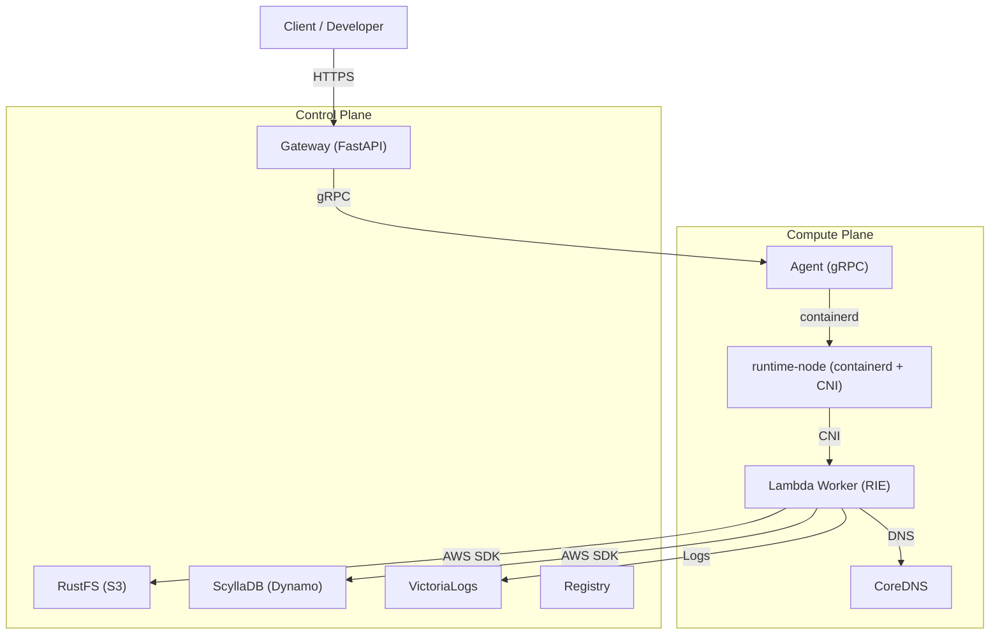

<!--
Where: docs/spec.md
What: System-level specification overview for the system.
Why: Provide a concise top-level picture and link to subsystem docs.
-->
# システム仕様（概要）

## 概要
本基盤は、オンプレ環境で AWS Lambda 互換の実行基盤を提供します。
HTTP 入口（Gateway）とコンテナ実行（Agent + runtime-node）を分離し、
構成は Docker Compose を基盤に運用します。

## 実行モード
- `docker` モード
- `containerd` モード

Firecracker は `containerd` 系の runtime 切替（`CONTAINERD_RUNTIME=aws.firecracker`）として扱います。

## 全体構成（概略）

## 主要コンポーネント
- Gateway: 認証・ルーティング・Invoke を担う HTTP 入口
- Agent: ワーカーの作成/削除/一覧/計測を提供する gRPC サービス
- runtime-node: containerd + CNI + CoreDNS を束ねる実行ノード
- Provisioner: `resources.yml` から S3/Dynamo 初期化を実行
- CLI: SAM テンプレートから config / Dockerfile / image build を実行

## 詳細ドキュメント
- Gateway: [services/gateway/docs/README.md](../services/gateway/docs/README.md)
- Agent: [services/agent/docs/README.md](../services/agent/docs/README.md)
- runtime-node: [services/runtime-node/docs/README.md](../services/runtime-node/docs/README.md)
- Provisioner: [services/provisioner/docs/README.md](../services/provisioner/docs/README.md)
- CLI: [cli/docs/architecture.md](../cli/docs/architecture.md)
- E2E smoke: [docs/e2e-runtime-smoke.md](./e2e-runtime-smoke.md)

---

## Implementation references
- `README.md`
- `docker-compose.containerd.yml`
- `docker-compose.docker.yml`
- `proto/agent.proto`
