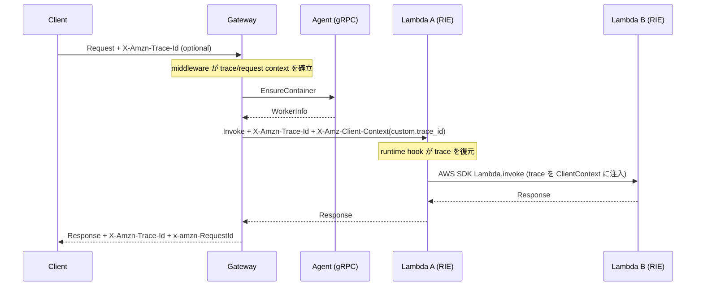

<!--
Where: docs/trace-propagation.md
What: Trace propagation via X-Amzn-Trace-Id and ClientContext.
Why: Explain system-wide runtime hooks and Gateway propagation logic.
-->
# X-Amzn-Trace-Id によるトレーシング

本ドキュメントは、Gateway と各 runtime での Trace 伝播契約を定義します。

## 背景
AWS Lambda 本番では `X-Amzn-Trace-Id` が runtime 側へ反映されますが、RIE では同等挙動がありません。  
本基盤では `X-Amz-Client-Context` の `custom.trace_id` を併用し、runtime 側で復元する設計にしています。

## Trace ID フォーマット

AWS X-Ray 準拠のフォーマット:

```
Root=1-{timestamp:08x}-{unique_id:24hex};Sampled=1

例: Root=1-67687c5a-a1b2c3d4e5f67890abcdef01;Sampled=1
```

| フィールド | 説明 |
|-----------|------|
| `Root` | トレースのルート識別子 (`1-XXXXXXXX-XXXXXXXXXXXXXXXXXXXXXXXX`) |
| `Parent` | 親スパンID（オプション） |
| `Sampled` | サンプリングフラグ (`0` or `1`) |

実装: `services/common/core/trace.py`

## Request ID の扱い
Gateway は各リクエストで `Request ID`（UUID）を生成し、Trace ID とは独立して扱います。

- クライアント返却: `x-amzn-RequestId`
- ログ項目: `aws_request_id`
- Lambda event: `requestContext.requestId` に Gateway 側 ID を設定

## 伝播フロー



## コンポーネント契約

### 1. Gateway middleware
`services/gateway/middleware.py`
- 受信ヘッダーの `X-Amzn-Trace-Id` を解釈し、未指定時は新規生成
- `ContextVar` に trace/request を保存
- レスポンスヘッダーへ `X-Amzn-Trace-Id` と `x-amzn-RequestId` を付与

### 2. Gateway -> Worker invoke
`services/gateway/services/lambda_invoker.py`
- `X-Amzn-Trace-Id` をヘッダーに付与
- `X-Amz-Client-Context` に `custom.trace_id` を埋め込み

### 3. Runtime 側の復元と再注入
- Python: `runtime-hooks/python/sitecustomize/site-packages/sitecustomize.py`
  - `ClientContext` から `_X_AMZN_TRACE_ID` を復元
  - `boto3 Lambda.invoke` に `custom.trace_id` を自動注入
- Java:
  - wrapper: `runtime-hooks/java/wrapper/src/com/runtime/lambda/HandlerWrapper.java`
  - agent: `runtime-hooks/java/agent/src/main/java/com/runtime/agent/aws/LambdaClientContextInjector.java`
  - いずれも `ClientContext` 連鎖を維持する

### 4. ログ出力
`services/common/core/logging_config.py`
- `trace_id` / `aws_request_id` を構造化ログに付与
- runtime hook 側ログにも同 ID を可能な範囲で付与

## 失敗時チェックリスト
1. Gateway レスポンスに `X-Amzn-Trace-Id` と `x-amzn-RequestId` があるか
2. Gateway -> Worker invoke ヘッダーに `X-Amz-Client-Context` があるか
3. Python runtime なら `sitecustomize` 初期化ログがあるか
4. Java runtime なら wrapper/agent が有効化されているか
5. VictoriaLogs 検索時に `trace_id` で絞り込めるか

## Implementation references
- `services/common/core/trace.py`
- `services/common/core/request_context.py`
- `services/gateway/middleware.py`
- `services/gateway/services/lambda_invoker.py`
- `services/common/core/logging_config.py`
- `runtime-hooks/python/sitecustomize/site-packages/sitecustomize.py`
- `runtime-hooks/java/wrapper/src/com/runtime/lambda/HandlerWrapper.java`
- `runtime-hooks/java/agent/src/main/java/com/runtime/agent/aws/LambdaClientContextInjector.java`
