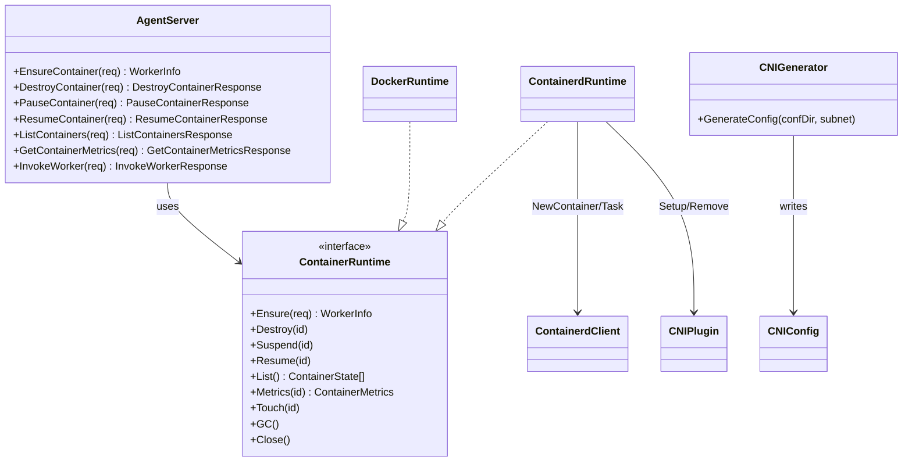
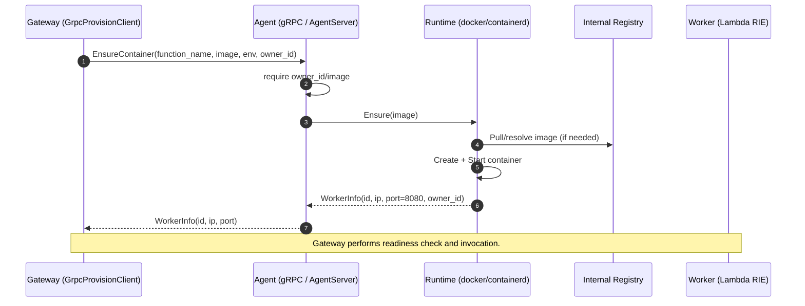

<!--
Where: services/agent/docs/architecture.md
What: Agent subsystem architecture with key flows and diagrams.
Why: Provide a code-grounded overview for maintainers and reviewers.
-->
# Agent アーキテクチャ

## 概要
Agent は Gateway の裏側で動作する gRPC サービスです。Gateway からの要求に応じて、
Lambda ワーカー（RIE コンテナ）を **起動/削除/一覧/計測**し、必要に応じて **Invoke の L7 代理**も行います。

Agent 自体は「プール管理」を持たず、**常に新しいワーカーを作る（Factory 振る舞い）**前提です。
プールの再利用や同時実行制御は Gateway 側（PoolManager/ContainerPool）が担います。

## 構成（クラス図）

補足:
- `CNIGenerator` は Agent 起動時に実行され、CNI の `.conflist` を生成します（containerd runtime のみ）。
- `AgentServer` は `workerCache` を持ち、`InvokeWorker` 時の接続情報再解決に利用します（owner_id チェック込み）。

## 主要フロー（EnsureContainer）

## 仕様ポイント（実装ベース）
### 1) `owner_id` は必須（所有権）
- すべての主要 RPC は `owner_id` を要求します。
- `container_id` に対する `owner_id` 不一致は `PermissionDenied` として扱われます。

### 2) 生成されるコンテナ名 / ラベル
- docker / containerd とも `{brand}-{env}-{function}-{id}` を使います。
- brand は起動時に `StackIdentity` で解決されます（`ESB_BRAND_SLUG` -> `PROJECT_NAME/ENV` -> `CONTAINERS_NETWORK`）。未解決時は起動を継続しません。
- `owner_id`/`env`/`function` はラベルとして付与され、`List`/Janitor でフィルタに利用されます。
- ラベルキーは brand で名前空間化されます（例: `esb_function`, `esb_env`, `com.esb.kind`, `com.esb.owner`）。
- 契約の詳細は `docs/runtime-identity-contract.md` を参照してください。

### 3) DNS 注入（containerd）
- `resolv.conf` を Agent 側で生成し、ワーカーの `/etc/resolv.conf` に bind-mount します。
- nameserver は `CNI_DNS_SERVER` → `CNI_GW_IP` → 既定値（`10.88.0.1`）の順で解決します。

### 4) Snapshotter の選択（containerd）
- `CONTAINERD_SNAPSHOTTER` が指定されていればそれを使用します。
- `CONTAINERD_RUNTIME=aws.firecracker` の場合は既定で `devmapper` を選びます（それ以外は `overlayfs`）。

### 5) gRPC TLS（mTLS）はデフォルト有効
- サーバ側は **デフォルトで mTLS を要求**します。
- 無効化は `AGENT_GRPC_TLS_DISABLED=1`（信頼済みネットワークのみで使用）。

### 6) 画像解決の責務分離
- 外部レジストリ起点の `PackageType: Image` 関数は、deploy/apply 時に
  **`artifactctl deploy` による Dockerfile 再ビルド + push** で内部レジストリへ配置されます。
- Agent runtime は **内部レジストリ参照の pull のみ**を行います。
- `image` が内部レジストリに存在しない場合は `EnsureContainer` が `Internal` で失敗します。

### 7) 依存方向ガード（重要）
- `services/*` は runtime 実行責務のみを持ち、tooling 実装へ依存しません。
- `services/* -> tools/*` および `services/* -> pkg/artifactcore` の import は禁止です。
- artifact の検証/merge/apply は `tools/artifactctl` 側に閉じ、runtime は反映済み `CONFIG_DIR` のみを読む契約を維持します。

## containerd runtime の責務分割
containerd runtime 実装は 1 ファイル集中ではなく、以下に分割されています。

| ファイル | 役割 |
| --- | --- |
| `services/agent/internal/runtime/containerd/runtime.go` | Runtime 本体、共通設定、Destroy/Suspend/Resume/List/Metrics の入口 |
| `services/agent/internal/runtime/containerd/ensure.go` | `EnsureContainer` 実行パス（container/task 起動、CNI attach、失敗時 rollback） |
| `services/agent/internal/runtime/containerd/cni.go` | CNI setup/remove と retry 制御 |
| `services/agent/internal/runtime/containerd/list.go` | 管理コンテナ列挙と CNI IP 再解決 |
| `services/agent/internal/runtime/containerd/metrics.go` | cgroup v1/v2 差異を吸収した metrics 取得 |

運用上の詳細（snapshotter や CNI 前提）は `runtime-containerd.md` を参照してください。

---

## Implementation references
- `services/contracts/proto/agent.proto`
- `services/agent/cmd/agent/main.go`
- `services/agent/internal/api/server.go`
- `services/agent/internal/runtime/interface.go`
- `services/agent/internal/identity/stack_identity.go`
- `services/agent/internal/runtime/containerd/runtime.go`
- `services/agent/internal/runtime/containerd/ensure.go`
- `services/agent/internal/runtime/containerd/cni.go`
- `services/agent/internal/runtime/containerd/list.go`
- `services/agent/internal/runtime/containerd/metrics.go`
- `services/agent/internal/runtime/docker/runtime.go`
- `services/agent/internal/cni/generator.go`
- `services/gateway/services/grpc_provision.py`
