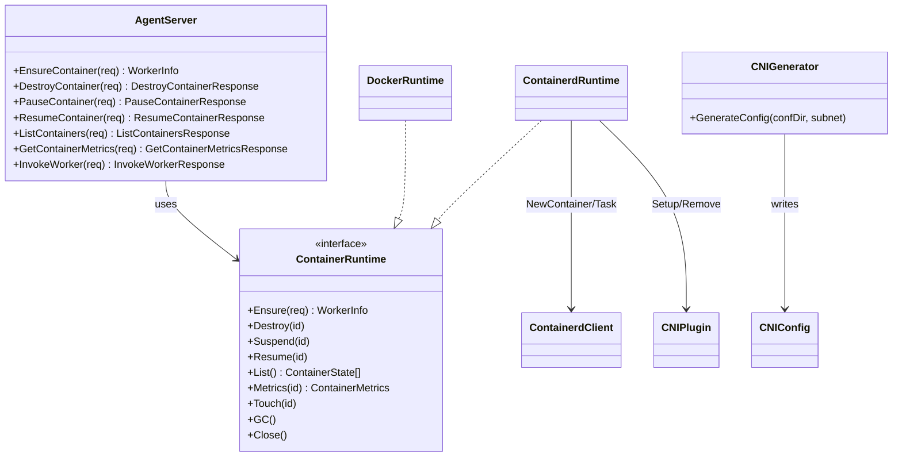
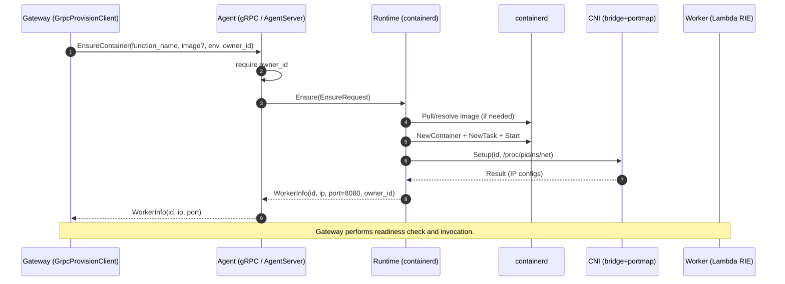

<!--
Where: services/agent/docs/architecture.md
What: Agent subsystem architecture with key flows and diagrams.
Why: Provide a code-grounded overview for maintainers and reviewers.
-->
# Agent アーキテクチャ

## 概要
Agent は Gateway の裏側で動作する gRPC サービスです。Gateway からの要求に応じて、
Lambda ワーカー（RIE コンテナ）を **起動/削除/一覧/計測**し、必要に応じて **Invoke の L7 代理**も行います。

Agent 自体は「プール管理」を持たず、**常に新しいワーカーを作る（Factory 振る舞い）**前提です。
プールの再利用や同時実行制御は Gateway 側（PoolManager/ContainerPool）が担います。

## 構成（クラス図）

補足:
- `CNIGenerator` は Agent 起動時に実行され、CNI の `.conflist` を生成します（containerd runtime のみ）。
- `AgentServer` は `workerCache` を持ち、`InvokeWorker` 時の接続情報再解決に利用します（owner_id チェック込み）。

## 主要フロー（EnsureContainer）

## 仕様ポイント（実装ベース）
### 1) `owner_id` は必須（所有権）
- すべての主要 RPC は `owner_id` を要求します。
- `container_id` に対する `owner_id` 不一致は `PermissionDenied` として扱われます。

### 2) 生成されるコンテナ名 / ラベル
- containerd runtime は `esb-{env}-{function}-{id}` 形式の短い ID を使います。
- docker runtime は `{brand}-{env}-{function}-{id}`（brand は `meta.Slug`）です。
- `owner_id`/`env`/`function` はラベルとして付与され、`List`/Janitor でフィルタに利用されます。

### 3) DNS 注入（containerd）
- `resolv.conf` を Agent 側で生成し、ワーカーの `/etc/resolv.conf` に bind-mount します。
- nameserver は `CNI_DNS_SERVER` → `CNI_GW_IP` → 既定値（`10.88.0.1`）の順で解決します。

### 4) Snapshotter の選択（containerd）
- `CONTAINERD_SNAPSHOTTER` が指定されていればそれを使用します。
- `CONTAINERD_RUNTIME=aws.firecracker` の場合は既定で `devmapper` を選びます（それ以外は `overlayfs`）。

### 5) gRPC TLS（mTLS）はデフォルト有効
- サーバ側は **デフォルトで mTLS を要求**します。
- 無効化は `AGENT_GRPC_TLS_DISABLED=1`（信頼済みネットワークのみで使用）。

---

## Implementation references
- `proto/agent.proto`
- `services/agent/cmd/agent/main.go`
- `services/agent/internal/api/server.go`
- `services/agent/internal/runtime/interface.go`
- `services/agent/internal/runtime/containerd/runtime.go`
- `services/agent/internal/runtime/docker/runtime.go`
- `services/agent/internal/cni/generator.go`
- `services/gateway/services/grpc_provision.py`
