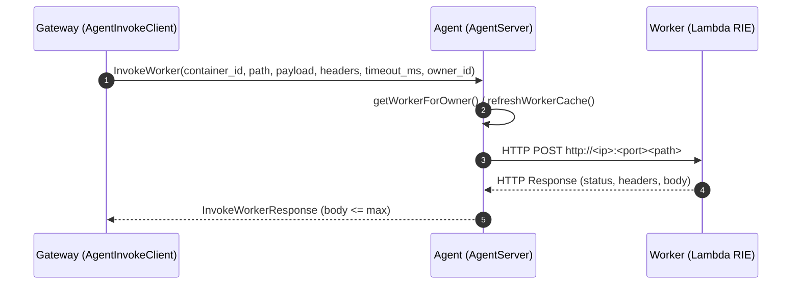

<!--
Where: services/agent/docs/grpc-api.md
What: gRPC API contract and behavior notes for the Agent.
Why: Keep the runtime control surface and error semantics explicit.
-->
# Agent gRPC API

## 参照（Source of Truth）
- Proto 定義: `proto/agent.proto`
- 実装: `services/agent/internal/api/server.go`

## サービス
`esb.agent.v1.AgentService`

## 共通仕様
### `owner_id` は必須
ほぼすべての RPC で `owner_id` が必須です。`container_id` が存在しても `owner_id` が一致しない場合、
Agent は `PermissionDenied` を返します。

### エラーコード（代表例）
- `InvalidArgument`: `owner_id`/`container_id`/`function_name` が空
- `NotFound`: `container_id` が見つからない
- `PermissionDenied`: `owner_id` が一致しない
- `Internal`: runtime 操作失敗（create/start/list 等）
- `DeadlineExceeded`: `InvokeWorker` の HTTP invoke がタイムアウト
- `ResourceExhausted`: `InvokeWorker` のレスポンスボディが上限超過

## RPC 一覧

### 1) EnsureContainer
目的: 関数コンテナを **起動**し、接続情報を返します。

入力（抜粋）:
- `function_name`（必須）
- `image`（任意、空なら Agent 側で推論）
- `env`（任意、map）
- `owner_id`（必須）

出力:
- `WorkerInfo { id, ip_address, port }`

補足:
- `image=""` の場合、`CONTAINER_REGISTRY` + `ESB_TAG` からイメージ名を解決します。
- Agent は「プール管理」を行わず、基本的に **毎回新規コンテナを作成**します。

### 2) DestroyContainer
目的: 指定コンテナを **削除**します（存在しなければ成功扱いにするケースがあります）。

入力（抜粋）:
- `container_id`（必須）
- `owner_id`（必須）

出力:
- `success: bool`

### 3) PauseContainer / ResumeContainer
目的: 将来的な warm start のための一時停止/再開 API です。

補足:
- containerd runtime では `task.Pause/Resume` を使用します。
- docker runtime では現状 `Unimplemented` です（互換のため RPC は存在します）。

### 4) ListContainers
目的: Agent が管理するコンテナ一覧を返します。

入力:
- `owner_id`（必須）

出力:
- `ContainerState[]`（`owner_id` でフィルタされます）

### 5) GetContainerMetrics
目的: コンテナのメトリクスを取得します（cgroup stats ベース）。

入力:
- `container_id`（必須）
- `owner_id`（必須）

出力:
- `ContainerMetrics`

### 6) InvokeWorker
目的: Worker への HTTP invoke を **Agent が代理**して行い、結果を返します。

入力（抜粋）:
- `container_id`（必須）
- `path`（任意、空なら RIE の既定パス）
- `payload`（bytes）
- `headers`（map）
- `timeout_ms`（任意、0/未指定時は既定値）
- `owner_id`（必須）

出力:
- `status_code`
- `headers`
- `body`

#### 代理 Invoke のシーケンス

#### サイズ上限
`AGENT_INVOKE_MAX_RESPONSE_SIZE`（bytes）でレスポンスサイズを制限します。
超過した場合は `ResourceExhausted` を返します。

---

## TLS / 運用系エンドポイント
### mTLS（デフォルト有効）
- 無効化: `AGENT_GRPC_TLS_DISABLED=1`
- 証明書（サーバ側）:
  - `AGENT_GRPC_CERT_PATH`（既定: `/app/config/ssl/server.crt`）
  - `AGENT_GRPC_KEY_PATH`（既定: `/app/config/ssl/server.key`）
  - `AGENT_GRPC_CA_CERT_PATH`（既定: `meta.RootCACertPath`）

### Reflection（デバッグ用）
- 有効化: `AGENT_GRPC_REFLECTION=1`

### Health / Metrics
- gRPC health service を提供します。
- Prometheus `/metrics` を `AGENT_METRICS_PORT`（既定 `9091`）で公開します。

---

## Implementation references
- `proto/agent.proto`
- `services/agent/internal/api/server.go`
- `services/agent/internal/runtime/interface.go`
- `services/agent/cmd/agent/main.go`
- `services/gateway/services/agent_invoke.py`
