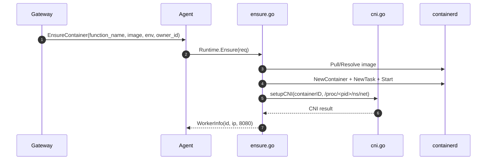

<!--
Where: services/agent/docs/runtime-containerd.md
What: Containerd runtime behavior and module boundaries for the Agent.
Why: Reflect WS3 runtime split and operational contracts.
-->
# Runtime（containerd）

## 前提
Agent は `AGENT_RUNTIME=containerd` のとき、containerd を直接操作してワーカーを起動します。

compose 前提:
- `network_mode: service:runtime-node`（runtime-node の NetNS 共有）
- `pid: service:runtime-node`（runtime-node の PIDNS 共有）
- `/run/containerd/containerd.sock` 共有

この前提により Agent は `/proc/<pid>/ns/net` を参照し、CNI add/del を実行できます。

## WS3 での runtime 分割
| ファイル | 責務 |
| --- | --- |
| `runtime.go` | Runtime 構造体、共有設定解決、Destroy/Suspend/Resume/List入口 |
| `ensure.go` | コンテナ生成、Task start、CNI attach、失敗時ロールバック |
| `cni.go` | CNI setup/remove、IPv4 抽出、setup retry 制御 |
| `list.go` | 管理コンテナ列挙、IPAM から IP 再解決 |
| `metrics.go` | task metrics 抽出、cgroup v1/v2 差異吸収 |

## 起動時（CNI config 生成）
Agent 起動時に CNI `.conflist` を生成します。

- 出力先: `CNI_CONF_DIR`（既定 `/etc/cni/net.d`）
- ファイル名: `10-<meta.RuntimeCNIName>.conflist`
- サブネット: `CNI_SUBNET`（未指定時 `10.88.0.0/16`）
- DNS: `CNI_DNS_SERVER` -> `CNI_GW_IP` -> `10.88.0.1`

## Ensure フロー（container 作成）

重要点:
- `owner_id` は必須
- `image` は通常必須（空時補完経路は互換のため残存）
- `CONTAINERD_RUNTIME=aws.firecracker` 時は snapshotter 既定が `devmapper`
- `/etc/resolv.conf` を bind mount で注入
- CNI setup 失敗時は task/container を rollback して失敗を返す

## CNI setup retry
`cni.go` は `Link not found` 系の race を吸収するため、
短い backoff で setup を再試行します。

## List（IP 再解決）
`list.go` は CNI IPAM state から IP を再解決します。

- `CNI_NET_DIR`（既定 `/var/lib/cni/networks`）
- 参照パス: `<CNI_NET_DIR>/<networkName>/<containerID>`

`networkName` は CNI 設定から取得し、取得できない場合は `meta.RuntimeCNIName` を使います。

## Metrics（cgroup v1/v2）
`metrics.go` は containerd metrics の型差異を吸収し、
統一フォーマットへ変換して `GetContainerMetrics` に返します。

## 外部レジストリとの責務分離
- runtime は外部レジストリ同期を行いません。
- 外部イメージ取り込みは `esb deploy --image-prewarm=all` の責務です。
- runtime は内部レジストリ参照の pull のみを行います。

---

## Implementation references
- `services/agent/internal/runtime/containerd/runtime.go`
- `services/agent/internal/runtime/containerd/ensure.go`
- `services/agent/internal/runtime/containerd/cni.go`
- `services/agent/internal/runtime/containerd/list.go`
- `services/agent/internal/runtime/containerd/metrics.go`
- `services/agent/internal/cni/generator.go`
- `docker-compose.containerd.yml`
