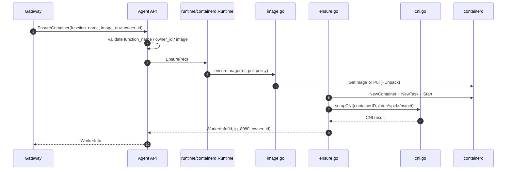
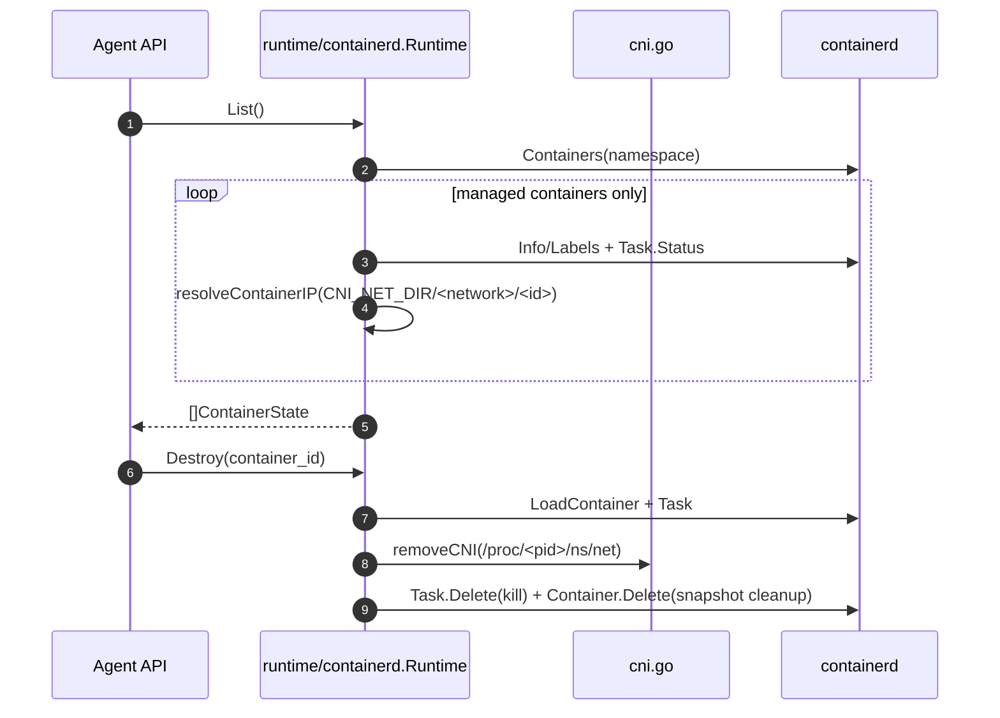

<!--
Where: services/agent/docs/runtime-containerd.md
What: Containerd runtime behavior and module boundaries for the Agent.
Why: Explain containerd runtime module boundaries and operational contracts.
-->
# Runtime（containerd）

## 前提
Agent は `AGENT_RUNTIME=containerd` のとき、containerd を直接操作してワーカーを起動します。

compose 前提:
- `network_mode: service:runtime-node`（runtime-node の NetNS 共有）
- `pid: service:runtime-node`（runtime-node の PIDNS 共有）
- `/run/containerd/containerd.sock` 共有

この前提により Agent は `/proc/<pid>/ns/net` を参照し、CNI add/del を実行できます。

前提:
- `ENV` 未指定時は `default`（`config.DefaultEnv`）
- namespace は `meta.RuntimeNamespace` 固定
- CNI `.conflist` は Agent 起動時に動的生成される

## runtime 分割
| ファイル | 責務 |
| --- | --- |
| `runtime.go` | Runtime 構造体、共有設定解決、Destroy/Suspend/Resume/List入口 |
| `ensure.go` | コンテナ生成、Task start、CNI attach、失敗時ロールバック |
| `cni.go` | CNI setup/remove、IPv4 抽出、setup retry 制御 |
| `list.go` | 管理コンテナ列挙、IPAM から IP 再解決 |
| `metrics.go` | task metrics 抽出、cgroup v1/v2 差異吸収 |
| `image.go` | image 存在確認、pull policy、TLS resolver、unpack 保証 |
| `gc.go` | 管理コンテナ限定 GC、task kill/delete、snapshot cleanup |

## 起動時（CNI config 生成）
Agent 起動時に CNI `.conflist` を生成します。

- 出力先: `CNI_CONF_DIR`（既定 `/etc/cni/net.d`）
- ファイル名: `10-<meta.RuntimeCNIName>.conflist`
- サブネット: `CNI_SUBNET`（未指定時 `10.88.0.0/16`）
- DNS: `CNI_DNS_SERVER` -> `CNI_GW_IP` -> `10.88.0.1`

## Ensure フロー（container 作成）

重要点:
- `owner_id` は必須
- `image` は必須（`EnsureContainer` で未指定は `InvalidArgument`）
- コンテナ ID: `esb-{env}-{function}-{hex(uuid[:4])}`
- `CONTAINERD_RUNTIME=aws.firecracker` 時は snapshotter 既定が `devmapper`（それ以外は `overlayfs`）
- `CONTAINERD_RUNTIME` 指定時は `WithRuntime(runtimeName, nil)` を追加
- `/run/containerd/esb/resolv.conf` を生成し、`/etc/resolv.conf` に read-only bind mount
- `AWS_LAMBDA_FUNCTION_MEMORY_SIZE` が有効な数値なら memory limit を適用
- CNI setup 失敗時は task/container を rollback して失敗を返す

## Image pull ポリシーと TLS
- `IMAGE_PULL_POLICY`:
  - `always`: 既存 image があっても pull を試行
  - `if-not-present`（既定）: 未存在時のみ pull
- pull は selected snapshotter 向けに unpack まで実行（`WithPullUnpack`）
- `CONTAINER_REGISTRY_INSECURE=1/true/yes/on` なら plain HTTP resolver
- insecure でない場合:
  - `meta.RootCACertPath` の CA を読み込み HTTPS resolver を構成
  - CA 未配置時は system cert resolver にフォールバック

## CNI setup retry
`cni.go` は `Link not found` 系 race を吸収するため再試行します。

- 最大 5 回
- 初期 backoff 100ms（最大 800ms）
- `Link not found` 以外のエラーは即時失敗
- `cniMu` で setup/remove を直列化

## List / Destroy / GC

`List` 実装の重要点:
- 管理対象判定 label:
  - `created_by=agent`
  - `env=<runtime.env>`
  - `kind=function`
- `function` label 未設定コンテナは除外
- task 未取得時の状態は `STOPPED`
- `last_used_at` は `Touch/Resume` の記録を優先、未記録なら `CreatedAt`
- IP は CNI state file を参照:
  - `CNI_NET_DIR`（既定 `/var/lib/cni/networks`）
  - `<CNI_NET_DIR>/<networkName>/<containerID>`
  - `networkName` は CNI 設定から取得、不可なら `meta.RuntimeCNIName`

`GC` 実装の重要点:
- 管理対象コンテナのみ処理
- running/paused task は SIGKILL して待機後に削除
- CNI remove 失敗は warning ログにして継続

## Pause/Resume と Metrics
- `Suspend` / `Resume` は containerd task の pause/resume を実装済み
- `Resume` 時に access time を更新
- `Metrics` は cgroup v1/v2 の型差を吸収して共通値へ変換:
  - `MemoryCurrent`, `MemoryMax`, `OOMEvents`, `CPUUsageNS`
- task が見つからない場合は `STOPPED` を返す（メトリクス値は未設定）

## 外部レジストリとの責務分離
- runtime は外部レジストリ同期を行いません。
- 外部イメージ取り込みは `esb deploy --image-prewarm=all` の責務です。
- runtime は内部レジストリ参照の pull のみを行います。

---

## Implementation references
- `services/agent/internal/runtime/containerd/runtime.go`
- `services/agent/internal/runtime/containerd/ensure.go`
- `services/agent/internal/runtime/containerd/cni.go`
- `services/agent/internal/runtime/containerd/list.go`
- `services/agent/internal/runtime/containerd/metrics.go`
- `services/agent/internal/runtime/containerd/image.go`
- `services/agent/internal/runtime/containerd/gc.go`
- `services/agent/internal/api/server.go`
- `services/agent/internal/config/constants.go`
- `services/agent/cmd/agent/main.go`
- `services/agent/internal/cni/generator.go`
- `docker-compose.containerd.yml`
