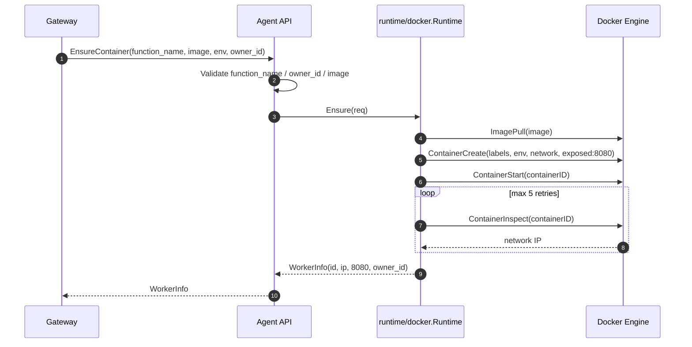
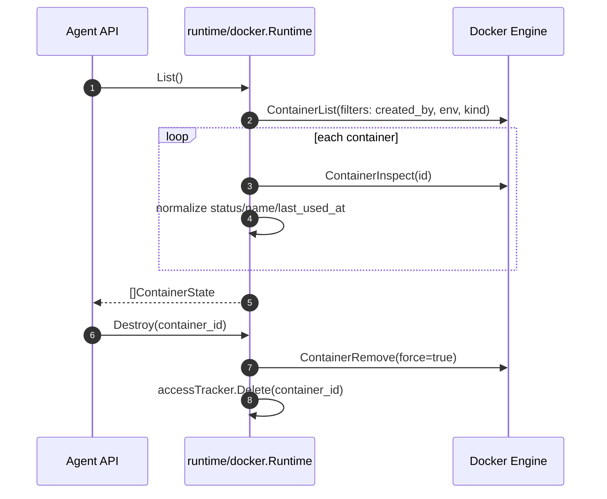

<!--
Where: services/agent/docs/runtime-docker.md
What: Docker runtime behavior and limitations for the Agent.
Why: Docker mode differs from containerd in networking, metrics, and pause semantics.
-->
# Runtime（docker）

## 前提
Agent は `AGENT_RUNTIME=docker` のとき、Docker Engine API を使ってワーカーを起動します。
containerd と違い CNI は使わず、`CONTAINERS_NETWORK` 上の IP を Docker inspect で解決します。

前提:
- `services/agent/cmd/agent/main.go` で `client.NewClientWithOpts(client.FromEnv, client.WithAPIVersionNegotiation())` を使用
- `CONTAINERS_NETWORK` と `ENV` は必須（欠落時は起動時 hard fail）
- brand は `StackIdentity` で解決（`ESB_BRAND_SLUG` -> `PROJECT_NAME/ENV` -> `CONTAINERS_NETWORK`）

## runtime 分割
Docker runtime は単一ファイル実装です（`runtime.go`）。

| 区分 | 責務 |
| --- | --- |
| `Ensure` | owner 検証、image pull、container create/start、IP 解決、`WorkerInfo` 返却 |
| `Destroy` | 強制 remove とアクセス時刻トラッキング削除 |
| `Touch` | 最終アクセス時刻更新 |
| `List` | 管理対象コンテナ列挙、label filter、owner/IP/状態の整形 |
| `Suspend` / `Resume` | 現状は `Unimplemented` を返す互換 API |
| `Metrics` | 現状は未実装エラー |

## Ensure フロー（container 作成）

実装上の重要点:
- API 層（`internal/api/server.go`）で `image` と `owner_id` は必須
- runtime 層でも `owner_id` 空はエラー
- コンテナ名: `{brand}-{env}-{function}-{hex(uuid[:4])}`
- label:
  - `<brand>_function=<function_name>`
  - `created_by=<brand>-agent`
  - `<brand>_env=<env>`
  - `com.<brand>.kind=function`
  - `com.<brand>.owner=<owner_id>`
- ポートは `8080/tcp` を exposed（戻り値の `WorkerInfo.Port` も `8080`）
- restart policy は `no`

## Image pull ポリシー
- `CONTAINER_REGISTRY` 未指定時は `registry:5010`（`config.DefaultContainerRegistry`）
- registry が空文字でない限り `ImagePull` を実行し、pull stream を最後まで drain
- API 契約上 `req.image` は必須なので、通常は API 指定イメージを pull
- runtime 側には `req.image` 空時のフォールバック実装があるが、通常運用では API 検証で到達しない

## 制限事項
- `Suspend` / `Resume` は未実装（`codes.Unimplemented`）
- `Metrics` は未実装（`metrics not implemented for docker runtime`）
- `GC` は no-op（Docker daemon 管理に委譲）

## IP 解決と再試行
`Ensure` では `ContainerInspect` で IP を解決し、未取得の場合は指数バックオフで再試行します。

- 回数: 最大 5 回
- 待機: `100ms, 200ms, 400ms, 800ms, 1.6s`
- 優先: `CONTAINERS_NETWORK` の endpoint IP
- フォールバック: 他 network の先頭有効 IP

5 回で取得できなければ `container started but IP address not available` で失敗します。

## List / Destroy フロー

List 実装の重要点:
- filter label:
  - `created_by=<brand>-agent`
  - `<brand>_env=<runtime.env>`
  - `com.<brand>.kind=function`
- `owner_id` は label から復元
- `last_used_at` は `Touch` の記録を優先し、なければ Docker `Created` 時刻
- 名前は Docker 由来の先頭 `/` を除去
- 状態正規化:
  - `running -> RUNNING`
  - `paused -> PAUSED`
  - `exited/dead -> STOPPED`
  - その他 -> `UNKNOWN`

---

## Implementation references
- `services/agent/internal/runtime/docker/runtime.go`
- `services/agent/internal/api/server.go`
- `services/agent/internal/runtime/constants.go`
- `services/agent/internal/identity/stack_identity.go`
- `services/agent/internal/config/constants.go`
- `services/agent/cmd/agent/main.go`
