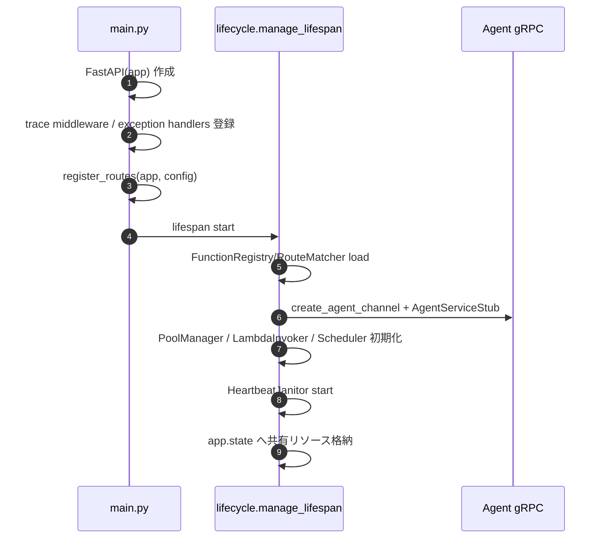
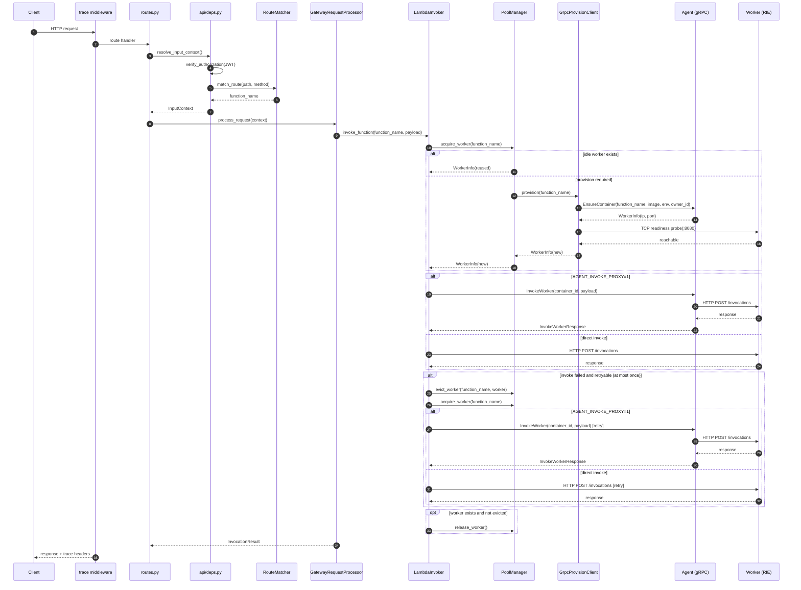

<!--
Where: services/gateway/docs/architecture.md
What: Gateway architecture, module boundaries, and runtime request flow.
Why: Explain app assembly, lifecycle, middleware, and route flow from current code.
-->
# Gateway アーキテクチャ

## 概要
Gateway は FastAPI ベースの HTTP エントリポイントです。
主経路（catch-all）は `RouteMatcher -> GatewayRequestProcessor -> LambdaInvoker -> PoolManager`
の順で進み、ワーカーの作成/削除は Agent gRPC に委譲されます。
`/2015-03-31/functions/{function_name}/invocations` 経路は RouteMatcher を使わず、
`LambdaInvoker -> PoolManager` を直接通ります。

## 責務分割
| ファイル | 主責務 |
| --- | --- |
| `services/gateway/main.py` | FastAPI app 組み立て、lifespan/middleware/route 登録 |
| `services/gateway/lifecycle.py` | 起動・終了オーケストレーション（state 初期化/解放） |
| `services/gateway/middleware.py` | trace propagation と access log |
| `services/gateway/routes.py` | エンドポイント実装と register_routes |
| `services/gateway/exceptions.py` | 例外ハンドラ登録 |

## 起動フロー

`lifecycle.py` の shutdown は以下順で実行されます。

1. config reloader stop
2. janitor stop
3. scheduler stop
4. pool_manager shutdown
5. gRPC channel close
6. HTTP client close

## リクエスト処理フロー

## 主要コンポーネント
| コンポーネント | 役割 |
| --- | --- |
| `GatewayRequestProcessor` | Lambda event 変換と実行結果整形 |
| `LambdaInvoker` | worker invoke 実行（direct/agent proxy） |
| `PoolManager` | `LambdaInvoker` の backend。worker の acquire/release/evict、起動時 cleanup、終了時 drain |
| `GrpcProvisionClient` | `EnsureContainer`/`DestroyContainer` など Agent 呼び出し |
| `AgentInvokeClient` | `AGENT_INVOKE_PROXY=1` 時の L7 invoke 代理 |
| `HeartbeatJanitor` | idle/orphan 管理 |
| `SchedulerService` | schedule 定義読み込みと実行 |

## ルーティング層の整理
`routes.py` は以下の責務を持ちます。

- 認証エンドポイント (`/user/auth/v1`)
- health endpoint
- metrics/list endpoints
- Lambda Invoke API 互換 endpoint
- catch-all gateway handler
- CORS/preflight と proxy header sanitization

## 重要ポイント
- Gateway がプール管理を担い、Agent は factory 的にコンテナを作成します。
- `PoolManager` は `LambdaInvoker` から利用され、`acquire/release` とエラー時 `evict` を担当します。
- `PoolManager` は idle worker を優先再利用し、容量不足時のみ Agent 経由で新規作成します。
- 起動時に `cleanup_all_containers()` を呼び、旧状態を明示的に掃除します。
- shutdown では `shutdown_all()` で pool を drain し、残存コンテナを削除します。
- Invoke API 経路では `FunctionName`（関数名/ARN/修飾子付き）を Gateway 境界で正規化してから処理します。
- trace middleware が `X-Amzn-Trace-Id` と `x-amzn-RequestId` を付与します。
- `AGENT_INVOKE_PROXY` により direct invoke と agent proxy invoke を切り替えます。

## 回帰テスト観点
- app assembly: `services/gateway/tests/test_openapi_docs.py`
- exception wiring: `services/gateway/tests/test_error_handling_main.py`
- error logging: `services/gateway/tests/test_error_logging.py`
- dependency integration: `services/gateway/tests/test_integration_handler.py`
- invoker DI path: `services/gateway/tests/test_lambda_invoker_di.py`
- fixture bootstrapping: `services/gateway/tests/conftest.py`

---

## Implementation references
- `services/gateway/main.py`
- `services/gateway/lifecycle.py`
- `services/gateway/middleware.py`
- `services/gateway/routes.py`
- `services/gateway/exceptions.py`
- `services/gateway/services/pool_manager.py`
- `services/gateway/services/lambda_invoker.py`
- `services/gateway/services/grpc_provision.py`
- `services/gateway/services/agent_invoke.py`
- `services/gateway/tests/conftest.py`
- `services/gateway/tests/test_error_handling_main.py`
- `services/gateway/tests/test_error_logging.py`
- `services/gateway/tests/test_integration_handler.py`
- `services/gateway/tests/test_lambda_invoker_di.py`
- `services/gateway/tests/test_openapi_docs.py`
