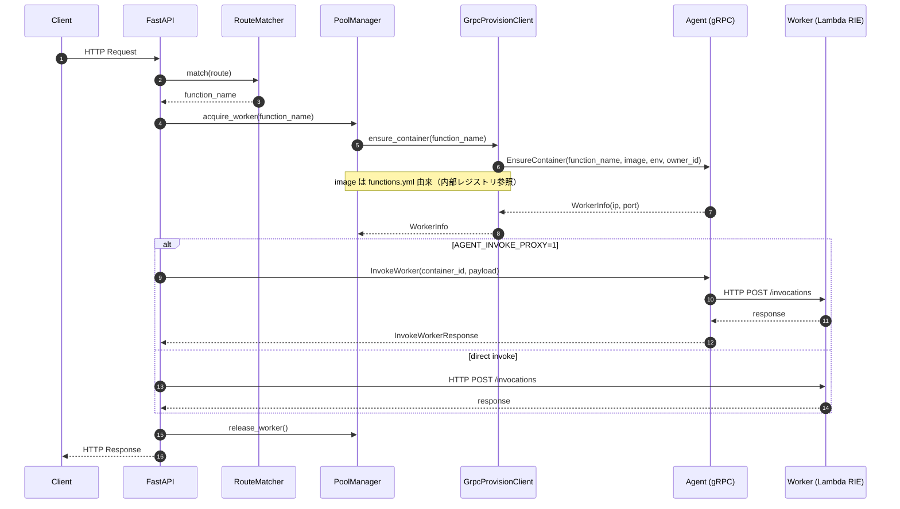
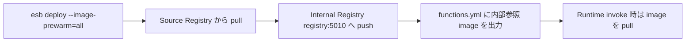

<!--
Where: services/gateway/docs/architecture.md
What: Gateway architecture, flows, and key collaborations.
Why: Provide a concise, code-grounded overview of request handling.
-->
# Gateway アーキテクチャ

## 概要
Gateway は FastAPI の HTTP エンドポイントとして動作し、**RouteMatcher -> PoolManager -> LambdaInvoker** の順に
リクエストを処理します。ワーカーの起動/削除は **Agent（gRPC）** に委譲されます。

## クラス構造（主要コンポーネント）

## リクエスト処理フロー

## Image 関数の運用フロー（正式）

## Image 関数の設定フィールド

| フィールド | 由来 | 役割 |
| --- | --- | --- |
| `image` | functions.yml | 実行時に Agent/Runtime が pull する内部レジストリ参照 |

## 重要ポイント
- **プール管理**は Gateway が実施（Agent は常に新規作成）
- **起動時クリーンアップ**: Gateway 起動時に Agent に `ListContainers` を投げ、
  既存コンテナを削除して状態を揃える（コールドスタート増加のトレードオフあり）
- **L7 invoke 代理**: `AGENT_INVOKE_PROXY=1` で Agent 経由の HTTP proxy を使用可能
- **Image 関数**: 外部レジストリ同期は deploy 側の責務。runtime は内部レジストリのみを参照

---

## Implementation references
- `services/gateway/main.py`
- `services/gateway/services/pool_manager.py`
- `services/gateway/services/container_pool.py`
- `services/gateway/services/janitor.py`
- `services/gateway/services/grpc_provision.py`
- `services/gateway/services/agent_invoke.py`
- `services/gateway/services/lambda_invoker.py`
- `services/gateway/services/processor.py`
