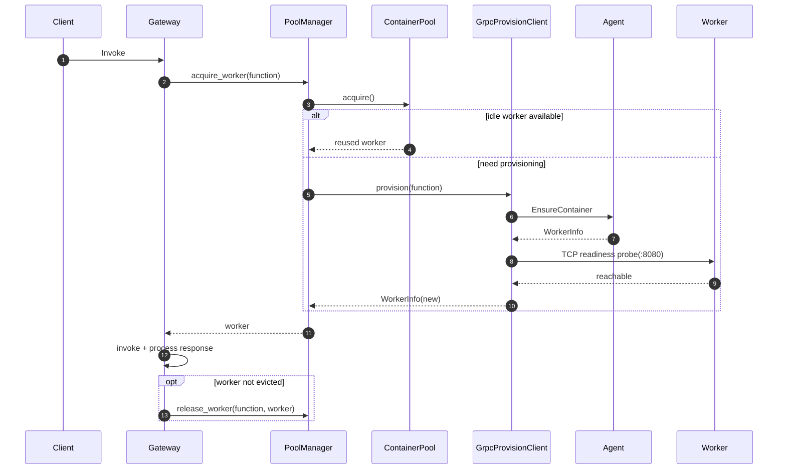
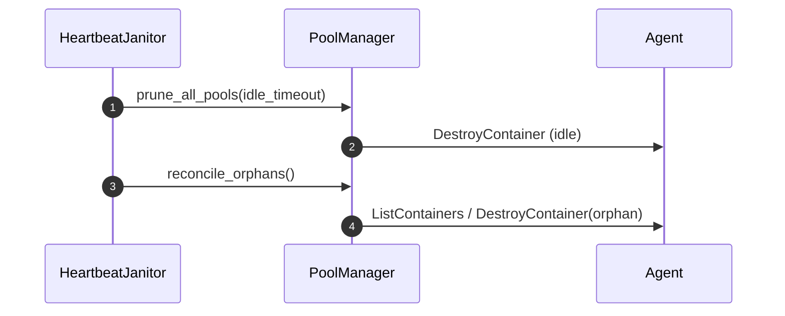

<!--
Where: services/gateway/docs/autoscaling.md
What: Autoscaling and worker lifecycle behavior in Gateway.
Why: Make pool/janitor behavior explicit for capacity planning and debugging.
-->
# オートスケーリングとワーカー管理

## 概要
Gateway のスケーリングは `PoolManager` + `ContainerPool` + `HeartbeatJanitor` で構成されます。

- 関数ごとに独立プールを持つ
- idle worker を再利用して cold start を抑制
- idle timeout 超過時は Janitor が削除（scale-to-zero）
- 起動時・再起動時は orphan cleanup で整合性を回復
- `min_capacity` は設定値として保持されるが、現状は起動時の先行 warmup（事前起動）は行わない

## コンポーネント
| コンポーネント | 役割 |
| --- | --- |
| `PoolManager` | 関数ごとの `ContainerPool` を生成し、acquire/release/evict を統括 |
| `ContainerPool` | 同時実行制御、idle/busy/provisioning 状態管理 |
| `HeartbeatJanitor` | 周期的に idle prune と orphan reconciliation を実行 |
| `GrpcProvisionClient` | Agent への `EnsureContainer` / `DestroyContainer` 連携と起動後 readiness 確認 |

## 基本フロー

## Janitor フロー

## 主要設定
| 変数 | 既定 | 説明 |
| --- | --- | --- |
| `DEFAULT_MAX_CAPACITY` | `1` | 関数ごとの既定最大同時実行 |
| `DEFAULT_MIN_CAPACITY` | `0` | 関数ごとの既定最小常駐 |
| `POOL_ACQUIRE_TIMEOUT` | `30.0` | acquire 待機上限（秒） |
| `HEARTBEAT_INTERVAL` | `30` | Janitor 実行間隔（秒） |
| `GATEWAY_IDLE_TIMEOUT_SECONDS` | `300` | idle 削除判定（秒） |
| `ORPHAN_GRACE_PERIOD_SECONDS` | `60` | 作成直後コンテナの保護時間（秒） |
| `ENABLE_CONTAINER_PAUSE` | `false` | idle pause を有効化 |
| `PAUSE_IDLE_SECONDS` | `30` | pause 判定までの idle 秒 |

## 運用メモ
- `/metrics/pools` で関数ごとのプール状態を確認できます。
- `/metrics/containers` は Agent runtime 実装に依存し、Docker モードでは `501` になる場合があります。
- 再起動直後は startup cleanup の影響で cold start が増えることがあります。
- Janitor は `manager_client` 未設定時（現行の `lifecycle.py` 構成）でも `prune_all_pools` と `reconcile_orphans` は実行します。

---

## Implementation references
- `services/gateway/services/pool_manager.py`
- `services/gateway/services/container_pool.py`
- `services/gateway/services/janitor.py`
- `services/gateway/lifecycle.py`
