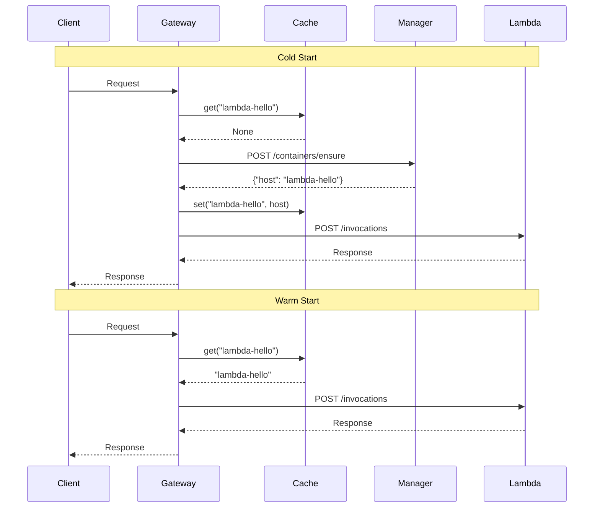

<!--
Where: services/gateway/docs/container-cache.md
What: Container host cache behavior (legacy/optional) in Gateway.
Why: Preserve intent and usage boundaries for the cache implementation.
-->
# コンテナキャッシュによるレイテンシ最適化

## 概要

Gateway にはコンテナのホスト情報を **TTL 付き LRU キャッシュ** で保持する実装 (`ContainerHostCache`) がありますが、現在の gRPC/Agent 経路では未使用です。将来的な最適化やレガシー経路向けのコードとして残しています。

## 動作原理

### Cold Start（初回リクエスト・レガシー経路）
1. Gateway がキャッシュを確認 → ミス
2. Manager に問い合わせ → コンテナ起動
3. 結果をキャッシュに登録（TTL 開始）
4. Lambda RIE にリクエスト転送

### Warm Start（キャッシュヒット・レガシー経路）
1. Gateway がキャッシュを確認 → ヒット
2. **Manager への問い合わせをスキップ**
3. Lambda RIE にリクエスト転送

## 設定

| 環境変数 | デフォルト | 説明 |
|---------|-----------|------|
| `CONTAINER_CACHE_TTL` | `30` | キャッシュ TTL（秒） |

キャッシュサイズ: 最大 100 エントリ（LRU で自動削除）

## 接続失敗時の自動無効化

Manager がコンテナを停止した場合、Gateway のキャッシュに古い情報が残る可能性があります。この問題に対処するため：

1. Lambda への接続失敗時（`502 Bad Gateway`）
2. Gateway が該当エントリをキャッシュから自動削除
3. 次回リクエストで Manager に再問い合わせ
4. コンテナが再起動され、正常レスポンス

## 実装ファイル

- `services/gateway/services/container_cache.py` - キャッシュ本体
- `services/gateway/client.py` - gRPC 経路移行後のメモ

---

## Implementation references
- `services/gateway/services/container_cache.py`
- `services/gateway/client.py`
