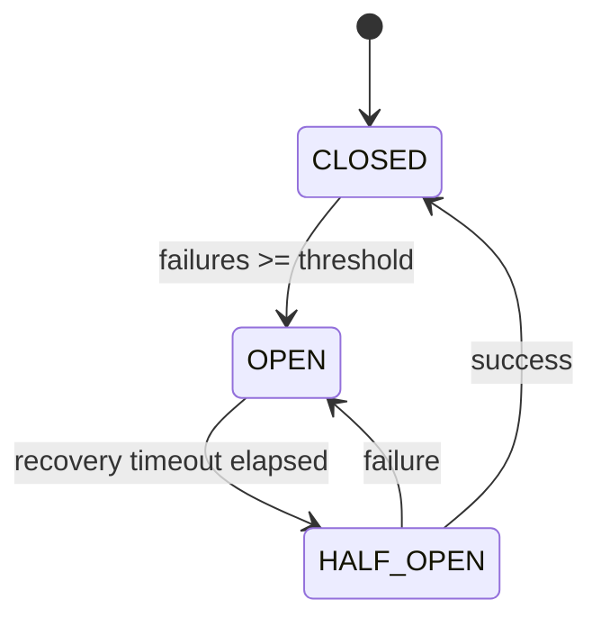

<!--
Where: services/gateway/docs/resilience.md
What: Gateway resilience mechanisms.
Why: Document failure handling and recovery behavior at runtime.
-->
# Gateway レジリエンス

## 対象
Gateway の信頼性機構として、以下を扱います。

- Circuit Breaker
- Worker lifecycle recovery（evict/retry）
- Startup cleanup / orphan reconciliation

## 1. Circuit Breaker
Gateway は関数ごとに独立した breaker を持ちます。

### 設定
| 変数 | 既定 | 説明 |
| --- | --- | --- |
| `CIRCUIT_BREAKER_THRESHOLD` | `5` | 連続失敗閾値 |
| `CIRCUIT_BREAKER_RECOVERY_TIMEOUT` | `30.0` | OPEN 維持時間（秒） |

### 失敗判定（主な例）
- HTTP 5xx
- `X-Amz-Function-Error` ヘッダー
- 接続エラー / gRPC 到達不可

## 2. Worker 回復
`LambdaInvoker` は次の回復処理を行います。

- 接続失敗時に worker を `evict`
- retry 可能条件なら worker を再取得して再実行
- `finally` で非 eviction worker を確実に `release`

## 3. 再起動時の整合（概要）
- Gateway 起動時に `cleanup_all_containers()` で既存コンテナを明示削除
- Janitor が `reconcile_orphans()` を周期実行
- `ORPHAN_GRACE_PERIOD_SECONDS` 以内の新規コンテナは誤削除を防止
- 詳細な運用手順・確認コマンドは `restart-resilience.md` を正本として参照

## 4. クライアントへの代表的なエラー
| ステータス | 主な原因 |
| --- | --- |
| `404` | ルート未定義 / 関数未定義 |
| `502` | breaker 作動、invoke 失敗、関数実行エラー |
| `503` | worker 起動失敗 |
| `504` | invoke timeout |

---

## Implementation references
- `services/gateway/core/circuit_breaker.py`
- `services/gateway/services/lambda_invoker.py`
- `services/gateway/services/pool_manager.py`
- `services/gateway/services/janitor.py`
- `services/gateway/lifecycle.py`
