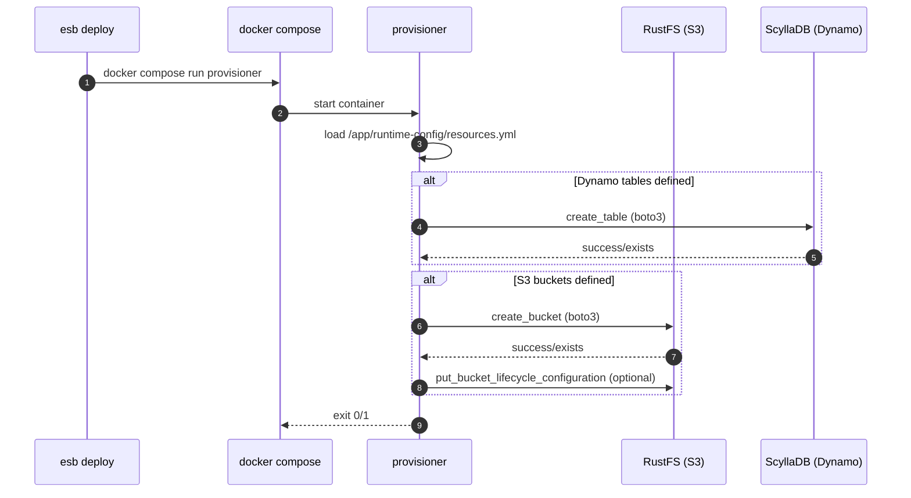

<!--
Where: services/provisioner/docs/architecture.md
What: Provisioner execution flow and responsibilities.
Why: Document the resource initialization path triggered by deploy.
-->
# Provisioner アーキテクチャ

## 概要
Provisioner は `resources.yml` を読み取り、S3（RustFS）と DynamoDB（ScyllaDB Alternator）
に対して **必要なリソースを作成**します。既存リソースはスキップされ、冪等的に動作します。

## 実行シーケンス

## 役割
- `resources.yml` を読み取り、**DynamoDB テーブル**と **S3 バケット**を作成
- 既存リソースは **スキップ**（エラーにしない）
- `LifecycleConfiguration` の一部を boto3 形式に変換して適用

## データソース
### マニフェスト
`/app/runtime-config/resources.yml` が唯一の入力です。

### エンドポイント
`sitecustomize.py` により以下の env を boto3 が参照します:
- `DYNAMODB_ENDPOINT`
- `S3_ENDPOINT`

---

## Implementation references
- `services/provisioner/src/main.py`
- `services/provisioner/entrypoint.sh`
- `docker-compose.docker.yml`
- `docker-compose.containerd.yml`
