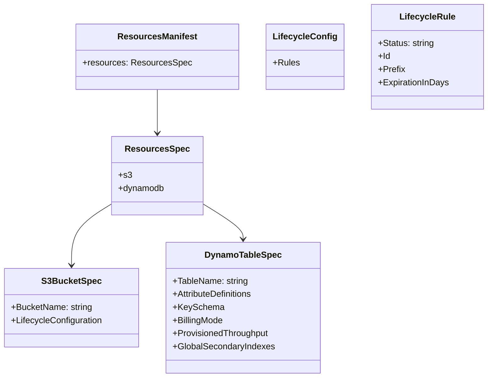

<!--
Where: services/provisioner/docs/resources-manifest.md
What: Schema notes for runtime-config/resources.yml.
Why: Provide a stable contract between producer output and provisioner input.
-->
# resources.yml 仕様（Provisioner 入力）

## 概要
Provisioner が参照する入力ファイルは **`/app/runtime-config/resources.yml`** のみです。
実装は辞書として読み取り、**参照されるキーのみ**を解釈します。

## 構造（型イメージ）



## 実装上の解釈
### DynamoDB
- `TableName` が無いテーブルはスキップ
- `create_table(**table)` に **そのまま渡す**（PascalCase の boto3 引数に一致）

### S3
- `BucketName` が無いバケットはスキップ
- `create_bucket(Bucket=BucketName)` を使用
- `LifecycleConfiguration` は **一部の項目のみ**を変換して適用:
  - `Status`（既定: `Enabled`）
  - `Id` → `ID`
  - `Prefix` → `Filter.Prefix`
  - `ExpirationInDays` → `Expiration.Days`

## 例

```yaml
resources:
  dynamodb:
    - TableName: MyTable
      BillingMode: PAY_PER_REQUEST
      AttributeDefinitions:
        - AttributeName: pk
          AttributeType: S
      KeySchema:
        - AttributeName: pk
          KeyType: HASH
  s3:
    - BucketName: my-bucket
      LifecycleConfiguration:
        Rules:
          - Status: Enabled
            Prefix: logs/
            ExpirationInDays: 30
```

---

## Implementation references
- `services/provisioner/src/main.py`
> 注: `resources.s3` / `resources.dynamodb` は **配列**です（図では簡略化）。
