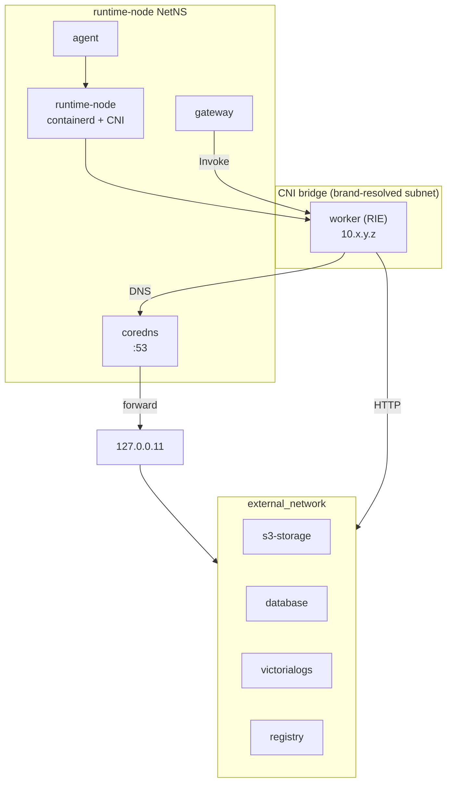

<!--
Where: services/runtime-node/docs/networking.md
What: Networking model for runtime-node in containerd mode.
Why: Clarify CNI/CoreDNS/NAT wiring and operational checks.
-->
# ネットワーク設計（containerd モード）

## 概要
runtime-node は CNI bridge と CoreDNS を使って worker ネットワークを提供します。

- worker subnet: `CNI_SUBNET`（Agent 解決値）
- DNS: `<CNI gateway>:53`（CoreDNS sidecar）
- 外向き通信: runtime-node の iptables MASQUERADE

## 構成


## 実装上の要点
- CoreDNS は `network_mode: service:runtime-node` で runtime-node の NetNS を共有
- Agent/Gateway も containerd compose では runtime-node NetNS を共有
- NAT ルールは `apply_cni_nat()` で投入され、`CNI_SUBNET` と `CNI_BRIDGE`（または `/var/lib/cni/esb-cni.env`）へ追従

## 代表的な確認コマンド
```bash
# NAT ルール
iptables -t nat -S POSTROUTING | grep MASQUERADE

# CoreDNS ログ
docker logs <project>-coredns

# runtime-node 内 containerd 生存確認
docker exec <project>-runtime-node ctr -a /run/containerd/containerd.sock version
```

## 注意
`runtime-node` は起動時と定期再適用で `/var/lib/cni/esb-cni.env` を再読込します。
`CNI_SUBNET` / `CNI_BRIDGE` の更新は iptables ルールへ自動追従します（既存ルールは `ensure_iptables_rule` で冪等化）。

---

## Implementation references
- `docker-compose.containerd.yml`
- `services/runtime-node/entrypoint.common.sh`
- `services/runtime-node/config/Corefile`
- `services/agent/internal/cni/generator.go`
