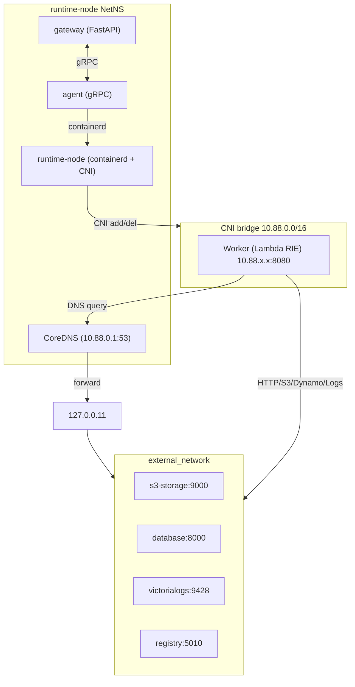

<!--
Where: services/runtime-node/docs/networking.md
What: Networking model for runtime-node (CNI + CoreDNS + NAT).
Why: Document the data-plane wiring used by containerd mode.
-->
# ネットワーク/ルーティング概要

このドキュメントは、runtime-node を中心とした **CNI + CoreDNS + NAT** の設計を説明します。
従来の local-proxy/DNAT を廃止し、**DNS による名前解決 + MASQUERADE** に統一しています。

## スコープと目的

- Lambda SDK/内部呼び出しのために `10.88.0.1` を DNS ネームサーバーとして利用する
- 外部サービス（S3/DB/Logs/Gateway）の IP 直指定を廃止し、論理名（`s3-storage` 等）での解決を可能にする
- `runtime-node` のサイドカーとして `CoreDNS` を導入し、NetNS 内の Docker DNS (127.0.0.11) へフォワードする
- Firecracker (Remote Node) 環境において、すべての制御プレーン通信を WireGuard (10.99.0.1) へ集約・解決する

## コンポーネントと役割

- **runtime-node**:
  - containerd + CNI bridge（`10.88.0.0/16`）を実行
  - CNI サブネットから外部への MASQUERADE (SNAT) ルールを管理
  - `agent` および `coredns` とネットワーク環境を共有
- **coredns (Sidecar)**:
  - `runtime-node` の NetNS 内で `10.88.0.1:53` (UDP/TCP) にバインド
  - Lambda VM からの問い合わせに対し、以下のいずれかへ解決・転送する：
    - ローカル環境 (Containerd): Docker DNS (`127.0.0.11`) へフォワード
    - リモート環境 (Firecracker/WG): `extra_hosts` 設定により `10.99.0.1` (Gateway) へ解決
- **gateway**:
  - HTTPS エントリポイント（`:8443`、ホスト公開は `:443`）
  - Control Plane 内の各サービスのリバースプロキシ (HAProxy) を内蔵し、WireGuard 経由のマルチサービス通信を単一 IP で受ける
- **agent**:
  - containerd 経由で task を作成し、CNI 設定で `dns.nameservers = ["10.88.0.1"]` を注入

## ネットワーク構成図（containerd モード）



## トラフィックフロー

### 1) Client -> Gateway（HTTPS）
- **経路**: Host `:443` -> `gateway` コンテナ `:8443`

### 2) Gateway -> Worker（Invoke）
- **経路**: `gateway` -> `worker.ip:8080` (CNI サブネット内)

### 3) Worker -> Control Plane (S3 / DB / Logs / Gateway)
- **名前解決**: Worker -> `10.88.0.1:53` (CoreDNS) -> 論理名 (`s3-storage` 等) を解決
- **通信 (Containerd モード)**:
  - Worker -> `172.50.0.x` (各コンテナの IP)
  - `runtime-node` が MASQUERADE を適用し、外部ネットワークへルーティング
- **通信 (Firecracker / Remote モード)**:
  - Worker -> `10.99.0.1` (WireGuard Gateway IP)
  - 制御プレーンの全サービスは Gateway の HAProxy 経由で中継される

## 主要な環境変数と設定

- **CNI_GW_IP** (既定: `10.88.0.1`): CNI ブリッジのゲートウェイ。CoreDNS の待ち受け IP としても利用される。
- **CNI_DNS_SERVER** (任意): ワーカーの DNS 参照先。未指定時は `CNI_GW_IP` を使用。
- **CNI_SUBNET** (任意): CNI ブリッジのサブネット。IPAM の subnet/range に反映される。
- **CONTROL_HOST** (既定: `10.99.0.1`): リモートノードから見た制御プレーンの到達先 IP。
- **DYNAMODB_ENDPOINT**: `http://database:8000` (DNS で解決)
- **S3_ENDPOINT**: `http://s3-storage:9000` (DNS で解決)

## CNI_SUBNET 変更時の推奨値（GW/DNS の関係）

`CNI_SUBNET` を変更する場合は、CNI ブリッジの GW と DNS を同じサブネット内に揃えるのが安全です。

- **推奨ルール**
  - `CNI_SUBNET` はホスト/他ネットワークと重複しない RFC1918 の範囲を選ぶ。
  - `CNI_GW_IP` は `CNI_SUBNET` 内の **先頭付近の固定 IP**（例: `.1`）にする。
  - CoreDNS がバインドする IP と `CNI_GW_IP` は一致させる。
  - `CNI_DNS_SERVER` は通常不要。明示する場合は `CNI_GW_IP` と同一にする。
  - MASQUERADE のルールは新しいサブネットに合わせて更新する。

- **例**
  - `CNI_SUBNET=10.20.0.0/24`
  - `CNI_GW_IP=10.20.0.1`
  - `CNI_DNS_SERVER=10.20.0.1`（指定する場合）

- **確認ポイント**
  - `docker exec esb-runtime-node ip addr` でブリッジ IP が `CNI_GW_IP` になっている。
  - `ctr -n esb task exec ... cat /etc/resolv.conf` で nameserver が `CNI_GW_IP` になっている。
  - `iptables -t nat -S POSTROUTING` に `-s <CNI_SUBNET> ! -d <CNI_SUBNET> -j MASQUERADE` がある。

## docker-compose 側の設定例

`.env` または compose の `environment` に指定します。通常は `CNI_GW_IP` のみで十分です。

```env
# .env
CNI_SUBNET=10.20.0.0/24
CNI_GW_IP=10.20.0.1
# CNI_DNS_SERVER=10.20.0.1  # 明示したい場合のみ
```

```yaml
# docker-compose.containerd.yml (例)
services:
  runtime-node:
    environment:
      - CNI_SUBNET=${CNI_SUBNET:-10.88.0.0/16}
      - CNI_GW_IP=${CNI_GW_IP:-10.88.0.1}
  agent:
    environment:
      - CNI_SUBNET=${CNI_SUBNET:-10.88.0.0/16}
      - CNI_GW_IP=${CNI_GW_IP:-10.88.0.1}
      # - CNI_DNS_SERVER=${CNI_DNS_SERVER:-}  # 明示する場合のみ
```

## Gateway 側 WireGuard プロキシ構成

リモートノード（Firecracker）からの通信を単一の WireGuard IP で受けるため、Gateway 内の HAProxy (`config/haproxy.gateway.cfg`) が以下のポートを中継します：

- `5010`: Registry
- `9000`: S3 (RustFS)
- `8000`: DynamoDB (ScyllaDB)
- `9428`: VictoriaLogs
 - `8443`: Gateway API

## トラブルシュート

1) **CoreDNS のログ確認**
```bash
docker logs esb-coredns
```

2) **Worker 内からの名前解決テスト**
```bash
# Lambda VM 内で (可能な場合)
nslookup s3-storage 10.88.0.1
```

3) **MASQUERADE ルールの確認**
```bash
docker exec esb-runtime-node iptables -t nat -S POSTROUTING
# 以下のようなルールが存在すること
# -A POSTROUTING -s 10.88.0.0/16 ! -d 10.88.0.0/16 -j MASQUERADE
```

4) **Gateway HAProxy の疎通確認 (Remote)**
```bash
# Compute Node から Control Plane へ
curl -v http://10.99.0.1:9000/health
```

---

## Implementation references
- `services/runtime-node/entrypoint.common.sh`
- `services/agent/internal/runtime/containerd/runtime.go`
- `docker-compose.containerd.yml`
