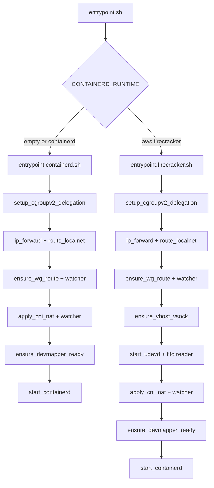

<!--
Where: services/runtime-node/docs/startup.md
What: Startup flow for runtime-node entrypoints.
Why: Explain how runtime-node boots containerd / firecracker mode.
-->
# 起動フロー（runtime-node）

runtime-node は `entrypoint.sh` で `CONTAINERD_RUNTIME` を判定し、
containerd or firecracker の初期化を分岐します。

## 起動フロー（概略）

## 重要ポイント
- `IMAGE_RUNTIME` は `containerd` 固定（`entrypoint.sh` でチェック）
- devmapper pool は **事前に存在**している必要があります（作成はしない）
- `apply_cni_nat` は `CNI_SUBNET` / `CNI_BRIDGE`（または `/var/lib/cni/esb-cni.env`）を参照して SNAT/FORWARD を設定します
- containerd compose では Gateway/Agent/CoreDNS が runtime-node の NetNS を共有します

---

## Implementation references
- `services/runtime-node/entrypoint.sh`
- `services/runtime-node/entrypoint.containerd.sh`
- `services/runtime-node/entrypoint.firecracker.sh`
- `services/runtime-node/entrypoint.common.sh`
