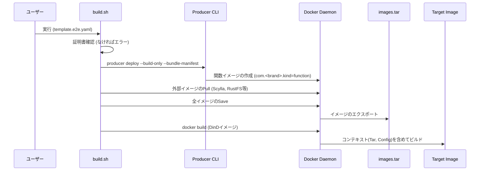
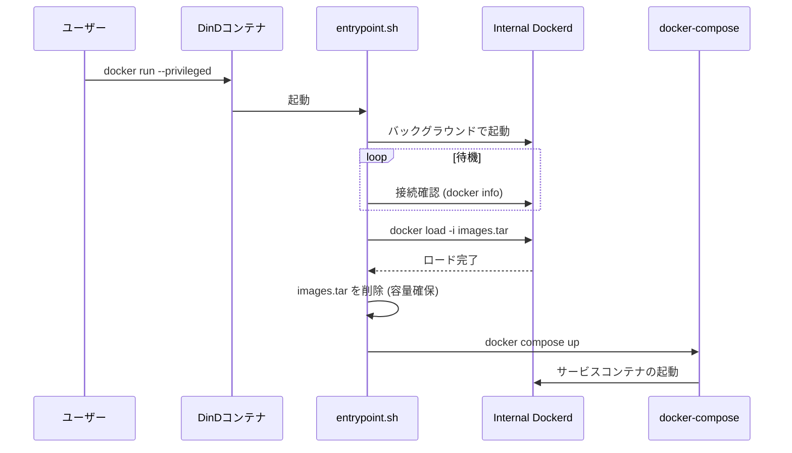

# DinD Bundler Tools

このディレクトリには、本スタック全体を単一の Docker-in-Docker (DinD) コンテナにパッケージングするためのツールが含まれています。
これにより、インターネット接続のない環境や、完全に自己完結したデモ/テスト環境において、`docker pull` やビルドプロセスなしで本スタックを実行できます。

## 概要

このツールセットは以下の機能を提供します：
1.  **ビルド自動化**: producer の deploy(build-only + bundle-manifest) を実行して Lambda 関数イメージを生成し、必要なベースイメージと共に単一の tar アーカイブにまとめます。
2.  **自己完結イメージ**: すべての依存イメージと設定ファイルを含む DinD イメージを作成します。
3.  **自動起動**: コンテナ起動時に内部 Docker デーモンを立ち上げ、イメージをロードし、`docker-compose` でスタックを起動します。

## 使用方法

プロジェクトのルートディレクトリで以下のコマンドを実行してください。

```bash
# 基本的な使用方法
./tools/dind-bundler/build.sh <SAMテンプレートパス> <出力イメージタグ>

# 例: e2eテスト用のテンプレートを使用してビルドする場合
./tools/dind-bundler/build.sh e2e/fixtures/template.e2e.yaml my-stack-bundle:latest

# 例: 複数テンプレートをまとめてビルドする場合
./tools/dind-bundler/build.sh -t template-a.yaml -t template-b.yaml my-stack-bundle:latest
```

※ `SAMテンプレートパス` は必須です。

### ビルドオプション (環境変数)

*   `ESB_ENV=<env>`: producer deploy の `--env` に渡す環境名を指定します。
*   `CERT_DIR=<path>`: 証明書の保存先を指定します（デフォルト: `./.esb/certs`）。存在しない場合はエラーになります。
*   `ESB_OUTPUT_DIR=<path>`: producer deploy の出力ディレクトリ（デフォルト: `.esb`）。
*   `BUNDLE_MANIFEST_PATH=<path>`: バンドル用マニフェストのパスを明示指定します（複数テンプレートでは使用不可）。

`.env` が存在する場合は DinD イメージに同梱されます。`.env` がない場合は、
`ENV` と `RUSTFS_ACCESS_KEY` / `RUSTFS_SECRET_KEY` の最小構成を生成します。

証明書は事前に用意されている必要があります（ダミー生成は行いません）。

## マニフェスト駆動

バンドラーは **マニフェストを唯一の入力** としてイメージを収集します。
producer deploy の `--bundle-manifest` は `bundle/manifest.json` を生成し、
ビルドスクリプトはこのファイルを読み取って `images.tar` を作成します。
既定パスは `.esb/<env>/bundle/manifest.json` です。
複数テンプレートを指定した場合は、各テンプレートのマニフェストを統合して 1 つにまとめます。
同一ディレクトリ内の複数テンプレートは `.esb/<template-base>/...` に出力して衝突を避けます。

## 実行方法

作成されたイメージは、特権モード (`--privileged`) で実行する必要があります。

```bash
docker run --privileged --name stack-bundle -p 8443:8443 -p 9000:9000 -p 9001:9001 -p 9428:9428 -d my-stack-bundle:latest
```

## アーキテクチャとフロー

### ビルドプロセス



### 実行 (Runtime) プロセス



## ファイル構成

*   `build.sh`: バンドルイメージ作成のオーケストレーションを行うスクリプト。
*   `Dockerfile`: DinD ベースの Dockerfile。`docker-compose` のインストールとアーティファクトのコピーを行います。
*   `entrypoint.sh`: コンテナ起動時の初期化（Dockerd起動、イメージロード）とサービスの立ち上げを行います。
