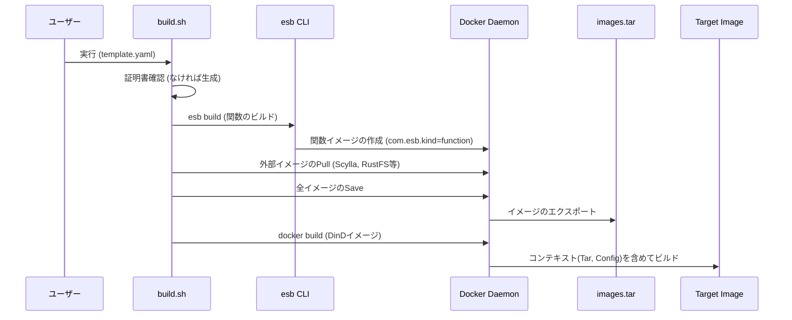
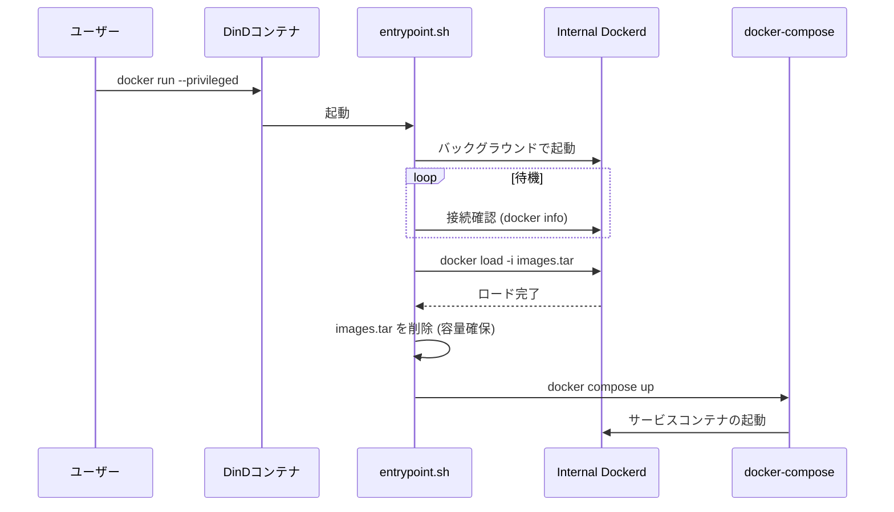

# DinD Bundler Tools

このディレクトリには、ESB (Edge Serverless Box) スタック全体を単一の Docker-in-Docker (DinD) コンテナにパッケージングするためのツールが含まれています。
これにより、インターネット接続のない環境や、完全に自己完結したデモ/テスト環境において、`docker pull` やビルドプロセスなしで ESB スタックを実行できます。

## 概要

このツールセットは以下の機能を提供します：
1.  **ビルド自動化**: `esb build` を実行して Lambda 関数イメージを生成し、必要なベースイメージと共に単一の tar アーカイブにまとめます。
2.  **自己完結イメージ**: すべての依存イメージと設定ファイルを含む DinD イメージを作成します。
3.  **自動起動**: コンテナ起動時に内部 Docker デーモンを立ち上げ、イメージをロードし、`docker-compose` でスタックを起動します。

## 使用方法

プロジェクトのルートディレクトリで以下のコマンドを実行してください。

```bash
# 基本的な使用方法
./tools/dind-bundler/build.sh <SAMテンプレートパス> <出力イメージタグ>

# 例: e2eテスト用のテンプレートを使用してビルドする場合
./tools/dind-bundler/build.sh e2e/fixtures/template.yaml my-esb-bundle:latest
```

### ビルドオプション (環境変数)

*   `SKIP_ESB_BUILD=true`: `esb build` プロセスをスキップします（既存のアーティファクトを再利用する場合やテスト用）。

## 実行方法

作成されたイメージは、特権モード (`--privileged`) で実行する必要があります。

```bash
docker run --privileged --name esb-bundle -p 8443:8443 -d my-esb-bundle:latest
```

## アーキテクチャとフロー

### ビルドプロセス



### 実行 (Runtime) プロセス



## ファイル構成

*   `build.sh`: バンドルイメージ作成のオーケストレーションを行うスクリプト。
*   `Dockerfile`: DinD ベースの Dockerfile。`docker-compose` のインストールとアーティファクトのコピーを行います。
*   `entrypoint.sh`: コンテナ起動時の初期化（Dockerd起動、イメージロード）とサービスの立ち上げを行います。
*   `generate_dummy_certs.sh`: CI/テスト環境用のダミー証明書生成スクリプト。
